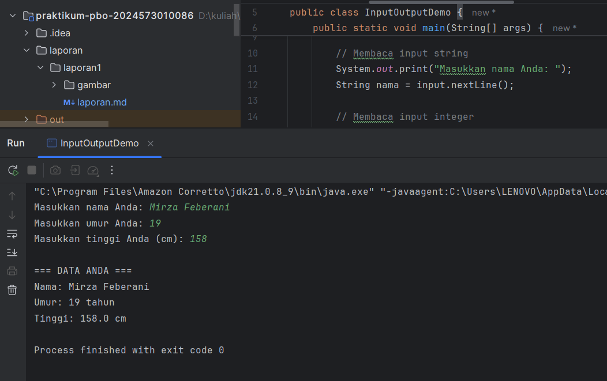

# Laporan Modul 2: Dasar Pemrograman Java
---
**Mata Kuliah:** Praktikum Pemrograman Berorientasi Objek  
**Nama:** MIRZA FEBERANI  
**NIM:** 2024573010086  
**Kelas:** TI 2E  
**Tanggal Praktikum:** 18 September 2025

---

## 1. Abstrak
Laporan ini membahas dasar pemrograman Java yang meliputi variabel dan tipe data, input/output menggunakan kelas `Scanner`, struktur percabangan, serta perulangan. Tujuan dari praktikum ini adalah memberikan pemahaman fundamental mengenai sintaks dan konsep dasar bahasa Java sebagai pijakan awal untuk mempelajari pemrograman berorientasi objek. Metode yang digunakan adalah implementasi kode program sederhana, menjalankannya, dan menganalisis hasil output. Hasil praktikum menunjukkan bahwa mahasiswa mampu mendeklarasikan variabel, menerima input, membuat keputusan logis dengan percabangan(if-else, switch), dan mengulang instruksi menggunakan perulangan(for, while, do-while).

---

## 2. Praktikum

### 2.1 Praktikum 1 — Variabel dan Tipe Data
#### 2.1.1 Dasar Teori
Variabel adalah wadah untuk menyimpan data dengan tipe tertentu. Java memiliki dua kategori utama :
- tipe data primitif (`int`, `double`, `char`, `boolean`) dan 
- tipe referensi seperti `String` atau array. Tipe data menentukan besar memori dan operasi yang bisa dilakukan.

---

**Tipe Data Primitif**
- byte: 8-bit signed integer (-128 to 127)
- short: 16-bit signed integer (-32,768 to 32,767)
- int: 32-bit signed integer (-2,147,483,648 to 2,147,483,647)
- long: 64-bit signed integer
- float: 32-bit IEEE 754 floating point
- double: 64-bit IEEE 754 floating point
- boolean: true atau false
- char: 16-bit Unicode character

---

**Tipe Data Reference**
- String, Array, Object, dll.

---

**Aturan Penamaan Variabel**
- Dimulai dengan huruf, underscore (_), atau dollar sign ($)
- Tidak boleh dimulai dengan angka
- Case sensitive
- Tidak boleh menggunakan keyword Java

---

#### Langkah Praktikum Variabel dan tipe data
1. Buat file `VariabelDemo.java`.
2. Ketik kode berikut:

```
package modul_2;

public class VariableDemo {
public static void main(String[] args) {
// Deklarasi dan inisialisasi variabel
int umur = 20;
double tinggi = 175.5;
char grade = 'A';
boolean lulus = true;
String nama = "John Doe";

        // Menampilkan nilai variabel
        System.out.println("Nama: " + nama);
        System.out.println("Umur: " + umur + " tahun");
        System.out.println("Tinggi: " + tinggi + " cm");
        System.out.println("Grade: " + grade);
        System.out.println("Lulus: " + lulus);

        int a = 10;
        int b = 3;

        System.out.println("\n===Operasi Aritmatika ===");
        System.out.println("a = " + a);
        System.out.println("b = " + b);
        System.out.println("a + b = " + (a + b));
        System.out.println("a - b = " + (a - b));
        System.out.println("a * b = " + (a * b));
        System.out.println("a / b = " + (a / b));
        System.out.println("a % b = " + (a % b));

        System.out.println("\n===Casting Tipe Data ===");
        double nilaiDouble = 9.8;
        int nilaiInt = (int) nilaiDouble;

        System.out.println("Nilai double: " + nilaiDouble);
        System.out.println("Setelah casting ke int: " + nilaiInt);

        // Automatic promotion
        byte byteVar = 50;
        short shortVar = 100;
        int hasil = byteVar + shortVar;
        System.out.println("byte + short = " + hasil + " (tipe: int)");
    }
}

```
- Compile dan jalankan program.

---

#### Screenshot Hasil


--- 

#### Analisa dan Pembahasan

Program `VariableDemo` menunjukkan penggunaan dasar variabel, operasi aritmatika, serta konversi tipe data (casting) dalam Java. Berikut analisis tiap bagiannya:

1. **Deklarasi dan Inisialisasi Variabel**
    - `int umur = 20;` → variabel bertipe bilangan bulat.
    - `double tinggi = 175.5;` → menyimpan bilangan pecahan (floating point).
    - `char grade = 'A';` → menyimpan satu karakter.
    - `boolean lulus = true;` → menyimpan nilai logika (benar/salah).
    - `String nama = "John Doe";` → menyimpan teks atau kumpulan karakter.

   Bagian ini memperlihatkan keragaman tipe data dasar Java untuk kebutuhan berbeda.

2. **Menampilkan Nilai Variabel**  
   Program menggunakan `System.out.println` untuk mencetak nilai variabel ke layar. Output yang dihasilkan memperlihatkan data yang sudah diinisialisasi sebelumnya.

3. **Operasi Aritmatika**  
   Variabel `a = 10` dan `b = 3` digunakan untuk menunjukkan operasi dasar:
    - Penjumlahan (`a + b = 13`)
    - Pengurangan (`a - b = 7`)
    - Perkalian (`a * b = 30`)
    - Pembagian (`a / b = 3`) → karena kedua operand bertipe `int`, hasilnya juga `int` (pembulatan ke bawah).
    - Modulus (`a % b = 1`) → sisa hasil bagi.

   Hal ini menegaskan bahwa tipe data mempengaruhi hasil operasi.

4. **Casting Tipe Data**  
   Variabel `double nilaiDouble = 9.8;` dicasting ke `int`, sehingga menghasilkan `9`.
    - Proses ini disebut **type casting eksplisit**, karena programmer secara sadar mengubah tipe data dari `double` ke `int`.
    - Dampaknya adalah hilangnya nilai desimal (informasi terpotong).

5. **Automatic Promotion (Promosi Otomatis)**  
   Variabel `byteVar` dan `shortVar` dijumlahkan. Hasilnya otomatis dipromosikan ke tipe `int`, meskipun operand awal bukan bertipe `int`.
    - Hal ini terjadi karena aturan internal Java yang mencegah kehilangan data saat operasi aritmatika.

**Kesimpulan Analisis:**  
Program ini menggambarkan dasar pemrograman Java dalam penggunaan variabel, menampilkan data, melakukan operasi aritmatika, dan konversi tipe data. Dengan percobaan ini, dapat dipahami bahwa:
- Pemilihan tipe data harus disesuaikan dengan kebutuhan.
- Operasi aritmatika di Java dipengaruhi oleh tipe data operand.
- Casting dapat menyebabkan hilangnya presisi.
- Java otomatis melakukan promosi tipe data untuk menjaga konsistensi operasi.

---

### Praktikum 2 — Input/Output dengan Scanner
#### Dasar Teori
Untuk membaca input dari pengguna dalam Java, kita menggunakan class Scanner yang terdapat dalam package java.util. Scanner menyediakan berbagai method untuk membaca berbagai tipe data:

- nextInt(): membaca integer
- nextDouble(): membaca double
- nextLine(): membaca String (termasuk spasi)
- next(): membaca String (sampai spasi pertama)
- nextBoolean(): membaca boolean

---

#### Langkah Praktikum Import dan Membuat Scanner
1. Buat file `InputOutputDemo.java`.
2. Ketik kode berikut:

```
package modul_2;

import java.util.Scanner;

public class InputOutputDemo {
    public static void main(String[] args) {
        // Membuat objek Scanner
        Scanner input = new Scanner(System.in);

        // Membaca input string
        System.out.print("Masukkan nama Anda: ");
        String nama = input.nextLine();

        // Membaca input integer
        System.out.print("Masukkan umur Anda: ");
        int umur = input.nextInt();

        // Membaca input double
        System.out.print("Masukkan tinggi Anda (cm): ");
        double tinggi = input.nextDouble();

        // Menampilkan output
        System.out.println("\n=== DATA ANDA ===");
        System.out.println("Nama: " + nama);
        System.out.println("Umur: " + umur + " tahun");
        System.out.println("Tinggi: " + tinggi + " cm");

        // Menutup Scanner
        input.close();
    }
}
```
- Compile dan jalankan program.

---

#### Screenshot Hasil


---

#### Analisa dan Pembahasan

Program `InputOutputDemo` bertujuan untuk mendemonstrasikan cara menerima input dari pengguna menggunakan kelas `Scanner` dan menampilkannya kembali sebagai output. Berikut analisisnya:

1. **Membuat Objek Scanner**  
   `Scanner input = new Scanner(System.in);` digunakan untuk membaca data dari keyboard. `System.in` adalah stream standar untuk input, sedangkan `Scanner` memudahkan membaca berbagai tipe data.

2. **Membaca Input Pengguna**
    - `nextLine()` membaca string lengkap, misalnya nama dengan spasi.
    - `nextInt()` membaca bilangan bulat, misalnya umur.
    - `nextDouble()` membaca bilangan pecahan, misalnya tinggi badan.  
      Kombinasi ini memungkinkan program menerima data diri pengguna secara berurutan.

3. **Menampilkan Output**  
   Setelah input diterima, program mencetak data yang dimasukkan dengan format terstruktur seperti pada screenshot hasil.

4. **Menutup Scanner**  
   `input.close();` dilakukan untuk menutup resource setelah digunakan. Ini adalah praktik baik agar tidak ada resource yang dibiarkan terbuka.

**Poin Penting:**
- Metode pembacaan input harus disesuaikan dengan tipe data.
- Urutan pemanggilan `Scanner` sudah benar, sehingga tidak menimbulkan error buffer (newline `\n`).
- Program memperlihatkan bagaimana Java mendukung interaksi dinamis dengan pengguna.

**Kesimpulan Analisis:**  
Program ini berhasil menunjukkan penggunaan kelas `Scanner` untuk membaca input dengan berbagai tipe data (`String`, `int`, `double`) dan menampilkannya kembali. Percobaan ini menegaskan pentingnya pemilihan metode input yang sesuai, praktik menutup resource, serta konsep dasar input–output dalam Java.

---

### Praktikum 3 — Percabangan
#### Dasar Teori
Percabangan digunakan untuk pengambilan keputusan berdasarkan kondisi logis. Struktur umum: `if`, `if-else`, `if-else if`, dan `switch`.

1. If Statement
```
if (kondisi) {
// kode yang dijalankan jika kondisi true
}
```
- If-Else Statement
```
if (kondisi) {
// kode jika kondisi true
} else {
// kode jika kondisi false
}
```
- If-Else if Statement
```
if (kondisi1) {
// kode jika kondisi1 true
} else if (kondisi2) {
// kode jika kondisi2 true
} else {
// kode jika semua kondisi false
}
```
- Switch Statement
```
switch (variabel) {
case nilai1:
// kode
break;
case nilai2:
// kode
break;
default:
// kode default
}
```
---

#### Langkah Praktikum 1 Program Penentu Grade
1. Buat file `GradeDemo.java`.
2. Ketik kode berikut:

```
package modul_2;

import java.util.Scanner;

public class GradeDemo {
    public static void main(String[] args) {
        Scanner input = new Scanner(System.in);

        System.out.print("Masukkan nilai (0-100): ");
        int nilai = input.nextInt();

        char grade;
        String keterangan;

        // Menggunakan if-else if-else
        if (nilai >= 85) {
            grade = 'A';
            keterangan = "Excellent";
        } else if (nilai >= 75) {
            grade = 'B';
            keterangan = "Good";
        } else if (nilai >= 65) {
            grade = 'C';
            keterangan = "Fair";
        } else if (nilai >= 55) {
            grade = 'D';
            keterangan = "Poor";
        } else {
            grade = 'E';
            keterangan = "Bad";
        }

        System.out.println("Nilai: " + nilai);
        System.out.println("Grade: " + grade);
        System.out.println("Keterangan: " + keterangan);

        input.close();
    }
}
```
- Jalankan program dengan beberapa nilai berbeda.

---

#### Screenshot Hasil


---

#### Analisa dan Pembahasan

Program `GradeDemo` digunakan untuk menentukan nilai huruf (grade) dan keterangan berdasarkan input nilai numerik dari pengguna. Berikut analisisnya:

1. **Penggunaan Scanner**  
   `Scanner input = new Scanner(System.in);` digunakan untuk membaca nilai yang dimasukkan pengguna melalui keyboard.

2. **Deklarasi Variabel**
    - `int nilai` → menyimpan nilai angka yang dimasukkan (0–100).
    - `char grade` → menyimpan hasil konversi nilai ke huruf.
    - `String keterangan` → menyimpan deskripsi dari grade (misalnya *Excellent*, *Good*, dll.).

3. **Struktur Kontrol if–else if–else**  
   Logika program menggunakan percabangan bertingkat untuk menentukan grade:
    - `nilai >= 85` → Grade A (*Excellent*).
    - `nilai >= 75` → Grade B (*Good*).
    - `nilai >= 65` → Grade C (*Fair*).
    - `nilai >= 55` → Grade D (*Poor*).
    - `< 55` → Grade E (*Bad*).

   Urutan kondisi dari yang tertinggi ke terendah memastikan program mengevaluasi nilai dengan benar tanpa bentrok antar syarat.

4. **Menampilkan Output**  
   Program mencetak kembali nilai numerik, grade huruf, dan keterangannya, misalnya:

- *Nilai: 82*
- *Grade: B*
- *Keterangan: Good*

- **Menutup Scanner**  
   `input.close();` dipanggil untuk menutup resource setelah selesai digunakan, sesuai praktik pemrograman yang baik.

**Poin Penting:**
- Percabangan if–else memungkinkan klasifikasi data berdasarkan rentang nilai.
- Variabel `char` dipilih untuk grade karena hanya butuh satu karakter, sementara `String` untuk keterangan agar lebih fleksibel.
- Program ini mencerminkan konsep *decision making* dalam Java.

**Kesimpulan Analisis:**  
Program `GradeDemo` berhasil menunjukkan penerapan struktur kontrol if–else untuk mengkategorikan nilai menjadi grade huruf beserta keterangannya. Dari percobaan ini dapat dipahami bagaimana logika percabangan bekerja dalam memproses data numerik dan mengubahnya menjadi informasi yang lebih bermakna.

---

#### Langkah Praktikum 2 Program Menu dengan Switch
1. Buat file `MenuDemo.java`.
2. Ketik kode berikut:

```
package modul_2;

import java.util.Scanner;

public class MenuDemo {
    public static void main(String[] args) {
        Scanner input = new Scanner(System.in);

        System.out.println("=== MENU PILIHAN ===");
        System.out.println("1. Hitung Luas Persegi");
        System.out.println("2. Hitung Luas Lingkaran");
        System.out.println("3. Hitung Luas Segitiga");
        System.out.println("4. Keluar");

        System.out.print("Pilihan menu (1-4): ");
        int pilihan = input.nextInt();

        switch(pilihan) {
            case 1:
                System.out.print("Masukkan sisi persegi: ");
                double sisi = input.nextDouble();
                double LuasPersegi = sisi * sisi;
                System.out.println("Luas Persegi = " + LuasPersegi);
                break;

            case 2:
                System.out.print("Masukkan jari-jari lingkaran: ");
                double jariJari = input.nextDouble();
                double luasLingkaran = Math.PI * jariJari * jariJari;
                System.out.println("Luas Lingkaran = " + luasLingkaran);
                break;

            case 3:
                System.out.print("Masukkan alas segitiga: ");
                double alas = input.nextDouble();
                System.out.print("Masukkan tinggi segitiga: ");
                double tinggi = input.nextDouble();
                double LuasSegitiga = 0.5 * alas * tinggi;
                System.out.println("Luas Segitiga = " + LuasSegitiga);
                break;

            case 4:
                System.out.println("Terima kasih!");
                break;

            default:
                System.out.println("Pilihan tidak valid!");
        }

        input.close();
    }
}

```
- Jalankan program dengan beberapa nilai berbeda.

---

#### Screenshot Hasil


---

#### Analisa dan Pembahasan

Program `MenuDemo` digunakan untuk menghitung luas bangun datar (persegi, lingkaran, segitiga) dengan menggunakan struktur kontrol `switch-case` berdasarkan pilihan menu yang dimasukkan pengguna. Berikut analisis rinci:

1. **Menampilkan Menu**  
   Program terlebih dahulu menampilkan daftar pilihan:
    1. Hitung Luas Persegi
    2. Hitung Luas Lingkaran
    3. Hitung Luas Segitiga
    4. Keluar

   Tampilan ini memberi pengguna gambaran opsi yang tersedia.

2. **Membaca Input Pilihan**  
   `int pilihan = input.nextInt();` digunakan untuk menangkap angka menu yang dipilih (1–4).

3. **Struktur Kontrol switch-case**
    - **Case 1: Hitung Luas Persegi**  
      Meminta input sisi, lalu menghitung luas dengan rumus `sisi * sisi`.
    - **Case 2: Hitung Luas Lingkaran**  
      Meminta input jari-jari, lalu menghitung luas dengan rumus `π * r^2` menggunakan `Math.PI`.
    - **Case 3: Hitung Luas Segitiga**  
      Meminta input alas dan tinggi, lalu menghitung luas dengan rumus `0.5 * alas * tinggi`.
    - **Case 4: Keluar**  
      Menampilkan pesan "Terima kasih!" dan mengakhiri program.
    - **Default**  
      Menangani kondisi jika pengguna memasukkan angka di luar 1–4 dengan pesan "Pilihan tidak valid!".

4. **Penggunaan Scanner**  
   Scanner dipakai untuk membaca nilai numerik (tipe `int` dan `double`). Setelah selesai, `input.close();` dipanggil untuk menutup resource.

**Poin Penting:**
- Struktur `switch-case` lebih efisien dan rapi dibandingkan `if-else` bertingkat dalam menangani banyak pilihan.
- Program ini mengkombinasikan logika kontrol alur dengan perhitungan matematis sederhana.
- Validasi input ditangani dengan `default`, sehingga program lebih tangguh terhadap kesalahan input.

**Kesimpulan Analisis:**  
Program `MenuDemo` berhasil menunjukkan penerapan `switch-case` untuk pembuatan menu interaktif. Dengan logika ini, pengguna dapat memilih berbagai perhitungan luas bangun datar, sementara program merespons sesuai pilihan. Percobaan ini menegaskan pentingnya pengendalian alur program berdasarkan input pengguna serta penerapan rumus matematika dalam pemrograman Java.

---
#### Langkah Praktikum 3 Program Nested If
1. Buat file `NestedIfDemo.java`.
2. Ketik kode berikut untuk menentukan katergori usia:

```
package modul_2;

import java.util.Scanner;

public class NestedIfDemo {
    public static void main(String[] args) {
        Scanner input = new Scanner(System.in);

        System.out.print("Masukkan umur: ");
        int umur = input.nextInt();

        if (umur > 0) {
            if (umur < 5) {
                System.out.println("Kategori: Bayi");
            } else if (umur < 12) {
                System.out.println("Kategori: Anak-anak");
            } else if (umur < 18) {
                System.out.println("Kategori: Remaja");
            } else if (umur < 60) {
                System.out.println("Kategori: Dewasa");
            } else {
                System.out.println("Kategori: Lansia");
            }
        } else {
            System.out.println("Umur tidak valid!");
        }

        input.close();
    }
}
```
- Jalankan program dengan usia anda.

---

#### Screenshot Hasil


---

#### Analisa dan Pembahasan

Program ini bertujuan untuk menentukan kategori umur seseorang berdasarkan input umur yang diberikan pengguna. Program menggunakan **struktur kontrol bersarang (nested if)** untuk mengevaluasi kondisi secara berurutan.

#### Alur Program
1. Program meminta pengguna memasukkan **umur** (bilangan bulat).
2. Jika umur lebih besar dari 0, maka program masuk ke dalam blok `if` bersarang:
    - Jika umur kurang dari 5 → kategori **Bayi**.
    - Jika umur kurang dari 12 → kategori **Anak-anak**.
    - Jika umur kurang dari 18 → kategori **Remaja**.
    - Jika umur kurang dari 60 → kategori **Dewasa**.
    - Selain itu → kategori **Lansia**.
3. Jika umur bernilai 0 atau negatif, maka program menampilkan pesan **"Umur tidak valid!"**.
4. Program menutup `Scanner` setelah selesai digunakan.

#### Pembahasan
- **Struktur nested if** dipilih karena setiap kondisi saling bergantung. Misalnya, syarat "umur < 5" hanya diperiksa setelah dipastikan bahwa umur lebih dari 0.
- Pendekatan ini membuat logika lebih **terstruktur** dan mudah dipahami karena kategori dipilah secara bertingkat.
- Program juga mengantisipasi **input tidak valid** (umur ≤ 0) sehingga tidak langsung memproses ke dalam kategori umur.
- Dengan rentang umur yang jelas, tidak ada kemungkinan tumpang tindih antar kategori (mutually exclusive).
- Kekurangannya: jika jumlah kategori lebih banyak, penggunaan nested if bisa membuat kode menjadi panjang dan sulit dikelola. Alternatifnya dapat digunakan **struktur if-else linear** atau **switch-case dengan rentang** (meskipun di Java `switch` tidak mendukung rentang langsung).

#### Kesimpulan
Program `NestedIfDemo` berhasil mengelompokkan umur ke dalam kategori yang tepat dengan logika kontrol `nested if`. Implementasi ini efektif untuk kasus sederhana dengan jumlah kategori terbatas. Namun, untuk skala yang lebih kompleks, bisa dipertimbangkan penggunaan struktur kontrol lain yang lebih ringkas.

---

### Praktikum 4 — Perulangan
#### Dasar Teori
Perulangan memungkinkan instruksi dijalankan berulang. Jenis utama:
- `for` → ketika jumlah iterasi sudah diketahui.
```
for (inisialisasi; kondisi; increment/decrement) {
// kode yang diulang
}
```
- `while` → ketika kondisi diperiksa di awal.
```
while (kondisi) {
    // kode yang diulang
}
```
- `do-while` → ketika kondisi diperiksa setelah minimal satu kali eksekusi.
```
do {
    // kode yang diulang
} while (kondisi);
```

---

#### Langkah Praktikum 1 Perulangan For
1. Buat file `ForLoopDemo.java`.
2. ketik kode berikut:

```
package modul_2;

public class ForLoopDemo {
    public static void main(String[] args) {
        // Contoh 1: Menampilkan angka 1-10
        System.out.println("\n=== Angka 1-10 ===");
        for (int i = 1; i <= 10; i++) {
            System.out.print(i + " ");
        }

        // Contoh 2: Menampilkan angka genap
        System.out.println("\n=== Angka Genap 2-20 ===");
        for (int i = 2; i <= 20; i += 2) {
            System.out.print(i + " ");
        }

        // Contoh 3: Countdown
        System.out.println("\n=== Countdown ===");
        for (int i = 10; i >= 1; i--) {
            System.out.print(i + " ");
        }
        System.out.println("Start!");

        // Contoh 4: Tabel perkalian
        System.out.println("\n=== Tabel Perkalian 5 ===");
        for (int i = 1; i <= 10; i++) {
            System.out.println("5 x " + i + " = " + (5 * i));
        }
    }
}
```
- Jalankan program untuk melihat output.

---

#### Screenshot Hasil


---

#### Analisa dan Pembahasan

Program ini mendemonstrasikan penggunaan **perulangan for** dalam berbagai contoh sederhana untuk menampilkan pola angka dan operasi matematis.

#### Alur Program
1. **Contoh 1 – Menampilkan angka 1–10**  
   Perulangan `for (int i = 1; i <= 10; i++)` mencetak angka dari 1 hingga 10 secara berurutan.

2. **Contoh 2 – Menampilkan angka genap 2–20**  
   Perulangan `for (int i = 2; i <= 20; i += 2)` mencetak hanya angka genap dengan menambahkan 2 setiap iterasi.

3. **Contoh 3 – Countdown**  
   Perulangan `for (int i = 10; i >= 1; i--)` mencetak angka mundur dari 10 sampai 1, lalu menampilkan kata **“Start!”**.

4. **Contoh 4 – Tabel perkalian 5**  
   Perulangan `for (int i = 1; i <= 10; i++)` digunakan untuk menghitung hasil perkalian angka 5 dengan 1 hingga 10, lalu mencetak dalam bentuk tabel.

#### Pembahasan
- Struktur `for` sangat cocok dipakai ketika jumlah iterasi sudah diketahui sebelumnya, misalnya dari 1 sampai 10 atau perulangan 10 kali.
- **Contoh 1** memperlihatkan perulangan linear.
- **Contoh 2** menekankan penggunaan *step increment* lebih dari 1 (dalam hal ini +2).
- **Contoh 3** menunjukkan bahwa `for` tidak hanya bisa naik, tetapi juga bisa menurun dengan decrement.
- **Contoh 4** menegaskan kegunaan `for` dalam menghasilkan pola matematis, misalnya tabel perkalian.
- Program ini efektif sebagai demonstrasi dasar `for`, tetapi jika skenario lebih kompleks, bisa digabung dengan **nested loop** untuk menghasilkan pola tabel lebih besar (misalnya tabel perkalian lengkap).

#### Kesimpulan
Program `ForLoopDemo` berhasil menunjukkan empat variasi penggunaan perulangan `for`, mulai dari pencetakan angka sederhana, deret bilangan tertentu, hitungan mundur, hingga aplikasi praktis berupa tabel perkalian. Struktur `for` menjadi pilihan utama saat iterasi terdefinisi dengan jelas.

---

#### Langkah Praktikum 2 Perulangan While dan Do-While
1. Buat file `WhileLoopDemo.java`.
2. ketik kode berikut:

```
package modul_2;

import java.util.Scanner;

public class WhileLoopDemo {
    public static void main(String[] args) {
        Scanner input = new Scanner(System.in);

        // Contoh While Loop
        System.out.println("== While Loop - Tebak Angka ==");
        int angkaRahasia = 7;
        int tebakan = 0;

        while (tebakan != angkaRahasia) {
            System.out.print("Tebak angka (1-10): ");
            tebakan = input.nextInt();

            if (tebakan < angkaRahasia) {
                System.out.println("Terlalu kecil!");
            } else if (tebakan > angkaRahasia) {
                System.out.println("Terlalu besar!");
            } else {
                System.out.println("Benar! Angka rahasianya adalah " + angkaRahasia);
            }
        }

        // Contoh Do-While Loop
        System.out.println("\n== Do-While Loop - Menu ==");
        int pilihan;

        do {
            System.out.println("Menu:");
            System.out.println("1. Hello World!");
            System.out.println("2. Hitung faktorial");
            System.out.println("3. Keluar");
            System.out.print("Pilih menu (1-3): ");
            pilihan = input.nextInt();

            switch (pilihan) {
                case 1:
                    System.out.println("Hello, World!");
                    break;
                case 2:
                    System.out.print("Masukkan angka: ");
                    int n = input.nextInt();
                    int faktorial = 1;
                    for (int i = 1; i <= n; i++) {
                        faktorial *= i;
                    }
                    System.out.println("Faktorial " + n + " = " + faktorial);
                    break;
                case 3:
                    System.out.println("Terima kasih!");
                    break;
                default:
                    System.out.println("Pilihan tidak valid!");
            }
        } while (pilihan != 3);

        input.close();
    }
}
```
- Jalankan program untuk melihat output.

---

#### Screenshot Hasil


---

#### Analisa dan Pembahasan

Program ini mendemonstrasikan penggunaan **while loop** dan **do-while loop** dengan dua contoh kasus: permainan tebak angka dan menu interaktif.

#### Alur Program
1. **While Loop – Tebak Angka**
    - Program menentukan angka rahasia (`angkaRahasia = 7`).
    - Variabel `tebakan` diinisialisasi dengan nilai 0.
    - Selama `tebakan != angkaRahasia`, pengguna diminta memasukkan angka (1–10).
    - Program memberikan umpan balik:
        - Jika tebakan terlalu kecil → cetak "Terlalu kecil!".
        - Jika tebakan terlalu besar → cetak "Terlalu besar!".
        - Jika benar → cetak pesan keberhasilan.

2. **Do-While Loop – Menu**
    - Program menampilkan menu berulang kali menggunakan `do-while`.
    - Pilihan menu:
        1. Cetak **“Hello, World!”**.
        2. Hitung faktorial dari bilangan yang dimasukkan pengguna dengan perulangan `for`.
        3. Keluar dari program.
    - Jika input tidak sesuai, muncul pesan "Pilihan tidak valid!".
    - Perulangan berhenti saat pengguna memilih **3**.

#### Pembahasan
- **While loop** cocok digunakan saat jumlah iterasi tidak diketahui, misalnya dalam permainan tebak angka yang hanya berhenti jika jawaban benar.
- **Do-while loop** memastikan menu ditampilkan minimal sekali meskipun kondisi awal tidak diketahui.
- Implementasi faktorial dalam menu memperlihatkan kombinasi struktur kontrol (`do-while`, `switch`, dan `for`) dalam satu blok program.
- Program ini cukup interaktif, tetapi angka rahasia pada permainan masih statis (selalu 7). Untuk meningkatkan tantangan, bisa dibuat acak menggunakan `Random`.
- Dari sisi validasi, program belum menangani input non-angka (misalnya huruf), sehingga masih berpotensi error jika input tidak sesuai tipe data.

#### Kesimpulan
Program `WhileLoopDemo` berhasil menunjukkan perbedaan konsep `while` dan `do-while`. `while` digunakan untuk kasus dengan kondisi berhenti yang jelas (tebakan benar), sementara `do-while` cocok untuk menu berulang yang harus ditampilkan minimal sekali. Program ini juga memperlihatkan kombinasi logika perulangan, seleksi, dan interaksi dengan pengguna.

---

#### Langkah Praktikum 3 Nested Loop (Perulangan Bersarang)
1. Buat file `ForLoopDemo.java`.
2. ketik kode berikut:

```
package modul_2;

public class NestedLoopDemo {
    public static void main(String[] args) {
        // Contoh 1: Pola Bintang
        System.out.println("=== Pola Bintang Segitiga ===");
        for (int i = 1; i <= 5; i++) {
            for (int j = 1; j <= i; j++) {
                System.out.print("*");
            }
            System.out.println();
        }

        // Contoh 2: Tabel Perkalian
        System.out.println("\n=== Tabel Perkalian 1-5 ===");
        for (int i = 1; i <= 5; i++) {
            for (int j = 1; j <= 5; j++) {
                System.out.printf("%3d ", (i * j));
            }
            System.out.println();
        }

        // Contoh 3: Pola Angka
        System.out.println("\n=== Pola Angka ===");
        for (int i = 1; i <= 5; i++) {
            for (int j = 1; j <= i; j++) {
                System.out.print(j);
            }
            System.out.println();
        }
    }
}
```
- Jalankan program untuk melihat output.

---

#### Screenshot Hasil


---

#### Analisa dan Pembahasan

Program ini mendemonstrasikan penggunaan **nested loop** (perulangan bersarang), yaitu perulangan di dalam perulangan lain, untuk membuat berbagai pola dan tabel.

#### Alur Program
1. **Pola Bintang Segitiga**
    - Menggunakan dua `for` loop.
    - Loop luar (`i`) menentukan jumlah baris (1–5).
    - Loop dalam (`j`) mencetak tanda `*` sesuai nilai `i`.
    - Hasilnya adalah segitiga bertingkat dengan jumlah bintang meningkat per baris.

2. **Tabel Perkalian**
    - Loop luar (`i`) berjalan dari 1–5 (baris).
    - Loop dalam (`j`) juga dari 1–5 (kolom).
    - Setiap elemen hasil kali `i * j` dicetak menggunakan `printf` agar rapi.
    - Hasilnya berupa tabel perkalian 1–5.

3. **Pola Angka**
    - Mirip pola bintang, tetapi yang dicetak adalah angka dari 1 sampai `j`.
    - Loop luar (`i`) mengatur jumlah baris.
    - Loop dalam (`j`) mencetak urutan angka sesuai baris.
    - Pola yang terbentuk adalah segitiga angka.

#### Pembahasan
- **Nested loop** sangat berguna untuk membentuk pola 2D (misalnya tabel, matriks, atau bentuk geometris).
- Pola bintang memperlihatkan hubungan langsung antara jumlah baris dengan jumlah kolom pada setiap baris.
- Tabel perkalian adalah contoh nyata penggunaan nested loop dalam aplikasi matematika.
- Penggunaan `System.out.printf` membuat tampilan tabel lebih rapi daripada `print` biasa.
- Pola angka memperlihatkan bagaimana loop dalam bisa memanfaatkan variabel loop untuk menghasilkan urutan yang berbeda di tiap baris.
- Kelemahan program ini: pola dan ukuran (5 baris) masih statis. Bisa ditingkatkan dengan meminta input dari pengguna untuk menentukan ukuran pola.

#### Kesimpulan
Program `NestedLoopDemo` memperlihatkan cara kerja perulangan bersarang dalam membentuk pola. Loop luar biasanya mengatur baris, sementara loop dalam mengatur kolom. Dengan konsep ini, berbagai pola bintang, angka, maupun tabel dapat dibuat dengan fleksibel.

---

## 3. Kesimpulan

Dari seluruh percobaan program yang telah dibuat, dapat disimpulkan bahwa:

1. **Dasar Pemrograman Java** mencakup deklarasi variabel, tipe data, operasi aritmatika, serta casting tipe data. Hal ini merupakan fondasi utama dalam membangun logika program.
2. **Input dan Output** memungkinkan interaksi antara pengguna dan program melalui kelas `Scanner` serta menampilkan hasil dengan `System.out.println`.
3. **Struktur Kontrol Seleksi** (`if-else`, `nested if`, dan `switch-case`) digunakan untuk mengambil keputusan berdasarkan kondisi tertentu, mulai dari menentukan grade, kategori umur, hingga pilihan menu.
4. **Perulangan (Looping)** (`for`, `while`, `do-while`, nested loop) mempermudah eksekusi instruksi yang berulang, baik untuk menampilkan pola, tabel perkalian, countdown, permainan interaktif, maupun perhitungan matematis seperti faktorial.
5. **Kombinasi Struktur Kontrol** (seleksi + perulangan) membuat program lebih dinamis, interaktif, dan mendekati aplikasi dunia nyata.
6. Seluruh percobaan ini menegaskan bahwa pemrograman berorientasi objek seperti Java membutuhkan pemahaman logika dasar, pengendalian alur program, serta pemrosesan input-output sebelum masuk ke konsep yang lebih kompleks seperti class, objek, dan pewarisan.

Secara keseluruhan, praktikum ini memberikan pemahaman mendasar tentang bagaimana Java mengelola data, membuat keputusan, dan mengulang instruksi. Konsep-konsep ini menjadi landasan penting untuk membangun program yang lebih besar, modular, dan berorientasi objek.

---

## 4. Referensi
- Oracle. *Java SE Documentation*. https://docs.oracle.com/javase
- Modul Praktikum PBO, Modul 2: Dasar Pemrograman Java
- Deitel & Deitel. *Java: How to Program*. Prentice Hall  
- Wahana Komputer. (2019). *Pemrograman Berorientasi Objek dengan Java*. Andi Publisher.
