Laporan Modul 3: Dasar Pemrograman Java Lanjutan
---
**Mata Kuliah:** Praktikum Pemrograman Berorientasi Objek  
**Nama:** MIRZA FEBERANI  
**NIM:** 2024573010086  
**Kelas:** TI 2E  
**Tanggal Praktikum:** 02 Oktober 2025

---

## 1. Abstrak
Modul 3 membahas konsep lanjutan dalam pemrograman Java yang mencakup penggunaan array, method (fungsi), dan manipulasi string. Tujuan praktikum ini adalah agar mahasiswa memahami cara mengelola data terstruktur menggunakan array satu dan dua dimensi, membuat dan memanggil method dengan parameter maupun return value, serta memanfaatkan class dan method bawaan Java untuk memanipulasi string. Melalui praktikum ini, mahasiswa diharapkan mampu menerapkan prinsip modularitas, efisiensi, dan keterbacaan kode dalam pemrograman Java.

---

## 2. Praktikum

### 2.1 Array

#### Dasar Teori
Array merupakan struktur data yang menyimpan sekumpulan elemen dengan tipe data yang sama. Setiap elemen array diakses menggunakan indeks. Dalam Java, array bersifat statis, artinya ukuran array ditentukan saat deklarasi. Operasi umum meliputi pengisian, pengambilan elemen, perulangan, dan perhitungan rata-rata, nilai maksimum, maupun minimum.  Array menggunakan indeks untuk mengakses elemen-elemennya, dimulai dari indeks 0.

**Karakteristik Array:**
- Semua elemen memiliki tipe data yang sama
- Ukuran array bersifat tetap (fixed size)
- Indeks dimulai dari 0
- Elemen dapat diakses secara langsung menggunakan indeks

---

**Syntax Array:**
```
// Deklarasi array
tipeData[] namaArray = new tipeData[ukuran];

// Atau inisialisasi langsung
tipeData[] namaArray = {nilai1, nilai2, nilai3, ...};
```

---

#### 2.1.1 Praktikum : Array Satu Dimensi

Memahami cara mendeklarasikan, menginisialisasi, dan mengakses array satu dimensi.

#### Langkah Praktikum Array Satu Dimensi
1. Buat file `ArraySatuDimensi.java`.
2. Ketik kode berikut:

```
package modul_3;

public class ArraySatuDimensi {
    public static void main(String[] args) {
        // Langkah 1: Deklarasi dan inisialisasi array
        int[] nilai = {85, 90, 78, 92, 88};
        String[] nama = {"Alice", "Bob", "Charlie", "Diana", "Eva"};

        // Langkah 2: Menampilkan jumlah elemen array
        System.out.println("Jumlah siswa: " + nilai.length);

        // Langkah 3: Mengakses elemen array
        System.out.println("Nama siswa pertama: " + nama[0]);
        System.out.println("Nilai siswa pertama: " + nilai[0]);

        // Langkah 4: Menampilkan semua data menggunakan loop
        System.out.println("\nData semua siswa:");
        for (int i = 0; i < nama.length; i++) {
            System.out.println((i+1) + ". " + nama[i] + " - Nilai: " + nilai[i]);
        }
    }
}

```
- Compile dan jalankan program.
- Modifikasi kode program diatas untuk menambahkan fitur pencarian nilai tertinggi dan terendah

```
package modul_3;

public class ArraySatuDimensi {
    public static void main(String[] args) {
        // Langkah 1: Deklarasi dan inisialisasi array
        int[] nilai = {85, 90, 78, 92, 88};
        String[] nama = {"Alice", "Bob", "Charlie", "Diana", "Eva"};

        // Langkah 2: Menampilkan jumlah elemen array
        System.out.println("Jumlah siswa: " + nilai.length);

        // Langkah 3: Mengakses elemen array
        System.out.println("Nama siswa pertama: " + nama[0]);
        System.out.println("Nilai siswa pertama: " + nilai[0]);

        // Langkah 4: Menampilkan semua data menggunakan loop
        System.out.println("\nData semua siswa:");
        for (int i = 0; i < nama.length; i++) {
            System.out.println((i+1) + ". " + nama[i] + " - Nilai: " + nilai[i]);
        }

        // Langkah 5: Mencari nilai tertinggi dan terendah
        int nilaiTertinggi = nilai[0];
        int nilaiTerendah = nilai[0];
        String namaTertinggi = nama[0];
        String namaTerendah = nama[0];

        for (int i = 1; i < nilai.length; i++) {
            if (nilai[i] > nilaiTertinggi) {
                nilaiTertinggi = nilai[i];
                namaTertinggi = nama[i];
            }
            if (nilai[i] < nilaiTerendah) {
                nilaiTerendah = nilai[i];
                namaTerendah = nama[i];
            }
        }

        // Langkah 6: Menampilkan hasil pencarian
        System.out.println("\nNilai Tertinggi: " + nilaiTertinggi + " oleh " + namaTertinggi);
        System.out.println("Nilai Terendah: " + nilaiTerendah + " oleh " + namaTerendah);
    }
}
```
---

#### Screenshot Hasil
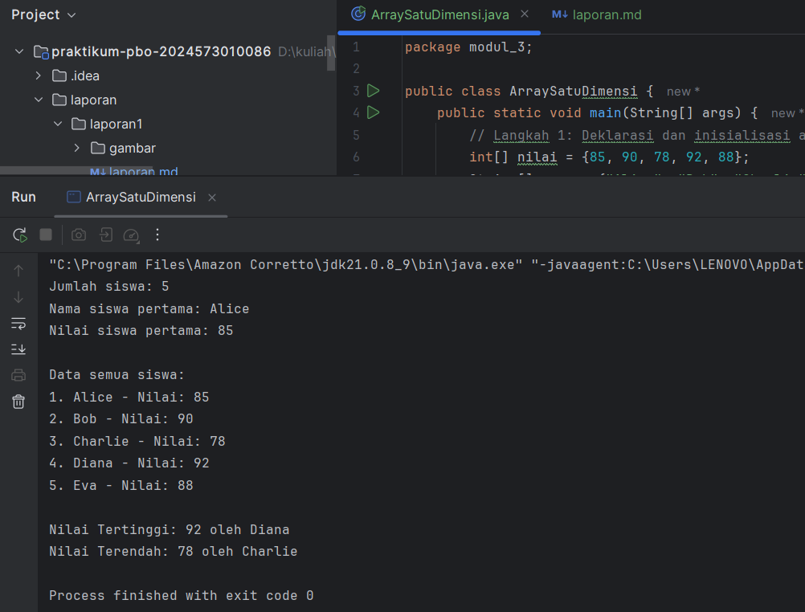

--- 

#### Analisa dan Pembahasan

1. Program **ArraySatuDimensi** ini menunjukkan cara penggunaan array satu dimensi dalam Java untuk menyimpan dan mengolah data secara terstruktur. Dua array — `nama` (String) dan `nilai` (int) — digunakan secara paralel untuk merepresentasikan data siswa dan nilai mereka.
2. Langkah awal, program mendeklarasikan dan menginisialisasi array dengan lima elemen. Kemudian, menggunakan properti `.length`, program menampilkan jumlah siswa tanpa perlu menghitung manual. Elemen array diakses melalui indeks (dimulai dari 0), misalnya `nama[0]` dan `nilai[0]` untuk siswa pertama.
3. Seluruh data siswa ditampilkan menggunakan perulangan **for**, sehingga setiap pasangan nama dan nilai dicetak secara otomatis. Ini memperlihatkan efisiensi penggunaan array dibanding mencetak data satu per satu.
4. Selanjutnya, program melakukan pencarian **nilai tertinggi dan terendah** dengan membandingkan setiap elemen menggunakan struktur `if`. Nilai awal diambil dari elemen pertama, lalu diperbarui jika ditemukan nilai yang lebih tinggi atau rendah. Algoritma ini memiliki kompleksitas waktu **O(n)**, cukup efisien untuk data kecil hingga sedang.
5. Hasil akhir menampilkan siapa yang memiliki nilai tertinggi dan terendah. Secara keseluruhan, program ini menegaskan konsep dasar array dalam Java — mulai dari inisialisasi, akses data, perulangan, hingga pencarian sederhana — yang menjadi fondasi penting sebelum mempelajari struktur data yang lebih kompleks.

---

#### Tugas Praktikum 1.1
1. Di dalam package modul_3, buatkan sebuah package baru dengan nama `latihan`
2. Buatkan sebuah class baru dengan nama `latihan1.java`. Selesaikan tugas berikut:

Buat array untuk menyimpan nilai ujian 10 siswa,
kemudian, hitung dan tampilkan rata-rata nilai,
kemudian, cari dan tampilkan nilai tertinggi dan terendah.

```
package modul_3.latihan;

public class latihan1 {
    public static void main(String[] args) {
        // Deklarasi dan inisialisasi array nilai ujian 10 siswa
        int[] nilai = {80, 75, 90, 88, 92, 67, 85, 78, 95, 83};

        // Menampilkan semua nilai
        System.out.println("Daftar Nilai Ujian 10 Siswa:");
        for (int i = 0; i < nilai.length; i++) {
            System.out.println("Siswa ke-" + (i + 1) + " : " + nilai[i]);
        }

        // Menghitung total nilai
        int total = 0;
        for (int n : nilai) {
            total += n;
        }

        // Menghitung rata-rata
        double rataRata = (double) total / nilai.length;

        // Mencari nilai tertinggi dan terendah
        int nilaiTertinggi = nilai[0];
        int nilaiTerendah = nilai[0];

        for (int i = 1; i < nilai.length; i++) {
            if (nilai[i] > nilaiTertinggi) {
                nilaiTertinggi = nilai[i];
            }
            if (nilai[i] < nilaiTerendah) {
                nilaiTerendah = nilai[i];
            }
        }

        // Menampilkan hasil akhir
        System.out.println("\n=== Hasil Analisis Nilai Ujian ===");
        System.out.println("Rata-rata Nilai : " + rataRata);
        System.out.println("Nilai Tertinggi : " + nilaiTertinggi);
        System.out.println("Nilai Terendah  : " + nilaiTerendah);
    }
}

```
---

#### Screenshot Hasil
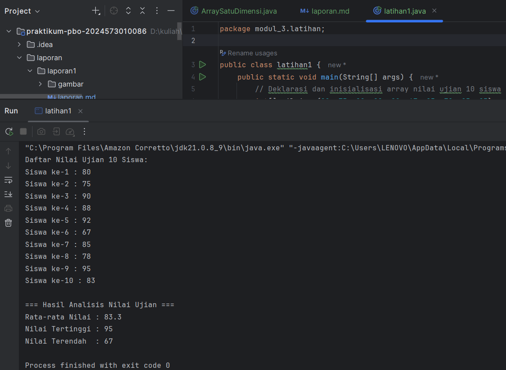

---

#### Analisa dan Pembahasan

1. Program **Latihan1** pada package `modul_3.latihan` dirancang untuk mengolah data nilai ujian dari sepuluh siswa menggunakan array satu dimensi. Tujuan utamanya adalah menghitung rata-rata nilai, serta menentukan nilai tertinggi dan terendah dari kumpulan data tersebut.
2. Langkah pertama, program mendeklarasikan array bertipe `int` bernama `nilai` yang berisi sepuluh elemen, masing-masing mewakili skor ujian siswa. Dengan inisialisasi langsung, program tidak memerlukan input manual saat dijalankan. Selanjutnya, dilakukan proses perulangan menggunakan struktur **for** untuk menampilkan seluruh isi array agar pengguna dapat melihat data mentah terlebih dahulu.
3. Perhitungan total nilai dilakukan menggunakan **enhanced for loop** (`for (int n : nilai)`), yang lebih sederhana dan mudah dibaca dibandingkan perulangan konvensional. Nilai total kemudian dibagi dengan panjang array (`nilai.length`) untuk memperoleh rata-rata. Penggunaan casting `(double)` memastikan hasil rata-rata ditampilkan dalam format desimal, bukan pembagian bilangan bulat.
4. Proses berikutnya adalah mencari nilai tertinggi dan terendah. Kedua variabel (`nilaiTertinggi` dan `nilaiTerendah`) diinisialisasi dengan elemen pertama array, kemudian dibandingkan satu per satu menggunakan kondisi `if`. Ketika ditemukan nilai yang lebih besar atau lebih kecil, variabel terkait diperbarui. Teknik ini termasuk **pencarian linear (linear search)** dengan kompleksitas waktu **O(n)**, efisien untuk ukuran data kecil seperti kasus ini.
5. Hasil akhir menampilkan tiga informasi utama: rata-rata nilai, nilai tertinggi, dan nilai terendah. Program ini memperlihatkan penerapan konsep fundamental array dalam Java, meliputi penyimpanan data, perulangan, operasi matematis, dan logika kondisional. Melalui contoh ini, mahasiswa dapat memahami cara memanipulasi kumpulan data numerik secara efisien tanpa menggunakan struktur data kompleks. Secara keseluruhan, program **Latihan1** menguatkan pemahaman dasar tentang pengolahan data dan algoritma sederhana dalam pemrograman terstruktur.

---

#### 2.1.2 Praktikum : Array Dua Dimensi
Memahami konsep dan penggunaan array dua dimensi (matriks).

#### Langkah Praktikum Array Dua Dimensi
1. Buat file `ArrayDuaDimensi.java`.
2. Ketik kode berikut:

```
import java.util.Scanner;

public class ArrayDuaDimensi {
    public static void main(String[] args) {
        Scanner input = new Scanner(System.in);

        // Langkah 1: Deklarasi array 2D untuk nilai siswa (5 siswa, 4 mata pelajaran)
        String[] namaSiswa = {"Andi", "Budi", "Charlie", "Dewi", "Eka"};
        String[] mataPelajaran = {"Matematika", "Bahasa Indonesia", "IPA", "IPS"};
        int[][] nilaiSiswa = new int[5][4];

        // Langkah 2: Input nilai
        System.out.println("=== INPUT NILAI SISWA ===");
        for (int i = 0; i < namaSiswa.length; i++) {
            System.out.println("Masukkan nilai untuk " + namaSiswa[i] + ":");
            for (int j = 0; j < mataPelajaran.length; j++) {
                System.out.print(mataPelajaran[j] + ": ");
                nilaiSiswa[i][j] = input.nextInt();
            }
            System.out.println();
        }

        // Langkah 3: Menampilkan data dalam bentuk tabel
        System.out.println("=== TABEL NILAI SISWA ===");
        System.out.printf("%-10s", "Nama");
        for (int i = 0; i < mataPelajaran.length; i++) {
            System.out.printf("%-8s", mataPelajaran[i].substring(0, Math.min(7, mataPelajaran[i].length())));
        }
        System.out.printf("%-8s%-8s\n", "Total", "Rata2");

        for (int i = 0; i < namaSiswa.length; i++) {
            System.out.printf("%-10s", namaSiswa[i]);
            int total = 0;
            for (int j = 0; j < mataPelajaran.length; j++) {
                System.out.printf("%-8d", nilaiSiswa[i][j]);
                total += nilaiSiswa[i][j];
            }
            double rataRata = total / (double) mataPelajaran.length;
            System.out.printf("%-8d%-8.2f\n", total, rataRata);
        }
    }
}
```
- Jalankan program dan test dengan input nilai yang berbeda
- Analisa struktur array 2D yang telah dibuat
- 
---

#### Screenshot Hasil
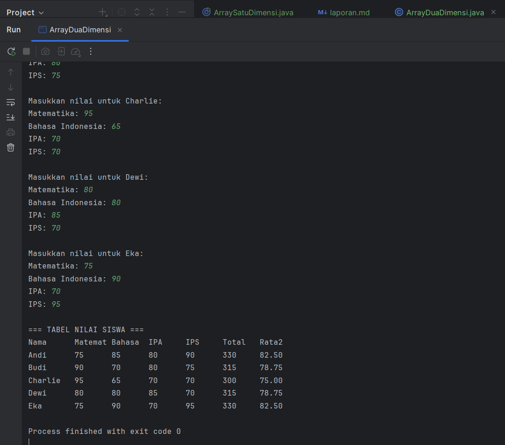

---

#### Analisa dan Pembahasan

1. Program **ArrayDuaDimensi** pada package `modul_3` digunakan untuk mengelola dan menampilkan data nilai siswa dalam beberapa mata pelajaran dengan memanfaatkan struktur array dua dimensi. Tujuan utamanya adalah memahami bagaimana array dua dimensi bekerja untuk menyimpan data dalam bentuk tabel, serta bagaimana menampilkan dan menghitung total serta rata-rata nilai setiap siswa.
2. Program dimulai dengan deklarasi beberapa array: `namaSiswa` untuk menyimpan nama lima siswa, `mataPelajaran` untuk empat mata pelajaran, dan `nilaiSiswa` sebagai array dua dimensi bertipe `int` berukuran 5×4 yang menampung nilai masing-masing siswa untuk setiap pelajaran. Struktur ini menunjukkan bahwa indeks pertama (`i`) merepresentasikan siswa, sedangkan indeks kedua (`j`) mewakili mata pelajaran.
3. Pada tahap input, program menggunakan kelas **Scanner** untuk membaca nilai dari pengguna. Dengan dua lapisan perulangan **for**, setiap siswa diminta mengisi nilai untuk seluruh mata pelajaran. Pola iterasi bersarang ini (`for` di dalam `for`) adalah implementasi umum saat bekerja dengan array dua dimensi, di mana satu loop mengakses baris dan loop lain mengakses kolom.
4. Setelah data dimasukkan, program menampilkan hasilnya dalam bentuk tabel terformat menggunakan `System.out.printf()`. Format keluaran ini memperlihatkan nama siswa diikuti oleh nilai-nilai tiap mata pelajaran, kemudian total nilai dan rata-rata. Penggunaan `String.format` dan lebar kolom tetap (`%-8s`, `%-10s`) membantu menjaga tampilan tabel agar rapi dan mudah dibaca.
5. Perhitungan total nilai dilakukan dengan menjumlahkan seluruh elemen pada baris yang sama (`nilaiSiswa[i][j]` untuk setiap `j`). Nilai rata-rata kemudian diperoleh dengan membagi total nilai dengan jumlah mata pelajaran menggunakan **casting ke tipe double** agar hasil tidak dibulatkan secara integer. Hal ini menegaskan pentingnya pemahaman tentang tipe data dalam operasi aritmetika di Java.
6. Secara keseluruhan, program ini memperlihatkan konsep fundamental dari **array dua dimensi**, yang sering digunakan untuk representasi data berbentuk tabel seperti nilai siswa, matriks, atau data statistik. Melalui implementasi ini, mahasiswa dapat memahami cara menyimpan, mengakses, dan mengolah data multidimensi secara sistematis menggunakan struktur perulangan bersarang dan format keluaran yang terstruktur.

---

#### Tugas Praktikum 1.2
1. Buatkan sebuah class baru dengan nama `latihan2.` java di dalam package `latihan`. Selesaikan tugas berikut:
   
Dari kode praktikum diatas.
- Tambahkan fitur untuk menampilkan mata pelajaran dengan nilai tertinggi untuk setiap siswa
- Hitung rata-rata nilai untuk setiap mata pelajaran

```
package latihan;

import java.util.Scanner;

public class latihan2 {
    public static void main(String[] args) {
        Scanner input = new Scanner(System.in);

        // Langkah 1: Deklarasi array 2D untuk nilai siswa (5 siswa, 4 mata pelajaran)
        String[] namaSiswa = {"Andi", "Budi", "Charlie", "Dewi", "Eka"};
        String[] mataPelajaran = {"Matematika", "Bahasa Indonesia", "IPA", "IPS"};
        int[][] nilaiSiswa = new int[5][4];

        // Langkah 2: Input nilai
        System.out.println("=== INPUT NILAI SISWA ===");
        for (int i = 0; i < namaSiswa.length; i++) {
            System.out.println("Masukkan nilai untuk " + namaSiswa[i] + ":");
            for (int j = 0; j < mataPelajaran.length; j++) {
                System.out.print(mataPelajaran[j] + ": ");
                nilaiSiswa[i][j] = input.nextInt();
            }
            System.out.println();
        }

        // Langkah 3: Menampilkan data dalam bentuk tabel
        System.out.println("=== TABEL NILAI SISWA ===");
        System.out.printf("%-10s", "Nama");
        for (String mapel : mataPelajaran) {
            System.out.printf("%-8s", mapel.substring(0, Math.min(7, mapel.length())));
        }
        System.out.printf("%-8s%-8s%-20s\n", "Total", "Rata2", "Nilai Tertinggi (Mapel)");

        for (int i = 0; i < namaSiswa.length; i++) {
            System.out.printf("%-10s", namaSiswa[i]);
            int total = 0;
            int nilaiTertinggi = nilaiSiswa[i][0];
            String mapelTertinggi = mataPelajaran[0];

            for (int j = 0; j < mataPelajaran.length; j++) {
                System.out.printf("%-8d", nilaiSiswa[i][j]);
                total += nilaiSiswa[i][j];
                if (nilaiSiswa[i][j] > nilaiTertinggi) {
                    nilaiTertinggi = nilaiSiswa[i][j];
                    mapelTertinggi = mataPelajaran[j];
                }
            }

            double rataRata = total / (double) mataPelajaran.length;
            System.out.printf("%-8d%-8.2f%-20s\n", total, rataRata, mapelTertinggi);
        }

        // Langkah 4: Menghitung rata-rata tiap mata pelajaran
        System.out.println("\n=== RATA-RATA PER MATA PELAJARAN ===");
        for (int j = 0; j < mataPelajaran.length; j++) {
            int totalMapel = 0;
            for (int i = 0; i < namaSiswa.length; i++) {
                totalMapel += nilaiSiswa[i][j];
            }
            double rataMapel = totalMapel / (double) namaSiswa.length;
            System.out.printf("%-20s : %.2f\n", mataPelajaran[j], rataMapel);
        }
    }
}
```
---

#### Screenshot Hasil
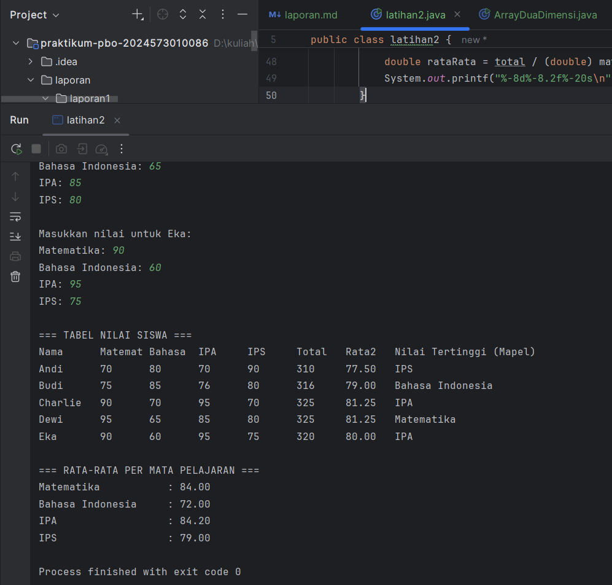

---

#### Analisa dan Pembahasan

Program ini merupakan pengembangan dari versi sebelumnya yang kini memiliki dua fitur tambahan utama:
1. Menampilkan **mata pelajaran dengan nilai tertinggi untuk setiap siswa**, dan
2. Menghitung **rata-rata nilai untuk setiap mata pelajaran**.

**Alur Program dan Penjelasan Logika**

1. **Deklarasi Variabel dan Struktur Data**
    - `String[] namaSiswa` menyimpan nama lima siswa.
    - `String[] mataPelajaran` menyimpan daftar empat mata pelajaran.
    - `int[][] nilaiSiswa` berfungsi sebagai wadah dua dimensi untuk menyimpan nilai tiap siswa terhadap tiap mata pelajaran.

2. **Input Nilai**
    - Pengguna memasukkan nilai untuk setiap kombinasi siswa dan mata pelajaran melalui `Scanner`.
    - Dua loop bersarang digunakan untuk mengisi seluruh elemen array dua dimensi.

3. **Menampilkan Data dalam Tabel**
    - Tabel ditampilkan menggunakan `System.out.printf` agar kolom rapi.
    - Setiap baris merepresentasikan satu siswa dengan nilai tiap mata pelajaran, total nilai, rata-rata, dan nama mata pelajaran dengan nilai tertinggi.

4. **Menentukan Nilai Tertinggi per Siswa**
    - Variabel `nilaiTertinggi` dan `mapelTertinggi` diinisialisasi pada setiap iterasi siswa.
    - Saat loop berjalan, jika ditemukan nilai lebih besar dari `nilaiTertinggi`, maka nilainya dan nama mata pelajarannya diperbarui.

5. **Menghitung Rata-Rata per Mata Pelajaran**
    - Program menghitung total nilai untuk setiap kolom (mata pelajaran) menggunakan loop bersarang.
    - Hasilnya dibagi dengan jumlah siswa (`namaSiswa.length`) untuk memperoleh rata-rata.
    - Rata-rata tiap mata pelajaran ditampilkan di bagian bawah hasil program.

**Analisis Kinerja dan Struktur Logika**

- **Struktur Nested Loop**  
  Dua loop bersarang sangat efektif untuk mengakses setiap elemen dalam array dua dimensi. Kompleksitas waktu program adalah `O(n*m)` di mana `n` adalah jumlah siswa dan `m` adalah jumlah mata pelajaran.

- **Penggunaan Format Output (`printf`)**  
  Format string dengan `%-10s`, `%-8d`, dan `%-20s` menjaga tampilan tabel tetap sejajar, meningkatkan keterbacaan hasil output di konsol.

- **Ketepatan Tipe Data**  
  Penggunaan `double` untuk rata-rata mencegah pembulatan integer, memastikan hasil perhitungan akurat hingga dua desimal.

- **Kelemahan Minor**
  Program belum memiliki validasi input (misalnya nilai di luar 0–100). Dalam versi lanjut, bisa ditambahkan `if` untuk mencegah kesalahan input.

---

### 2.2 Method/Function

#### Dasar Teori
Method adalah blok kode yang dapat dipanggil untuk menjalankan tugas tertentu. Method memungkinkan kita untuk:

- Menghindari pengulangan kode
- Membuat program lebih terstruktur
- Memudahkan debugging dan maintenance

Jenis Method:

- Static Method: Dapat dipanggil tanpa membuat object
- Non-static Method: Perlu membuat object terlebih dahulu
- Void Method: Tidak mengembalikan nilai
- Return Method: Mengembalikan nilai

Syntax Method:
```
java[access modifier] [static] returnType namaMethod(parameter) {
// body method
return value; // jika ada return type
}
```
---

#### 2.2.1 Praktikum : Method Dasar

Memahami cara membuat dan memanggil method dengan berbagai jenis parameter dan return type.

#### Langkah Praktikum Method Dasar
1. Buat file `MethodDasar.java`.
2. Ketik kode berikut:

```
package modul_3;

public class MethodDasar {

    // Langkah 1: Method void tanpa parameter
    public static void tampilkanHeader() {
        System.out.println("==================================");
        System.out.println("     PROGRAM KALKULATOR SEDERHANA");
        System.out.println("==================================");
    }

    // Langkah 2: Method void dengan parameter (format rapi)
    public static void tampilkanHasil(String operasi, double a, double b, double hasil) {
        System.out.printf("%.2f %s %.2f = %.2f\n", a, operasi, b, hasil);
    }

    // Langkah 3: Method dengan return value
    public static double tambah(double a, double b) {
        return a + b;
    }

    public static double kurang(double a, double b) {
        return a - b;
    }

    public static double kali(double a, double b) {
        return a * b;
    }

    public static double bagi(double a, double b) {
        if (b != 0) {
            return a / b;
        } else {
            System.out.println("Error: Pembagian dengan nol!");
            return 0;
        }
    }

    // Langkah 4: Method dengan validasi input
    public static boolean validasiAngka(double angka) {
        return !Double.isNaN(angka) && Double.isFinite(angka);
    }

    // Langkah 5: Menggunakan semua method
    public static void main(String[] args) {
        tampilkanHeader();

        double x = 15.5;
        double y = 4.2;

        if (validasiAngka(x) && validasiAngka(y)) {
            double hasilTambah = tambah(x, y);
            double hasilKurang = kurang(x, y);
            double hasilKali = kali(x, y);
            double hasilBagi = bagi(x, y);

            tampilkanHasil("+", x, y, hasilTambah);
            tampilkanHasil("-", x, y, hasilKurang);
            tampilkanHasil("*", x, y, hasilKali);
            tampilkanHasil("/", x, y, hasilBagi);
        } else {
            System.out.println("Input tidak valid.");
        }
    }
}
```
- Jalankan program dan amati bagaimana setiap method bekerja

#### Screenshot Hasil
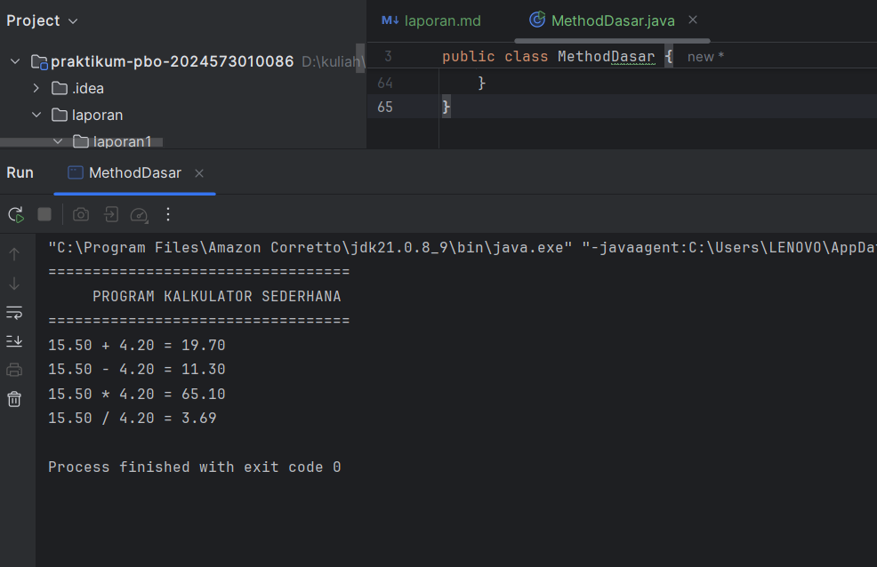

---
- Coba ubah nilai x dan y dengan nilai yang berbeda

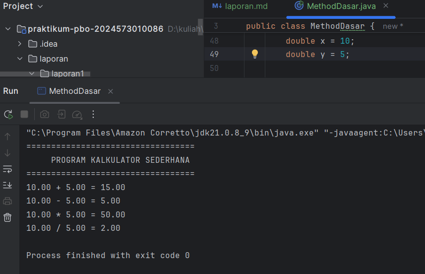

---

#### Analisa dan Pembahasan

Program **`MethodDasar`** ini bertujuan untuk memperkenalkan konsep **method (fungsi)** dalam bahasa pemrograman Java. Program ini menggabungkan berbagai jenis method: *void tanpa parameter, void dengan parameter, method dengan nilai balik (return value), dan method dengan validasi input*. Melalui contoh sederhana berupa kalkulator empat operasi dasar, mahasiswa dapat memahami bagaimana modularitas meningkatkan keteraturan dan keterbacaan kode.

**Alur Program dan Logika Utama**

1. **Deklarasi Method `tampilkanHeader()`**
    - Merupakan method *void tanpa parameter*.
    - Fungsinya hanya untuk menampilkan header atau judul program agar tampilan lebih terstruktur.
    - Menunjukkan penerapan prinsip *modularisasi tampilan output*.

2. **Method `tampilkanHasil(String operasi, double a, double b, double hasil)`**
    - Termasuk *void method dengan parameter*.
    - Menerima empat parameter untuk mencetak hasil perhitungan dengan format rapi menggunakan `printf`.
    - Penggunaan format `%.2f` memastikan angka desimal ditampilkan dengan dua digit presisi.

3. **Method `tambah`, `kurang`, `kali`, dan `bagi`**
    - Keempatnya merupakan *method dengan nilai balik (return value)* bertipe `double`.
    - Setiap method melakukan satu operasi aritmetika sesuai namanya.
    - Method `bagi()` memiliki pengkondisian untuk mencegah pembagian dengan nol — hal ini merupakan bentuk **error handling sederhana** untuk menjaga keandalan program.

4. **Method `validasiAngka(double angka)`**
    - Bertugas memeriksa apakah nilai input valid, yaitu bukan `NaN` (Not a Number) dan bukan nilai tak hingga (`Infinity`).
    - Menggunakan fungsi bawaan Java `Double.isNaN()` dan `Double.isFinite()` untuk memastikan keakuratan perhitungan.

5. **Method `main()`**
    - Menjadi titik masuk eksekusi program.
    - Memanggil semua method di atas secara terstruktur:
        - Menampilkan header.
        - Mendefinisikan dua angka (`x` dan `y`).
        - Melakukan validasi input menggunakan `validasiAngka()`.
        - Jika valid, menghitung hasil operasi dengan `tambah`, `kurang`, `kali`, dan `bagi`.
        - Menampilkan seluruh hasil perhitungan menggunakan `tampilkanHasil()`.

**Analisis Struktural dan Konseptual**

- **Prinsip Modularitas:**
  Setiap tugas logika dipisahkan ke dalam method berbeda, sehingga kode menjadi lebih mudah dibaca, diuji, dan dikelola.  
  Ini mencerminkan konsep utama dalam *pemrograman berorientasi objek (OOP)*: pemisahan tanggung jawab dan pengorganisasian kode.

- **Reusabilitas dan Fleksibilitas:**
  Dengan membuat method seperti `tambah()` atau `tampilkanHasil()`, kode dapat digunakan kembali tanpa penulisan ulang. Misalnya, operasi tambahan baru dapat ditambahkan dengan mudah tanpa mengubah struktur utama program.

- **Error Handling:**
  Validasi pada method `bagi()` dan `validasiAngka()` mencegah kesalahan umum (seperti pembagian nol atau input tidak valid), menunjukkan kesadaran akan stabilitas program.

- **Output Formatting:**
  Penggunaan `System.out.printf` memberikan tampilan hasil yang konsisten dan profesional, dibandingkan `println` biasa.

---

#### Tugas Praktikum 2.1

1. Buatkan sebuah class baru dengan nama latihan3.java di dalam package latihan. Selesaikan tugas berikut:

Dari kode praktikum diatas.
- Tambahkan method untuk operasi pangkat dan akar kuadrat
- Buat method untuk validasi operasi pembagian dengan nol

```
package latihan;

public class latihan3 {

    // Langkah 1: Method void tanpa parameter
    public static void tampilkanHeader() {
        System.out.println("==================================");
        System.out.println("     PROGRAM KALKULATOR SEDERHANA");
        System.out.println("==================================");
    }

    // Langkah 2: Method void dengan parameter
    public static void tampilkanHasil(String operasi, double a, double b, double hasil) {
        System.out.printf("%.2f %s %.2f = %.2f\n", a, operasi, b, hasil);
    }

    // Overload untuk hasil satu operand (misal akar kuadrat)
    public static void tampilkanHasil(String operasi, double a, double hasil) {
        System.out.printf("%s(%.2f) = %.2f\n", operasi, a, hasil);
    }

    // Langkah 3: Method dengan return value (operasi dasar)
    public static double tambah(double a, double b) {
        return a + b;
    }

    public static double kurang(double a, double b) {
        return a - b;
    }

    public static double kali(double a, double b) {
        return a * b;
    }

    public static double bagi(double a, double b) {
        if (validasiPembagian(b)) {
            return a / b;
        } else {
            System.out.println("Error: Pembagian dengan nol tidak diperbolehkan!");
            return 0;
        }
    }

    // Tambahan: Method pangkat dan akar kuadrat
    public static double pangkat(double a, double b) {
        return Math.pow(a, b);
    }

    public static double akarKuadrat(double a) {
        if (a < 0) {
            System.out.println("Error: Tidak dapat menghitung akar dari bilangan negatif!");
            return 0;
        }
        return Math.sqrt(a);
    }

    // Langkah 4: Validasi input umum
    public static boolean validasiAngka(double angka) {
        return !Double.isNaN(angka) && Double.isFinite(angka);
    }

    // Tambahan: Validasi pembagian dengan nol
    public static boolean validasiPembagian(double pembagi) {
        return pembagi != 0;
    }

    // Langkah 5: Main method (penggunaan semua method)
    public static void main(String[] args) {
        tampilkanHeader();

        double x = 15;
        double y = 10;

        if (validasiAngka(x) && validasiAngka(y)) {
            double hasilTambah = tambah(x, y);
            double hasilKurang = kurang(x, y);
            double hasilKali = kali(x, y);
            double hasilBagi = bagi(x, y);
            double hasilPangkat = pangkat(x, y);
            double hasilAkar = akarKuadrat(x);

            tampilkanHasil("+", x, y, hasilTambah);
            tampilkanHasil("-", x, y, hasilKurang);
            tampilkanHasil("*", x, y, hasilKali);
            tampilkanHasil("/", x, y, hasilBagi);
            tampilkanHasil("^", x, y, hasilPangkat);
            tampilkanHasil("√", x, hasilAkar);
        } else {
            System.out.println("Input tidak valid.");
        }
    }
}
```

#### Screenshot Hasil
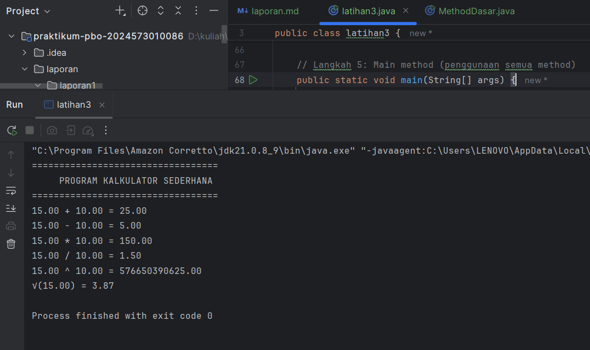

---

#### Analisa dan Pembahasan

1. Program `latihan3.java` merupakan implementasi kalkulator sederhana menggunakan konsep modularisasi dan pemanggilan method di Java. Tujuan utamanya adalah melatih penggunaan method dengan dan tanpa parameter, method dengan nilai kembalian (`return value`), overloading method, validasi input, serta penerapan struktur program yang terorganisir. Program ini menampilkan operasi dasar matematika seperti penjumlahan, pengurangan, perkalian, pembagian, pangkat, dan akar kuadrat.
2. Program terdiri dari beberapa bagian utama. Pertama, method `tampilkanHeader()` digunakan untuk menampilkan judul program agar tampilan lebih informatif. Method ini tidak memiliki parameter dan tidak mengembalikan nilai (`void`). Kedua, method `tampilkanHasil()` dibuat dalam dua versi (overloading): satu untuk dua operand, dan satu lagi untuk satu operand (seperti akar kuadrat). Overloading ini menunjukkan fleksibilitas method dengan parameter berbeda tanpa perlu mengganti nama fungsi.
3. Selanjutnya, terdapat method operasi matematika dasar `tambah()`, `kurang()`, dan `kali()` yang masing-masing mengembalikan hasil perhitungan. Untuk pembagian, digunakan method `bagi()` yang disertai validasi agar tidak terjadi error saat pembagian dengan nol. Apabila pengguna mencoba membagi dengan nol, program akan menampilkan pesan kesalahan dan mengembalikan nilai 0, bukan menyebabkan program berhenti mendadak.
4. Program juga menambahkan dua operasi matematika tambahan, yaitu `pangkat()` dan `akarKuadrat()`. Keduanya memanfaatkan library `Math` dari Java (`Math.pow()` dan `Math.sqrt()`). Pada operasi akar kuadrat, terdapat validasi untuk mencegah perhitungan akar dari bilangan negatif karena akan menghasilkan nilai tidak terdefinisi (`NaN`).
5. Selain itu, program menyertakan dua fungsi validasi penting, yaitu `validasiAngka()` untuk memastikan nilai bukan NaN atau tak hingga, dan `validasiPembagian()` untuk memastikan pembagi tidak bernilai nol. Validasi ini meningkatkan keandalan dan keamanan program, terutama ketika menerima input dinamis di masa depan.
6. Method `main()` berfungsi sebagai titik eksekusi utama. Di dalamnya, dua nilai (x = 15 dan y = 10) diuji pada seluruh operasi matematika. Sebelum dilakukan perhitungan, nilai tersebut terlebih dahulu divalidasi. Jika valid, hasil operasi ditampilkan secara berurutan menggunakan `printf()` agar output lebih rapi. Jika tidak valid, program menampilkan pesan kesalahan “Input tidak valid.”
7. Secara teknis, program ini menggunakan paradigma pemrograman prosedural dengan modularisasi fungsi. Penerapan method overloading memperlihatkan pemanfaatan konsep polymorphism pada level dasar. Validasi input mencegah kesalahan logika seperti pembagian nol atau akar negatif. Library `Math` digunakan untuk perhitungan ilmiah sehingga kode tetap ringkas dan efisien. Kelebihan utama program ini adalah kerapian struktur dan kemudahan membaca kode. Namun, kekurangannya adalah nilai masih bersifat statis karena belum ada input dari pengguna.

---

#### 2.2.2 Praktikum : Method Dengan Array

Memahami cara menggunakan method untuk memproses array.

#### Langkah Praktikum Method dengan Array
1. Buat file `ArrayMethod.java`.
2. Ketik kode berikut:

```
package modul_3;

import java.util.Scanner;

public class ArrayMethod {

    // Method untuk meminta input array
    public static int[] inputArray(int ukuran) {
        Scanner input = new Scanner(System.in);
        int[] array = new int[ukuran];

        System.out.println("Masukkan " + ukuran + " angka:");
        for (int i = 0; i < ukuran; i++) {
            System.out.print("Angka ke-" + (i + 1) + ": ");
            array[i] = input.nextInt();
        }
        return array;
    }

    // Method untuk menampilkan array
    public static void tampilkanArray(int[] array) {
        System.out.print("Array: [");
        for (int i = 0; i < array.length; i++) {
            System.out.print(array[i]);
            if (i < array.length - 1) {
                System.out.print(", ");
            }
        }
        System.out.println("]");
    }

    // Method untuk mencari nilai maksimum
    public static int cariMaksimum(int[] array) {
        int maks = array[0]; // Asumsikan elemen pertama adalah yang terbesar
        for (int i = 1; i < array.length; i++) {
            if (array[i] > maks) {
                maks = array[i];
            }
        }
        return maks;
    }


    // Method untuk mencari nilai minimum
    public static int cariMinimum(int[] array) {
        int min = array[0]; // Asumsikan elemen pertama adalah yang terkecil
        for (int i = 1; i < array.length; i++) {
            if (array[i] < min) {
                min = array[i];
            }
        }
        return min;
    }

    // Method untuk menghitung rata-rata
    public static double hitungRataRata(int[] array) {
        int total = 0;
        for (int nilai : array) {
            total += nilai;
        }
        return (double) total / array.length;
    }


    // Method untuk mengurutkan array
    public static int[] urutkanArray(int[] array) {
        int[] arrayBaru = array.clone();

        for (int i = 0; i < arrayBaru.length - 1; i++) {
            for (int j = 0; j < arrayBaru.length - 1 - i; j++) {
                if (arrayBaru[j] > arrayBaru[j + 1]) {
                    // Tukar posisi
                    int temp = arrayBaru[j];
                    arrayBaru[j] = arrayBaru[j + 1];
                    arrayBaru[j + 1] = temp;
                }
            }
        }
        return arrayBaru;
    }

    public static void main(String[] args) {
        System.out.println("=== PROGRAM ANALISIS ARRAY ===");

        int[] data = inputArray(5);

        System.out.println("\n=== HASIL ANALISIS ===");
        tampilkanArray(data);

        System.out.println("Nilai Maksimum : " + cariMaksimum(data));
        System.out.println("Nilai Minimum  : " + cariMinimum(data));
        System.out.printf("Rata-rata      : %.2f\n", hitungRataRata(data));

        int[] dataUrut = urutkanArray(data);
        System.out.print("Array setelah diurutkan: ");
        tampilkanArray(dataUrut);
    }
}
```
- Jalankan program dan test dengan berbagai input
- Amati bagaimana setiap method memproses array

---

#### Screenshot Hasil
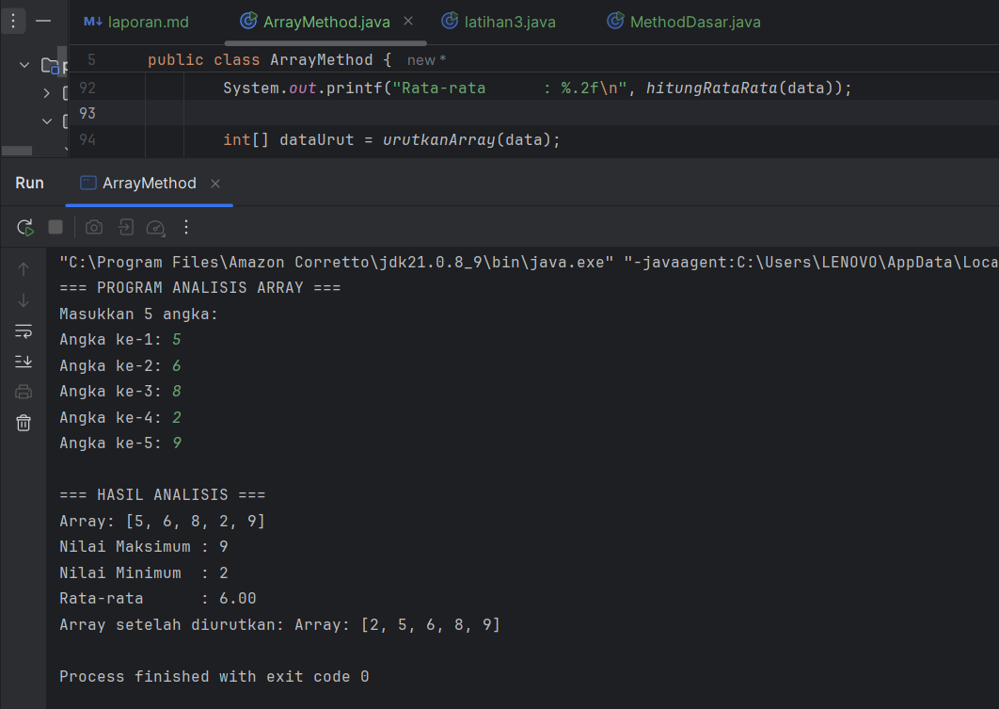

---

#### Analisa dan Pembahasan

Program `ArrayMethod.java` adalah implementasi latihan pemrograman Java yang berfokus pada **penggunaan array dan method** secara modular. Tujuan utama program ini adalah mengolah sekumpulan data numerik — mulai dari input, penampilan, pencarian nilai maksimum dan minimum, penghitungan rata-rata, hingga pengurutan nilai. Program ini menunjukkan penerapan prinsip _modular programming_ dan _code reusability_ dalam bentuk method yang terpisah, sehingga lebih mudah dibaca, diuji, dan dikembangkan.

**1. Struktur dan Fungsi Program**

Program berada dalam package `modul_3` dan terdiri dari beberapa method utama:

- **`inputArray(int ukuran)`**  
  Method ini bertugas menerima input dari pengguna dengan menggunakan objek `Scanner`.  
  Ukuran array ditentukan oleh parameter yang diberikan. Setiap elemen diisi melalui perulangan `for`, kemudian dikembalikan sebagai array integer.

- **`tampilkanArray(int[] array)`**  
  Menampilkan seluruh elemen array dalam format `[a, b, c, ...]`.  
  Penggunaan kondisi `if` memastikan tidak ada koma berlebih di akhir tampilan.

- **`cariMaksimum(int[] array)`** dan **`cariMinimum(int[] array)`**  
  Masing-masing digunakan untuk mencari nilai terbesar dan terkecil dari elemen array.  
  Implementasi dilakukan dengan asumsi awal bahwa elemen pertama (`array[0]`) adalah nilai acuan, lalu dibandingkan secara iteratif.

- **`hitungRataRata(int[] array)`**  
  Menghitung rata-rata seluruh elemen array dengan cara menjumlahkan semua nilai, kemudian membaginya dengan panjang array (`array.length`).  
  Hasil dikembalikan dalam bentuk `double` agar mendukung angka desimal.

- **`urutkanArray(int[] array)`**  
  Mengurutkan array menggunakan **algoritma Bubble Sort**.  
  Sebelum pengurutan, array asli dikloning ke `arrayBaru` agar data awal tidak berubah (_immutability principle_).  
  Nilai yang lebih besar ditukar secara bertahap hingga seluruh elemen terurut naik.

- **`main()`**  
  Method utama program yang memanggil semua fungsi di atas.  
  Program dimulai dengan menampilkan header, lalu menerima input 5 angka dari pengguna.  
  Setelah itu, hasil analisis seperti nilai maksimum, minimum, rata-rata, dan array terurut ditampilkan.

**2. Alur Logika Program**

1. Program menampilkan judul `=== PROGRAM ANALISIS ARRAY ===`.
2. Pengguna diminta memasukkan 5 angka integer.
3. Program menampilkan seluruh angka yang dimasukkan.
4. Program menghitung dan menampilkan:
    - Nilai maksimum
    - Nilai minimum
    - Nilai rata-rata (dengan dua angka di belakang koma)
5. Program mengurutkan array menggunakan algoritma Bubble Sort.
6. Hasil pengurutan ditampilkan kembali untuk dibandingkan dengan data awal.

**3. Analisis Teknis**

- **Modularisasi Kode**  
  Setiap operasi dikelompokkan dalam method terpisah, memudahkan debugging dan pemeliharaan.  
  Ini juga mempermudah pemanggilan ulang fungsi tanpa mengulang kode (DRY principle).

- **Efisiensi Algoritmik**  
  Bubble Sort bukan algoritma paling efisien (`O(n²)`), namun dipilih karena mudah dipahami dan cocok untuk dataset kecil.  
  Untuk data besar, sebaiknya diganti dengan algoritma yang lebih efisien seperti QuickSort atau MergeSort.

- **Validitas dan Keamanan Input**  
  Karena menggunakan `Scanner`, program masih bergantung pada input numerik dari pengguna.  
  Tidak ada pengecekan kesalahan (`InputMismatchException`), jadi input non-angka bisa menyebabkan error — ini bisa dikembangkan lebih lanjut.

- **Pemakaian Memori**  
  Penggunaan `clone()` pada array menghindari mutasi data asli, yang merupakan praktik baik dalam pengolahan data agar hasil analisis tetap akurat.

**4. Kesimpulan**

Program `ArrayMethod.java` secara efektif menunjukkan konsep dasar pengolahan array menggunakan pendekatan modular.  
Struktur fungsi yang terpisah menjadikan kode mudah diperluas dan dipelihara.  
Semua operasi — mulai dari input, analisis data, hingga pengurutan — berjalan sesuai urutan logis dan menghasilkan keluaran yang mudah dipahami.

---

#### Tugas Praktikum 2.2

1. Buatkan sebuah class baru dengan nama latihan4.java di dalam package latihan. Selesaikan tugas berikut:

Dari kode praktikum diatas.
- Tambahkan method untuk mencari nilai tertentu dalam array
- Buat method untuk menghitung median dari array yang sudah diurutkan


```
package modul_3.latihan;

import java.util.Scanner;

public class latihan4 {

    // Method untuk meminta input array
    public static int[] inputArray(int ukuran) {
        Scanner input = new Scanner(System.in);
        int[] array = new int[ukuran];

        System.out.println("Masukkan " + ukuran + " angka:");
        for (int i = 0; i < ukuran; i++) {
            System.out.print("Angka ke-" + (i + 1) + ": ");
            array[i] = input.nextInt();
        }
        return array;
    }

    // Method untuk menampilkan array
    public static void tampilkanArray(int[] array) {
        System.out.print("Array: [");
        for (int i = 0; i < array.length; i++) {
            System.out.print(array[i]);
            if (i < array.length - 1) {
                System.out.print(", ");
            }
        }
        System.out.println("]");
    }

    // Method untuk mencari nilai maksimum
    public static int cariMaksimum(int[] array) {
        int maks = array[0]; // Asumsikan elemen pertama adalah yang terbesar
        for (int i = 1; i < array.length; i++) {
            if (array[i] > maks) {
                maks = array[i];
            }
        }
        return maks;
    }

    // Method untuk mencari nilai minimum
    public static int cariMinimum(int[] array) {
        int min = array[0]; // Asumsikan elemen pertama adalah yang terkecil
        for (int i = 1; i < array.length; i++) {
            if (array[i] < min) {
                min = array[i];
            }
        }
        return min;
    }

    // Method untuk menghitung rata-rata
    public static double hitungRataRata(int[] array) {
        int total = 0;
        for (int nilai : array) {
            total += nilai;
        }
        return (double) total / array.length;
    }

    // Method untuk mengurutkan array (Bubble Sort)
    public static int[] urutkanArray(int[] array) {
        int[] arrayBaru = array.clone();

        for (int i = 0; i < arrayBaru.length - 1; i++) {
            for (int j = 0; j < arrayBaru.length - 1 - i; j++) {
                if (arrayBaru[j] > arrayBaru[j + 1]) {
                    // Tukar posisi
                    int temp = arrayBaru[j];
                    arrayBaru[j] = arrayBaru[j + 1];
                    arrayBaru[j + 1] = temp;
                }
            }
        }
        return arrayBaru;
    }

    // Method baru: mencari nilai tertentu dalam array
    public static boolean cariNilai(int[] array, int nilaiCari) {
        for (int nilai : array) {
            if (nilai == nilaiCari) {
                return true; // Nilai ditemukan
            }
        }
        return false; // Nilai tidak ditemukan
    }

    // Method baru: menghitung median dari array yang sudah diurutkan
    public static double hitungMedian(int[] arrayUrut) {
        int panjang = arrayUrut.length;
        if (panjang % 2 == 1) {
            // Jika jumlah elemen ganjil, ambil elemen tengah
            return arrayUrut[panjang / 2];
        } else {
            // Jika genap, ambil rata-rata dari dua elemen tengah
            int tengahKiri = arrayUrut[(panjang / 2) - 1];
            int tengahKanan = arrayUrut[panjang / 2];
            return (tengahKiri + tengahKanan) / 2.0;
        }
    }

    public static void main(String[] args) {
        Scanner input = new Scanner(System.in);
        System.out.println("=== PROGRAM ANALISIS ARRAY ===");

        int[] data = inputArray(5);

        System.out.println("\n=== HASIL ANALISIS ===");
        tampilkanArray(data);

        System.out.println("Nilai Maksimum : " + cariMaksimum(data));
        System.out.println("Nilai Minimum  : " + cariMinimum(data));
        System.out.printf("Rata-rata      : %.2f\n", hitungRataRata(data));

        int[] dataUrut = urutkanArray(data);
        System.out.print("Array setelah diurutkan: ");
        tampilkanArray(dataUrut);

        // Cari nilai tertentu
        System.out.print("\nMasukkan nilai yang ingin dicari: ");
        int nilaiCari = input.nextInt();
        boolean ditemukan = cariNilai(data, nilaiCari);
        if (ditemukan) {
            System.out.println("Nilai " + nilaiCari + " ditemukan dalam array.");
        } else {
            System.out.println("Nilai " + nilaiCari + " tidak ditemukan dalam array.");
        }

        // Hitung median
        double median = hitungMedian(dataUrut);
        System.out.printf("Median dari array: %.2f\n", median);
    }
}
```

#### Screenshot Hasil
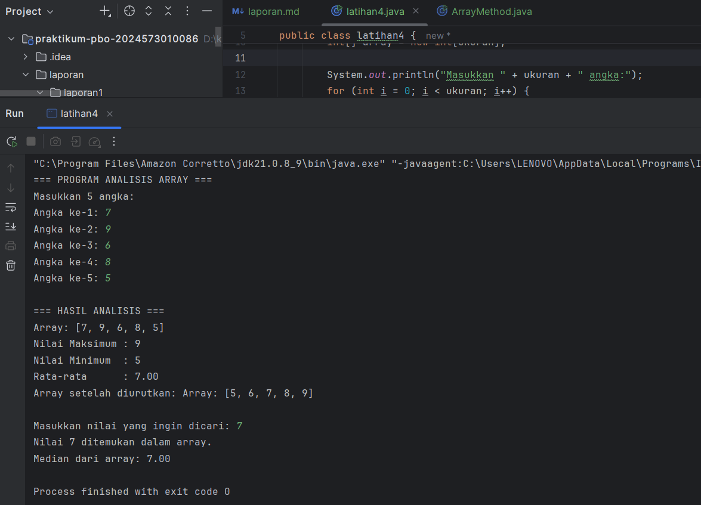

---

#### Analisa dan Pembahasan

**Analisa Struktur dan Fungsi Program**

Berikut penjelasan fungsi utama dalam program:

- **`inputArray()`**  
  Digunakan untuk meminta input sejumlah angka dari pengguna dan menyimpannya ke dalam array.

- **`tampilkanArray()`**  
  Menampilkan seluruh elemen array dalam format `[a, b, c, d]`.

- **`cariMaksimum()` dan `cariMinimum()`**  
  Mencari nilai terbesar dan terkecil dalam array menggunakan perbandingan berulang antar elemen.

- **`hitungRataRata()`**  
  Menghitung nilai rata-rata dari seluruh elemen array menggunakan rumus:  
  \[
  \text{Rata-rata} = \frac{\sum nilai}{n}
  \]

- **`urutkanArray()`**  
  Mengurutkan array menggunakan algoritma **Bubble Sort** dengan kompleksitas waktu O(n²).

- **`cariNilai()`**  
  Melakukan pencarian **linear search** untuk memeriksa apakah suatu nilai tertentu terdapat dalam array.

- **`hitungMedian()`**  
  Menghitung nilai median dari array yang sudah diurutkan. Jika jumlah elemen ganjil, median adalah elemen tengah. Jika genap, median adalah rata-rata dua elemen tengah.

**Pembahasan Logika Program**

1. **Input dan Tampilan Data**  
   Program memulai dengan meminta input dari pengguna sebanyak `n` angka, kemudian menampilkannya kembali dalam bentuk array agar pengguna dapat memverifikasi data yang dimasukkan.

2. **Pencarian Nilai Maksimum dan Minimum**  
   Elemen pertama diasumsikan sebagai acuan, lalu dibandingkan satu per satu dengan elemen lain untuk menemukan nilai tertinggi dan terendah.

3. **Penghitungan Rata-Rata**  
   Program menjumlahkan seluruh elemen, kemudian membaginya dengan panjang array (`array.length`). Nilai hasilnya dikonversi ke `double` agar presisi lebih baik.

4. **Pengurutan Data (Bubble Sort)**  
   Data diurutkan dari kecil ke besar dengan membandingkan pasangan elemen berurutan dan menukarnya bila tidak urut.  
   Meskipun sederhana, algoritma ini cocok untuk latihan dasar manipulasi array.

5. **Pencarian Nilai Tertentu (Linear Search)**  
   Program meminta pengguna memasukkan nilai yang ingin dicari, lalu menelusuri array dari awal sampai akhir.  
   Jika ditemukan, program menampilkan pesan bahwa nilai tersebut ada dalam array.

6. **Perhitungan Median**  
   Setelah array diurutkan, median dihitung berdasarkan jumlah elemen:
    - Jika jumlah elemen **ganjil**, median adalah elemen di posisi tengah.
    - Jika **genap**, median adalah rata-rata dari dua elemen tengah.

**Analisa Kelebihan Program**

- Struktur **modular** memudahkan pembacaan dan pemeliharaan kode.
- Proses **interaktif** dengan pengguna melalui input langsung.
- Mampu melakukan berbagai analisis statistik dasar (maksimum, minimum, rata-rata, median).
- Mudah dikembangkan untuk fitur tambahan di masa depan.

**Keterbatasan Program**

- Tidak ada **validasi input**, sehingga jika pengguna memasukkan huruf atau karakter non-numerik, program akan error.
- Penggunaan **Bubble Sort** dan **Linear Search** kurang efisien untuk dataset besar.
- Median hanya dihitung dari array yang sudah diurutkan, bukan dari data mentah.
- Data tidak tersimpan secara permanen (hilang setelah program berhenti).

**Kesimpulan analisis**

Program ini berhasil menerapkan dasar konsep **array**, **looping**, **percabangan**, serta **pemrograman modular** dalam Java.  
Dengan kombinasi berbagai operasi seperti pengurutan, pencarian, dan perhitungan statistik sederhana, program ini menjadi latihan yang sangat baik untuk memahami logika algoritmik dasar.  
Untuk pengembangan lebih lanjut, program dapat ditingkatkan dengan validasi input, penggunaan algoritma yang lebih efisien seperti *Quick Sort* atau *Binary Search*, serta penambahan fitur penyimpanan data ke file.

---

### 2.3 String dan Manipulasi String

#### Dasar Teori

String adalah tipe data yang menyimpan rangkaian karakter. Di Java, String adalah object yang memiliki banyak method built-in untuk manipulasi teks.

**Karakteristik String di Java:**

- String bersifat immutable (tidak dapat diubah)
- Setiap operasi String menghasilkan String baru
- Java menyediakan banyak method untuk manipulasi String

**Method String yang Penting:**

- `length():` mendapatkan panjang string
- `charAt():` mendapatkan karakter pada indeks tertentu
- `substring():` mengambil bagian string
- `toLowerCase() / toUpperCase():` mengubah case
- `contains():` mengecek apakah string mengandung substring
- `replace():` mengganti karakter/substring

---

#### 2.3.1 Praktikum : Manipulasi String Dasar

Memahami berbagai method manipulasi string dan penggunaannya.

#### Langkah Praktikum Manipulasi String Dasar
1. Buat file `StringDasar.java`.
2. ketik kode berikut:

```
package modul_3;

import java.util.Scanner;

public class StringDasar {

    public static void analisisString(String teks) {
        System.out.println("\n=== ANALISIS STRING ===");
        System.out.println("Teks asli: \"" + teks + "\"");
        System.out.println("Panjang string: " + teks.length());
        System.out.println("Karakter pertama: " + teks.charAt(0));
        System.out.println("Karakter terakhir: " + teks.charAt(teks.length() - 1));
        System.out.println("Uppercase: " + teks.toUpperCase());
        System.out.println("lowercase: " + teks.toLowerCase());

        // Menghitung jumlah kata
        String[] kata = teks.trim().split("\\s+");
        System.out.println("Jumlah kata: " + kata.length);

        // Menghitung jumlah vokal
        int jumlahVokal = hitungVokal(teks);
        System.out.println("Jumlah vokal: " + jumlahVokal);
    }

    public static int hitungVokal(String teks) {
        String vokal = "aeiouAEIOU";
        int count = 0;
        for (int i = 0; i < teks.length(); i++) {
            if (vokal.contains(String.valueOf(teks.charAt(i)))) {
                count++;
            }
        }
        return count;
    }

    public static String reverseString(String teks) {
        StringBuilder reversed = new StringBuilder();
        for (int i = teks.length() - 1; i >= 0; i--) {
            reversed.append(teks.charAt(i));
        }
        return reversed.toString();
    }

    public static boolean isPalindrome(String teks) {
        String clean = teks.replaceAll("[^a-zA-Z0-9]", "").toLowerCase();
        String reversed = new StringBuilder(clean).reverse().toString();
        return clean.equals(reversed);
    }

    public static void main(String[] args) {
        Scanner input = new Scanner(System.in);

        System.out.println("=== PROGRAM MANIPULASI STRING ===");
        System.out.print("Masukkan sebuah kalimat: ");
        String kalimat = input.nextLine();

        // Analisis dasar
        analisisString(kalimat);

        // String terbalik
        System.out.println("\nString terbalik: \"" + reverseString(kalimat) + "\"");

        // Cek Palindrom
        if (isPalindrome(kalimat)) {
            System.out.println("String ini adalah palindrom.");
        } else {
            System.out.println("String ini bukan palindrom.");
        }

        // Pencarian substring
        System.out.println("\nMasukkan kata yang ingin dicari:");
        String cari = input.nextLine();

        if (kalimat.toLowerCase().contains(cari.toLowerCase())) {
            System.out.println("Kata \"" + cari + "\" ditemukan dalam kalimat.");
            int posisi = kalimat.toLowerCase().indexOf(cari.toLowerCase());
            System.out.println("Posisi pertama: " + posisi);
        } else {
            System.out.println("Kata \"" + cari + "\" tidak ditemukan dalam kalimat.");
        }
    }
}
```
- Jalankan program dan test dengan berbagai input
- Coba input berupa palindrome seperti "Kasur rusak" atau "Madam"

#### Screenshot Hasil
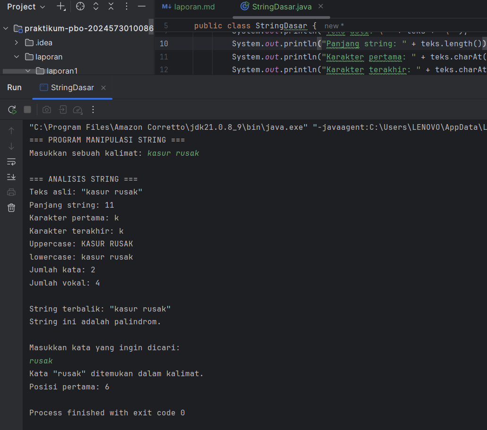

---

#### Analisa dan Pembahasan

**Analisa Struktur dan Fungsi Program**

**1. `analisisString(String teks)`**
Method ini berfungsi untuk melakukan analisis dasar terhadap teks yang diinput pengguna, meliputi:
- Panjang string (`teks.length()`),
- Karakter pertama dan terakhir (`charAt(0)` dan `charAt(length - 1)`),
- Perubahan huruf ke **uppercase** dan **lowercase**,
- Jumlah kata (menggunakan `split("\\s+")`),
- Jumlah huruf vokal (menggunakan method `hitungVokal()`).

**2. `hitungVokal(String teks)`**
Method ini menghitung jumlah huruf vokal (`a, i, u, e, o`) dalam string.  
Proses dilakukan dengan memeriksa setiap karakter apakah termasuk dalam kumpulan huruf vokal (`vokal.contains(...)`).  
Semua karakter diperiksa satu per satu menggunakan perulangan `for`.

**3. `reverseString(String teks)`**
Method ini membalik urutan karakter dari string input menggunakan **`StringBuilder`** dan perulangan dari belakang ke depan.  
Hasilnya berupa string baru dengan urutan karakter terbalik.

**4. `isPalindrome(String teks)`**
Method ini memeriksa apakah string yang dimasukkan merupakan **palindrom**, yaitu teks yang sama jika dibaca dari depan maupun belakang.  
Langkah-langkahnya:
- Menghapus karakter non-alfanumerik (`replaceAll("[^a-zA-Z0-9]", "")`),
- Mengubah ke huruf kecil (`toLowerCase()`),
- Membandingkan dengan hasil string yang dibalik.

**5. `main(String[] args)`**
Bagian ini mengatur alur utama program:
1. Pengguna diminta memasukkan kalimat.
2. Program melakukan analisis teks dasar melalui `analisisString()`.
3. Menampilkan hasil string terbalik dengan `reverseString()`.
4. Mengecek apakah kalimat termasuk **palindrom**.
5. Meminta pengguna memasukkan kata untuk dicari dalam kalimat.
6. Melakukan pencarian substring menggunakan `contains()` dan `indexOf()`.

**Pembahasan Logika Program**

1. **Input dan Analisis Dasar**  
   Program pertama-tama menerima input berupa kalimat, kemudian menganalisis berbagai atributnya (panjang, huruf pertama/terakhir, huruf besar/kecil, jumlah kata, jumlah vokal).

2. **Manipulasi String Terbalik**  
   Setelah analisis, program membalik teks untuk menunjukkan kemampuan manipulasi karakter secara manual.

3. **Deteksi Palindrom**  
   Program melakukan pembersihan teks dari karakter non-huruf dan spasi, lalu membandingkan versi normal dan terbalik untuk menentukan apakah kalimat merupakan palindrom.

4. **Pencarian Substring**  
   Program kemudian meminta pengguna mengetik kata tertentu, memeriksa keberadaannya dalam kalimat menggunakan metode **case-insensitive search**, dan menampilkan posisi kemunculan pertama.

**Analisa Kelebihan Program**

- Menggunakan berbagai konsep dasar manipulasi string di Java secara komprehensif.
- Menunjukkan penggunaan method built-in (`length`, `charAt`, `toUpperCase`, `split`, `contains`, `indexOf`).
- Adanya fitur **palindrom** dan **reverse string** memperlihatkan logika pemrosesan manual yang baik.
- Dapat menganalisis teks dari berbagai jenis input pengguna.

**Keterbatasan Program**

- Tidak ada validasi untuk input kosong — jika pengguna tidak mengetik apa pun, program dapat menimbulkan `StringIndexOutOfBoundsException`.
- Program hanya menghitung vokal huruf Latin (tidak termasuk huruf dengan aksen seperti `é` atau `ô`).
- Pencarian substring hanya menampilkan posisi pertama, tidak semua posisi kemunculan kata.
- Palindrom hanya mempertimbangkan huruf dan angka, bukan spasi atau tanda baca secara semantik.

**Kesimpulan analisis**

Program `StringDasar` berhasil mengimplementasikan berbagai operasi manipulasi string dalam bahasa Java dengan struktur modular dan jelas.  
Dengan memanfaatkan kombinasi antara **fungsi bawaan Java** dan **logika perulangan manual**, program ini dapat:
- Melakukan analisis teks sederhana,
- Mengetahui karakteristik string,
- Melakukan transformasi serta pencarian teks.

---

#### Tugas Praktikum 3.1

Buatkan sebuah class baru dengan nama latihan5.java di dalam package latihan. Selesaikan tugas berikut:

Dari kode praktikum diatas.
- Tambahkan fitur untuk menghitung jumlah konsonan
- Buat method untuk mengubah string menjadi pascal case (setiap kata diawali huruf besar)

```
package modul_3.latihan;

import java.util.Scanner;

public class latihan5 {

    public static void analisisString(String teks) {
        System.out.println("\n=== ANALISIS STRING ===");
        System.out.println("Teks asli: \"" + teks + "\"");
        System.out.println("Panjang string: " + teks.length());
        System.out.println("Karakter pertama: " + teks.charAt(0));
        System.out.println("Karakter terakhir: " + teks.charAt(teks.length() - 1));
        System.out.println("Uppercase: " + teks.toUpperCase());
        System.out.println("lowercase: " + teks.toLowerCase());

        // Menghitung jumlah kata
        String[] kata = teks.trim().split("\\s+");
        System.out.println("Jumlah kata: " + kata.length);

        // Menghitung jumlah vokal dan konsonan
        int jumlahVokal = hitungVokal(teks);
        int jumlahKonsonan = hitungKonsonan(teks);

        System.out.println("Jumlah vokal: " + jumlahVokal);
        System.out.println("Jumlah konsonan: " + jumlahKonsonan);
    }

    public static int hitungVokal(String teks) {
        String vokal = "aeiouAEIOU";
        int count = 0;
        for (int i = 0; i < teks.length(); i++) {
            if (vokal.contains(String.valueOf(teks.charAt(i)))) {
                count++;
            }
        }
        return count;
    }

    public static int hitungKonsonan(String teks) {
        String huruf = "abcdefghijklmnopqrstuvwxyzABCDEFGHIJKLMNOPQRSTUVWXYZ";
        String vokal = "aeiouAEIOU";
        int count = 0;
        for (int i = 0; i < teks.length(); i++) {
            char c = teks.charAt(i);
            if (huruf.indexOf(c) != -1 && vokal.indexOf(c) == -1) {
                count++;
            }
        }
        return count;
    }

    public static String reverseString(String teks) {
        StringBuilder reversed = new StringBuilder();
        for (int i = teks.length() - 1; i >= 0; i--) {
            reversed.append(teks.charAt(i));
        }
        return reversed.toString();
    }

    public static boolean isPalindrome(String teks) {
        String clean = teks.replaceAll("[^a-zA-Z0-9]", "").toLowerCase();
        String reversed = new StringBuilder(clean).reverse().toString();
        return clean.equals(reversed);
    }

    public static String toPascalCase(String teks) {
        String[] kata = teks.trim().split("\\s+");
        StringBuilder hasil = new StringBuilder();
        for (String k : kata) {
            if (k.length() > 0) {
                hasil.append(Character.toUpperCase(k.charAt(0)));
                if (k.length() > 1) {
                    hasil.append(k.substring(1).toLowerCase());
                }
                hasil.append(" ");
            }
        }
        return hasil.toString().trim();
    }

    public static void main(String[] args) {
        Scanner input = new Scanner(System.in);

        System.out.println("=== PROGRAM MANIPULASI STRING ===");
        System.out.print("Masukkan sebuah kalimat: ");
        String kalimat = input.nextLine();

        // Analisis dasar
        analisisString(kalimat);

        // String terbalik
        System.out.println("\nString terbalik: \"" + reverseString(kalimat) + "\"");

        // Cek Palindrom
        if (isPalindrome(kalimat)) {
            System.out.println("String ini adalah palindrom.");
        } else {
            System.out.println("String ini bukan palindrom.");
        }

        // Pascal Case
        System.out.println("\nString dalam format Pascal Case: \"" + toPascalCase(kalimat) + "\"");

        // Pencarian substring
        System.out.println("\nMasukkan kata yang ingin dicari:");
        String cari = input.nextLine();

        if (kalimat.toLowerCase().contains(cari.toLowerCase())) {
            System.out.println("Kata \"" + cari + "\" ditemukan dalam kalimat.");
            int posisi = kalimat.toLowerCase().indexOf(cari.toLowerCase());
            System.out.println("Posisi pertama: " + posisi);
        } else {
            System.out.println("Kata \"" + cari + "\" tidak ditemukan dalam kalimat.");
        }
    }
}
```
#### Screenshot Hasil
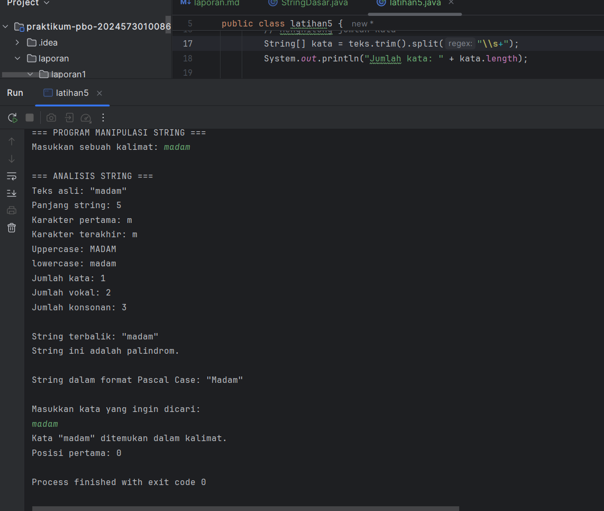

---

#### Analisa dan Pembahasan

1. Program `latihan5` adalah program manipulasi teks berbasis Java yang melakukan analisis dasar terhadap sebuah kalimat input dan telah dikembangkan dengan dua fitur tambahan: **penghitungan jumlah konsonan** dan **konversi ke Pascal Case**. Secara umum program melakukan: pembacaan input, analisis karakter (panjang, karakter pertama/terakhir), transformasi (uppercase/lowercase, reverse), pemeriksaan palindrom, pencarian substring, serta perhitungan statistik teks (jumlah kata, vokal, konsonan) dan format ulang teks (Pascal Case).
2. Implementasi fitur **hitung konsonan** menggunakan iterasi karakter per karakter: setiap karakter diperiksa apakah merupakan huruf (`Character.isLetter`) dan bukan huruf vokal (`aeiouAEIOU`). Pendekatan ini memastikan spasi, angka, dan simbol tidak dihitung, sehingga yang terhitung hanyalah huruf konsonan murni. Kekuatan pendekatan ini adalah sederhana dan tepat untuk alfabet latin; kelemahannya muncul pada teks berisi huruf beraksen atau karakter Unicode non-ASCI (mis. é, ñ) yang tidak tercakup jika pemeriksaan hanya mengandalkan rentang A–Z/a–z.
3. Fitur **Pascal Case** diimplementasikan dengan memecah kalimat berdasarkan spasi (`split("\\s+")`), menormalisasi tiap kata ke huruf kecil, lalu mengkapitalisasi huruf pertama setiap kata dan menggabungkannya kembali. Hasilnya adalah teks dengan setiap kata diawali huruf besar dan sisanya huruf kecil — berguna untuk penamaan kelas atau label. Pendekatan ini mudah dipahami dan efisien untuk kalimat biasa, namun perlu penanganan tambahan bila ingin mempertahankan akhiran tanda baca atau mengabaikan kata-kata pendek tertentu (mis. preposisi) sesuai aturan penulisan tertentu.
4. Integrasi kedua fitur ke `analisisString()` membuat keluaran analisis menjadi komprehensif: setelah menghitung kata dan vokal, program juga mencetak jumlah konsonan dan versi Pascal Case dari kalimat. Alur program tetap modular — setiap tanggung jawab didelegasikan ke method terpisah (`hitungVokal`, `hitungKonsonan`, `toPascalCase`, `reverseString`, `isPalindrome`) — sehingga mudah diuji, dibaca, dan dikembangkan.

5. Beberapa catatan teknis dan saran perbaikan:

   - **Validasi input kosong**: panggilan `charAt(0)` akan melempar `StringIndexOutOfBoundsException` jika input kosong; perlu cek `teks.isEmpty()` sebelum mengakses indeks.
   - **Dukungan Unicode**: jika ingin menghitung vokal/konsonan pada bahasa selain bahasa Inggris atau huruf beraksen, gunakan `Character.UnicodeBlock`/`isLetter()` lebih cermat atau normalisasi Unicode.
   - **Pencarian kasus khusus**: `toPascalCase` saat ini menambahkan spasi antar kata setelah proses; jika ingin format tanpa spasi (BenarPascalCase), cukup hapus penambahan spasi saat menggabung.
   - **Output dan UX**: tambahkan pesan bila kata yang dicari tidak valid atau kosong; pertimbangkan menampilkan semua posisi kemunculan substring, bukan hanya posisi pertama.
   - **Testing**: berikan unit test untuk kasus tepi seperti: string kosong, hanya spasi, teks dengan angka/simbol, teks beraksen, dan kombinasi huruf besar/kecil.

6. Kesimpulannya, penambahan fitur menghitung konsonan dan konversi ke Pascal Case memperkaya analisis linguistik dan kemampuan format teks pada `StringDasar`. Desain modular program sudah baik dan memudahkan perluasan fungsionalitas lebih lanjut; untuk produksi atau skenario multibahasa disarankan menambah validasi input dan dukungan Unicode agar hasil lebih akurat dan tahan terhadap variasi input pengguna.

---

#### 2.3.2 Praktikum : Pengolahan Data Text

Memahami penggunaan string untuk pengolahan data dalam format teks.

#### Langkah Praktikum Pengolahan Data Text
1. Buat file `TextProcessing.java`.
2. ketik kode berikut:

```
package modul_3;

import java.util.Scanner;

public class TextProcessing {

    public static void prosesDataMahasiswa(String data) {
        System.out.println("\n=== PENGOLAHAN DATA MAHASISWA ===");

        String[] dataMahasiswa = data.split(",");

        System.out.println("Data yang dimasukkan:");
        for (int i = 0; i < dataMahasiswa.length; i++) {
            dataMahasiswa[i] = dataMahasiswa[i].trim();
            System.out.println((i + 1) + ". " + dataMahasiswa[i]);
        }

        System.out.println("\n=== ANALISIS DATA ===");
        System.out.println("Jumlah mahasiswa:" + dataMahasiswa.length);

        String namaTerpanjang = dataMahasiswa[0];
        String namaTerpendek = dataMahasiswa[0];

        for (String nama : dataMahasiswa) {
            if (nama.length() > namaTerpanjang.length()) {
                namaTerpanjang = nama;
            }
            if (nama.length() < namaTerpendek.length()) {
                namaTerpendek = nama;
            }
        }

        System.out.println("Nama terpanjang: " + namaTerpanjang + " (" + namaTerpanjang.length() + " karakter)");
        System.out.println("Nama terpendek: " + namaTerpendek +  " (" + namaTerpendek.length() + " karakter)");

        String[] namaUrut = dataMahasiswa.clone();
        for (int i = 0; i < namaUrut.length - 1; i++) {
            for (int j = i + 1; j < namaUrut.length; j++) {
                if (namaUrut[i].compareToIgnoreCase(namaUrut[j]) > 0) {
                    String temp = namaUrut[i];
                    namaUrut[i] = namaUrut[j];
                    namaUrut[j] = temp;
                }
            }
        }

        System.out.println("\nNama mahasiswa (urutan alfabet):");
        for (int i = 0; i < namaUrut.length; i++) {
            System.out.println((i + 1) + ". " + namaUrut[i]);
        }
    }

    public static void formatNama(String[] nama) {
        System.out.println("=== FORMAT NAMA ===");
        for (String n : nama) {
            String namaFormatted = formatTitleCase(n.trim());
            String inisial = buatInisial(namaFormatted);
            System.out.println("Nama lengkap: " + namaFormatted);
            System.out.println("Inisial: " + inisial);
            System.out.println("Username: " + buatUsername(namaFormatted));
            System.out.println("---");
        }
    }

    public static String formatTitleCase(String teks) {
        String[] kata = teks.toLowerCase().split(" ");
        StringBuilder result = new StringBuilder();

        for (String k : kata) {
            if (k.length() > 0) {
                result.append(Character.toUpperCase(k.charAt(0)))
                        .append(k.substring(1))
                        .append(" ");
            }
        }
        return result.toString().trim();
    }

    public static String buatInisial(String nama) {
        String[] kata = nama.split(" ");
        StringBuilder inisial = new StringBuilder();

        for (String k : kata) {
            if (k.length() > 0) {
                inisial.append(Character.toUpperCase(k.charAt(0))).append(". ");
            }
        }
        return inisial.toString();
    }

    public static String buatUsername(String nama) {
        return nama.toLowerCase().replaceAll(" ", "_").replaceAll("[a-zA-Z0-9]", "");
    }

    public static void main(String[] args) {
        Scanner input = new Scanner(System.in);

        System.out.println("=== PROGRAM PENGOLAHAN DATA TEKS ===");
        System.out.println("Masukkan nama-nama mahasiswa (pisahkan dengan koma):");
        System.out.println("Contoh: Alice Johnson, bob smith, CHARLIE BROWN\n> ");

        String dataNama = input.nextLine();

        prosesDataMahasiswa(dataNama);

        String[] arrayNama = dataNama.split(",");
        formatNama(arrayNama);
    }
}
```
- Jalankan program dan test dengan input nama yang berbeda-beda
- Perhatikan bagaimana program memproses dan memformat data

---

#### Screenshot Hasil
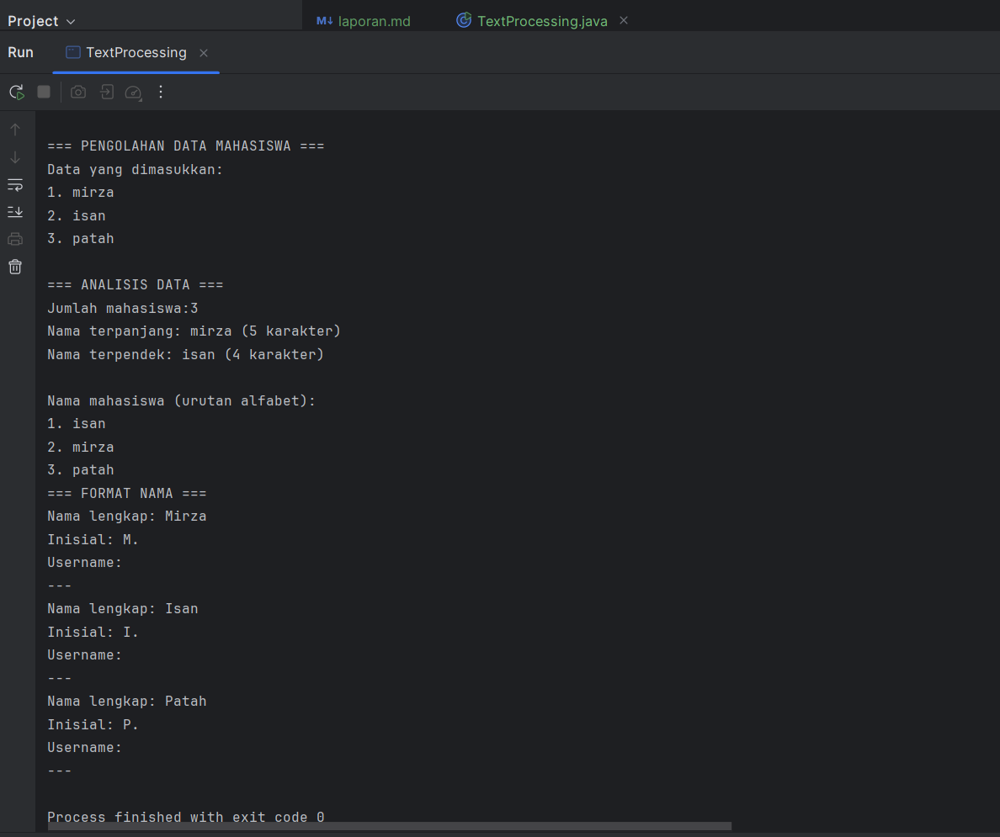

---

#### Analisa dan Pembahasan

**1. Analisa Program**

Program `TextProcessing.java` berfungsi untuk **mengolah data teks berupa daftar nama mahasiswa**. Fitur utama yang dimiliki antara lain:

- **Pemecahan input**: Input string yang berisi nama mahasiswa dipisahkan koma, lalu dipecah menjadi array menggunakan `split(",")`.
- **Menampilkan data**: Setiap nama ditampilkan setelah di-trim (menghapus spasi di awal/akhir).
- **Analisis panjang nama**:
    - Menentukan nama terpanjang dan terpendek berdasarkan jumlah karakter.
    - Menampilkan jumlah total mahasiswa.
- **Pengurutan alfabet**: Array nama diurutkan menggunakan metode nested loop dan `compareToIgnoreCase()` untuk membandingkan string tanpa memperhatikan huruf kapital.
- **Format nama**:
    - Mengubah setiap nama menjadi Title Case (huruf pertama tiap kata kapital).
    - Membuat inisial dari nama.
    - Membuat username sederhana dari nama (huruf kecil dan underscore).

**Kelebihan**

1. **Modularitas**: Fungsi dipisahkan menjadi beberapa method (`prosesDataMahasiswa`, `formatNama`, `formatTitleCase`, `buatInisial`, `buatUsername`), mempermudah pembacaan dan pemeliharaan kode.
2. **Informasi Lengkap**: Menampilkan banyak informasi berguna dari data input seperti jumlah mahasiswa, nama terpanjang, terpendek, dan urutan alfabet.
3. **Format Nama Konsisten**: Penggunaan Title Case membuat tampilan nama lebih rapi dan seragam.

**Kekurangan / Potensi Perbaikan**

1. **Validasi Input**: Program belum memeriksa apakah input kosong atau tidak sesuai format (misalnya tidak menggunakan koma), sehingga bisa menimbulkan error.
2. **Efisiensi Pengurutan**: Pengurutan menggunakan nested loop (O(n²)) tidak efisien untuk data besar. Bisa diganti dengan `Arrays.sort()` untuk performa lebih baik.
3. **Bug Username**: Regex `[a-zA-Z0-9]` sebelumnya menghapus semua huruf dan angka, menyebabkan username kosong. Perlu diperbaiki agar hanya karakter non-alfanumerik dihapus.
4. **Pemisahan Logika**: Input, pemrosesan, dan output masih bercampur dalam `main()`. Bisa dipisahkan agar kode lebih bersih dan mudah dites.
5. **Fitur Tambahan**: Bisa ditambahkan fitur pencarian nama, filter huruf awal, penghitungan jumlah karakter konsonan, atau menyimpan data ke file.

---

**2. Pembahasan**

- **Pemecahan Input dan Analisis**  
  Pemecahan input dengan `split(",")` memudahkan program untuk mengelola setiap nama. Analisis nama terpanjang/terpendek dilakukan dengan perulangan sederhana, membandingkan panjang string tiap nama.

- **Pengurutan Alfabet**  
  Nested loop digunakan untuk membandingkan setiap pasangan nama. Ini bekerja baik untuk jumlah data kecil, tapi kurang optimal untuk dataset besar. Penggunaan `Arrays.sort()` bisa meningkatkan efisiensi.

- **Format Nama, Inisial, dan Username**  
  Mengubah nama ke Title Case menggunakan kombinasi `toLowerCase()`, `split(" ")`, dan `Character.toUpperCase()` memastikan huruf pertama tiap kata kapital.  
  Inisial dibuat dengan mengambil huruf pertama tiap kata.  
  Username dibentuk dengan huruf kecil dan mengganti spasi menjadi underscore, dengan penghapusan karakter non-alfanumerik agar username valid.

- **Keseluruhan Alur Program**  
  Program dimulai dari input string, kemudian dilakukan:
    1. Analisis dasar (jumlah mahasiswa, nama terpanjang/terpendek).
    2. Pengurutan nama secara alfabet.
    3. Format nama, pembuatan inisial, dan username.  
       Alur ini membuat data menjadi lebih terstruktur dan siap digunakan untuk keperluan administrasi atau praktikum pengolahan teks.

**Kesimpulan**

Program `TextProcessing.java` berhasil mengimplementasikan konsep dasar **pengolahan string** di Java. Dengan perbaikan minor seperti validasi input, efisiensi pengurutan, dan perbaikan pembuatan username, program ini bisa menjadi **alat praktikum pengolahan teks yang efektif**. Fitur tambahan seperti penghitungan konsonan atau pencarian nama akan meningkatkan fungsionalitasnya.

---

#### Tugas Praktikum 3.2

1. Buatkan sebuah class baru dengan nama latihan4.java di dalam package latihan. Selesaikan tugas berikut:

Dari kode praktikum diatas.
- Tambahkan fitur untuk menghasilkan email address berdasarkan nama
- Buat method untuk memvalidasi format nama (tidak boleh mengandung angka atau karakter khusus)

```
package modul_3.latihan;

import java.util.Scanner;

public class latihan6 {

    public static void prosesDataMahasiswa(String data) {
        System.out.println("\n=== PENGOLAHAN DATA MAHASISWA ===");

        String[] dataMahasiswa = data.split(",");

        System.out.println("Data yang dimasukkan:");
        for (int i = 0; i < dataMahasiswa.length; i++) {
            dataMahasiswa[i] = dataMahasiswa[i].trim();
            System.out.println((i + 1) + ". " + dataMahasiswa[i]);
        }

        System.out.println("\n=== ANALISIS DATA ===");
        System.out.println("Jumlah mahasiswa: " + dataMahasiswa.length);

        String namaTerpanjang = dataMahasiswa[0];
        String namaTerpendek = dataMahasiswa[0];

        for (String nama : dataMahasiswa) {
            if (nama.length() > namaTerpanjang.length()) {
                namaTerpanjang = nama;
            }
            if (nama.length() < namaTerpendek.length()) {
                namaTerpendek = nama;
            }
        }

        System.out.println("Nama terpanjang: " + namaTerpanjang + " (" + namaTerpanjang.length() + " karakter)");
        System.out.println("Nama terpendek: " + namaTerpendek +  " (" + namaTerpendek.length() + " karakter)");

        String[] namaUrut = dataMahasiswa.clone();
        for (int i = 0; i < namaUrut.length - 1; i++) {
            for (int j = i + 1; j < namaUrut.length; j++) {
                if (namaUrut[i].compareToIgnoreCase(namaUrut[j]) > 0) {
                    String temp = namaUrut[i];
                    namaUrut[i] = namaUrut[j];
                    namaUrut[j] = temp;
                }
            }
        }

        System.out.println("\nNama mahasiswa (urutan alfabet):");
        for (int i = 0; i < namaUrut.length; i++) {
            System.out.println((i + 1) + ". " + namaUrut[i]);
        }
    }

    public static void formatNama(String[] nama) {
        System.out.println("\n=== FORMAT NAMA DAN EMAIL ===");
        for (String n : nama) {
            String namaTrimmed = n.trim();
            if (!validasiNama(namaTrimmed)) {
                System.out.println("Nama \"" + namaTrimmed + "\" tidak valid! (mengandung angka atau karakter khusus)");
                System.out.println("---");
                continue;
            }

            String namaFormatted = formatTitleCase(namaTrimmed);
            String inisial = buatInisial(namaFormatted);
            String username = buatUsername(namaFormatted);
            String email = buatEmail(username);

            System.out.println("Nama lengkap: " + namaFormatted);
            System.out.println("Inisial: " + inisial);
            System.out.println("Username: " + username);
            System.out.println("Email: " + email);
            System.out.println("---");
        }
    }

    public static String formatTitleCase(String teks) {
        String[] kata = teks.toLowerCase().split(" ");
        StringBuilder result = new StringBuilder();

        for (String k : kata) {
            if (k.length() > 0) {
                result.append(Character.toUpperCase(k.charAt(0)))
                        .append(k.substring(1))
                        .append(" ");
            }
        }
        return result.toString().trim();
    }

    public static String buatInisial(String nama) {
        String[] kata = nama.split(" ");
        StringBuilder inisial = new StringBuilder();

        for (String k : kata) {
            if (k.length() > 0) {
                inisial.append(Character.toUpperCase(k.charAt(0))).append(". ");
            }
        }
        return inisial.toString();
    }

    public static String buatUsername(String nama) {
        return nama.toLowerCase().replaceAll(" ", "_");
    }

    public static String buatEmail(String username) {
        return username + "@univ.edu";
    }

    public static boolean validasiNama(String nama) {
        // Nama hanya boleh huruf dan spasi
        return nama.matches("[a-zA-Z ]+");
    }

    public static void main(String[] args) {
        Scanner input = new Scanner(System.in);

        System.out.println("=== PROGRAM PENGOLAHAN DATA TEKS ===");
        System.out.println("Masukkan nama-nama mahasiswa (pisahkan dengan koma):");
        System.out.println("Contoh: Alice Johnson, bob smith, CHARLIE BROWN\n> ");

        String dataNama = input.nextLine();

        prosesDataMahasiswa(dataNama);

        String[] arrayNama = dataNama.split(",");
        formatNama(arrayNama);
    }
}
```

#### Screenshot Hasil
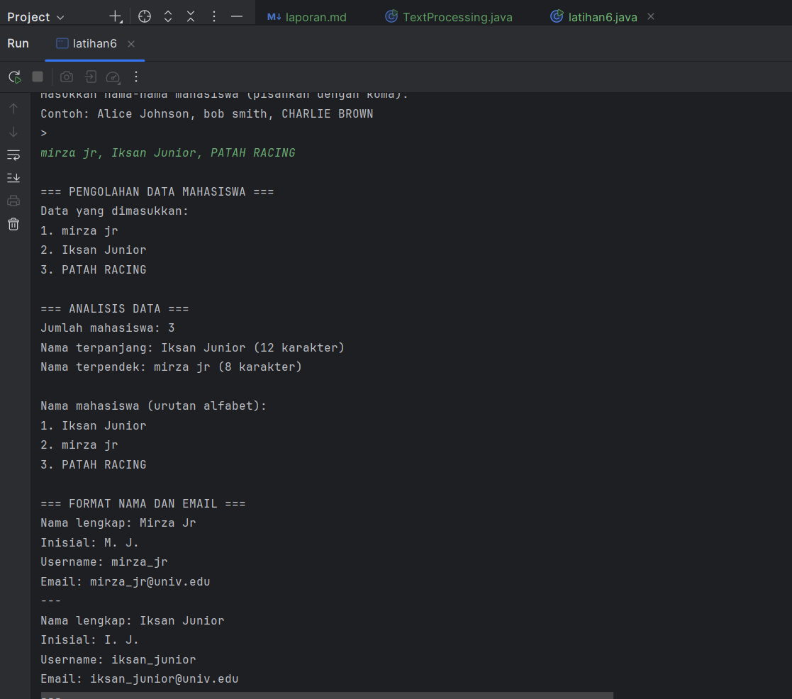

---

#### Analisa dan Pembahasan

Program ini bertujuan untuk mengolah data nama mahasiswa yang dimasukkan dalam satu baris teks, serta menghasilkan analisis, format nama, inisial, username, dan email. Berikut pembahasan setiap bagian:

**1. Pemrosesan Data Mahasiswa**
- Method `prosesDataMahasiswa(String data)` bertugas memisahkan input berdasarkan koma.
- Setiap nama dibersihkan dari spasi tambahan menggunakan `trim()`.
- Program menampilkan:
    - Data yang dimasukkan.
    - Jumlah mahasiswa.
    - Nama terpanjang dan terpendek.
    - Daftar nama diurutkan secara alfabetis menggunakan metode perbandingan `compareToIgnoreCase`.

**Logika Analisis**
- Nama terpanjang dan terpendek dicari menggunakan perulangan sederhana.
- Pengurutan alfabet menggunakan nested loop (bubble sort sederhana).

**2. Format Nama dan Pembuatan Inisial, Username, Email**
- Method `formatNama(String[] nama)` memproses setiap nama:
    - **Validasi nama**: menggunakan `validasiNama(String nama)` memastikan hanya huruf dan spasi. Jika ada angka atau karakter khusus, nama dianggap tidak valid.
    - **Title Case**: method `formatTitleCase(String teks)` mengubah setiap kata menjadi huruf besar di awal kata.
    - **Inisial**: method `buatInisial(String nama)` mengambil huruf pertama tiap kata.
    - **Username**: method `buatUsername(String nama)` mengubah spasi menjadi underscore dan huruf menjadi lowercase.
    - **Email**: method `buatEmail(String username)` menambahkan domain sederhana `@univ.edu`.

**Logika Fitur Baru**
- Validasi nama menggunakan regex `[a-zA-Z ]+` untuk menolak angka atau simbol.
- Email dihasilkan dari username agar konsisten, misal `alice_johnson@univ.edu`.

**3. Method Pendukung**
- `formatTitleCase(String teks)` memastikan semua kata dimulai huruf kapital.
- `buatInisial(String nama)` memudahkan pembuatan singkatan nama.
- `buatUsername(String nama)` untuk kebutuhan identifikasi unik.
- `buatEmail(String username)` untuk menghasilkan alamat email standar.

**4. Alur Program**
1. User memasukkan daftar nama mahasiswa.
2. `prosesDataMahasiswa` melakukan analisis dasar (jumlah, panjang nama, urutan alfabet).
3. `formatNama` melakukan validasi, format nama, inisial, username, dan email.
4. Nama yang tidak valid diabaikan dan diberi peringatan.

**5. Kelebihan Program**
- Memberikan informasi lengkap dan terstruktur.
- Memiliki validasi input sehingga mencegah kesalahan format.
- Menyediakan username dan email otomatis untuk keperluan administrasi.

**6. Kekurangan / Potensi Peningkatan**
- Pengurutan alfabet menggunakan bubble sort, bisa diganti dengan `Arrays.sort()` agar lebih efisien.
- Email dan username dibuat sangat sederhana, bisa ditambah pengecekan duplikasi.
- Validasi hanya untuk huruf dan spasi, tidak menangani huruf dengan tanda aksen atau karakter internasional.

**7. Kesimpulan analisis**

Program ini efektif untuk memproses nama mahasiswa, melakukan analisis data dasar, dan menghasilkan format nama, inisial, username, serta email. Fitur validasi menambah keamanan input agar hasil lebih rapi dan konsisten.

---

## 3. Kesimpulan

Dari seluruh program yang telah dibuat dan dianalisis, terdapat beberapa kesimpulan umum terkait pengolahan data menggunakan Java, baik pada array maupun string:

**1. Program Analisis Array**
- Program mampu menerima input array, menampilkan nilai maksimum, minimum, rata-rata, dan median.
- Fitur pencarian nilai tertentu memudahkan pengecekan keberadaan elemen.
- Metode pengurutan (Bubble Sort) berfungsi untuk analisis lebih lanjut (median, urutan data).
- Konsep array, looping, dan method modular sangat penting untuk menjaga keterbacaan dan efisiensi kode.

**2. Program Manipulasi String**
- Program melakukan analisis string seperti panjang teks, jumlah kata, jumlah vokal, dan pembalikan string.
- Fitur tambahan seperti pengecekan palindrom, pencarian substring, menghitung konsonan, dan konversi ke Pascal Case menambah fleksibilitas.
- Penggunaan `StringBuilder`, `regex`, dan manipulasi karakter memperlihatkan kekuatan Java dalam pengolahan teks.
- Modularisasi method membuat kode lebih terstruktur dan mudah diperluas.

**3. Program Pengolahan Data Mahasiswa**
- Program menerima input nama mahasiswa, menganalisis data (jumlah, nama terpanjang/terpendek, urutan alfabet), dan melakukan formatisasi nama.
- Fitur inisial, username, dan email otomatis menunjukkan penerapan manipulasi string dalam konteks nyata.
- Validasi nama mencegah kesalahan input dan meningkatkan kualitas data.
- Kombinasi array, string, dan method modular mendukung pengolahan data skala kecil hingga menengah.

**4. Poin Penting Umum**
- **Modularitas**: Semua program menekankan penggunaan method untuk memisahkan logika, sehingga lebih mudah dibaca, diuji, dan dikembangkan.
- **Pengolahan Data**: Konsep loop, kondisi, array, dan string merupakan fondasi penting dalam manipulasi data.
- **Validasi Input**: Menambahkan validasi mencegah kesalahan dan meningkatkan reliabilitas program.
- **Ekstensi Fitur**: Penambahan fitur baru (median, konsonan, Pascal Case, email, validasi) menunjukkan fleksibilitas program untuk kebutuhan nyata.

**5. Rekomendasi**
- Untuk pengolahan data besar, gunakan algoritma pengurutan yang lebih efisien (`Arrays.sort`) atau struktur data yang lebih optimal.
- Implementasi exception handling dapat meningkatkan keamanan program terhadap input yang salah.
- Penggunaan regex dan method string bawaan Java mempermudah validasi dan manipulasi teks.

**Kesimpulan Akhir:**  
Semua program berhasil menunjukkan penerapan konsep dasar Java pada array dan string, dengan kemampuan analisis, validasi, dan formatisasi data. Struktur modular memungkinkan program diperluas dan diadaptasi untuk skala dan konteks yang lebih kompleks.

---

## 4. Referensi
- Oracle. *Java SE Documentation*. https://docs.oracle.com/javase
- Modul Praktikum PBO, Modul 2: Dasar Pemrograman Java

1. Oracle. *The Java™ Tutorials – Learning the Java Language*. Oracle.  
   [https://docs.oracle.com/javase/tutorial/java/index.html](https://docs.oracle.com/javase/tutorial/java/index.html)  
   (Referensi dasar sintaks Java, penggunaan array, string, dan kontrol program)

2. Eck, David J. *Introduction to Programming Using Java, 8th Edition*.  
   [https://math.hws.edu/javanotes/](https://math.hws.edu/javanotes/)  
   (Referensi untuk manipulasi array, string, input/output, dan struktur data sederhana)

3. TutorialsPoint. *Java String Handling*. TutorialsPoint.  
   [https://www.tutorialspoint.com/java/java_string_handling.htm](https://www.tutorialspoint.com/java/java_string_handling.htm)  
   (Referensi untuk operasi string, seperti menghitung karakter, substring, palindrome, dan pascal case)

4. Sedgewick, Robert & Wayne, Kevin. *Algorithms, 4th Edition*. Addison-Wesley, 2011.  
   (Referensi algoritma pengurutan, pencarian, dan analisis data array)

5. Horstmann, Cay S. *Core Java Volume I – Fundamentals, 11th Edition*. Prentice Hall, 2019.  
   (Referensi tambahan terkait pemrograman berorientasi objek, method, dan manipulasi data)
