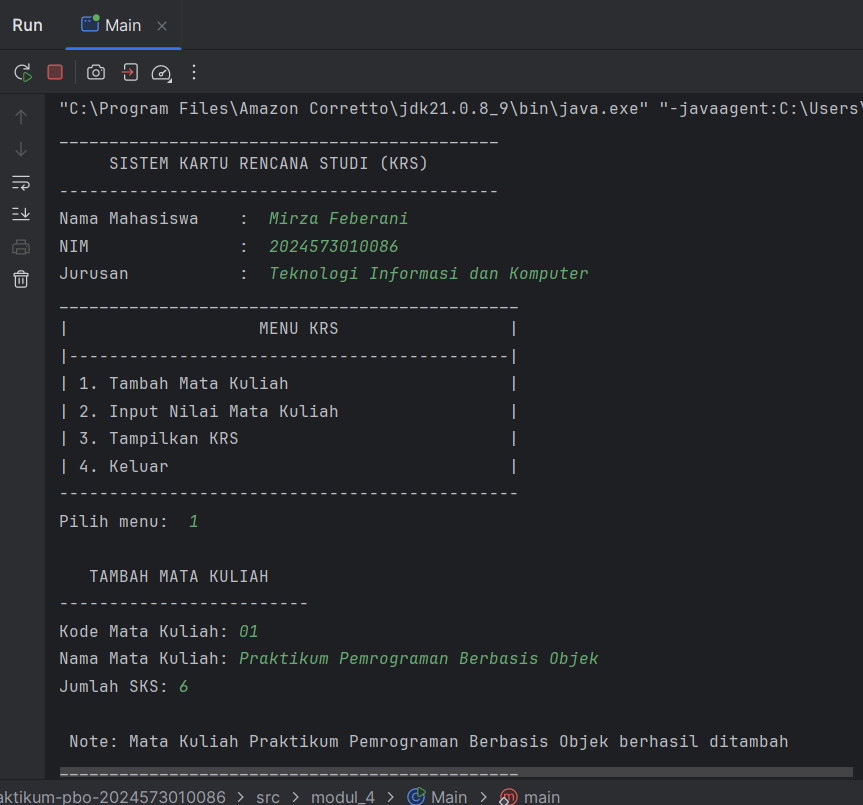
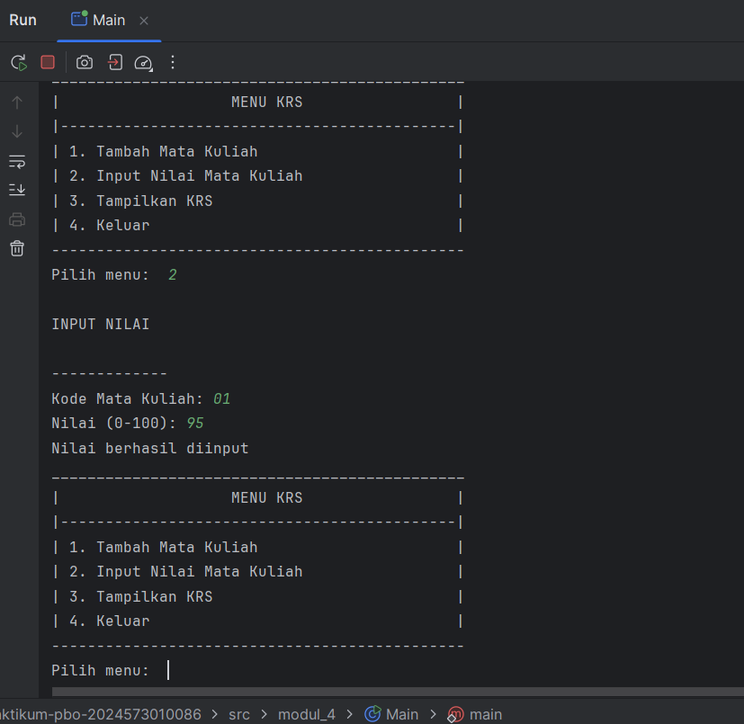
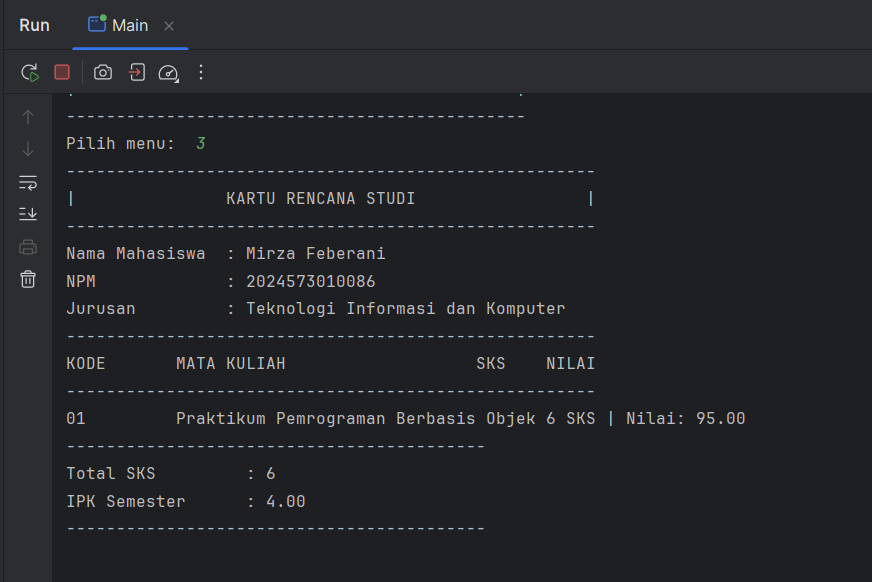
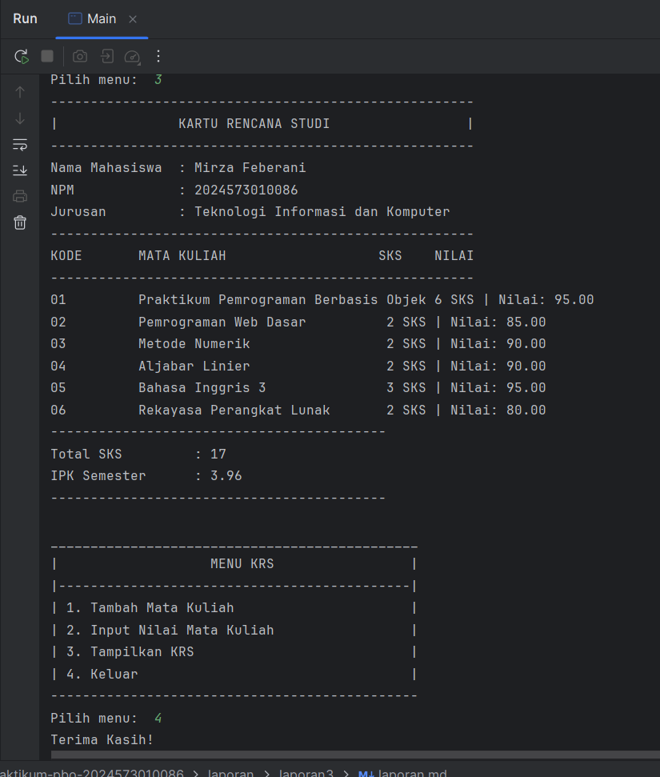
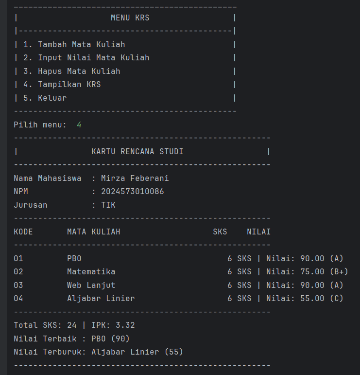
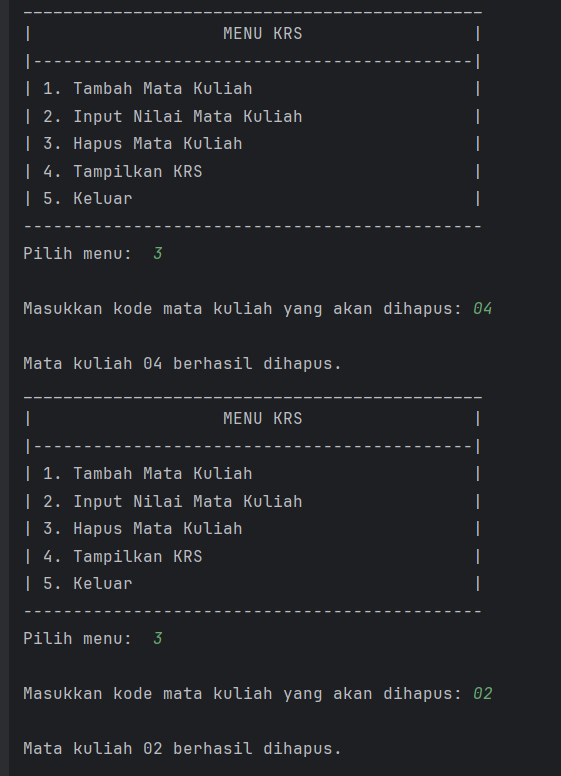

Laporan Modul 4: Pengenalan Object oriented Programming
---
**Mata Kuliah:** Praktikum Pemrograman Berorientasi Objek  
**Nama:** MIRZA FEBERANI  
**NIM:** 2024573010086  
**Kelas:** TI 2E  
**Tanggal Praktikum:** 09 Oktober 2025

---

## 1. Abstrak

Object Oriented Programming (OOP) merupakan paradigma pemrograman yang berfokus pada konsep objek sebagai representasi
dari entitas dunia nyata. Paradigma ini menawarkan pendekatan yang lebih modular dan terstruktur dalam pengembangan
perangkat lunak melalui penggunaan kelas, objek, enkapsulasi, pewarisan, dan polimorfisme. Dalam laporan ini, dibahas
secara sistematis prinsip-prinsip dasar OOP serta penerapannya dalam membangun sistem informasi yang efisien dan mudah
dipelihara. Studi ini bertujuan untuk memberikan pemahaman konseptual dan praktis mengenai OOP kepada mahasiswa sebagai
bekal dalam mengembangkan aplikasi berbasis teknologi modern. Melalui pendekatan ini, diharapkan mahasiswa mampu
merancang dan mengimplementasikan solusi perangkat lunak yang bersifat reusable, scalable, dan maintainable.

Modul ini dirancang untuk memberikan pemahaman dasar tentang pemrograman berorientasi objek menggunakan Java melalui
praktikum langsung. Setiap praktikum dilengkapi dengan teori dasar dan langkah-langkah implementasi yang detail.

---

## 2. Praktikum

### Dasar Teori

Objek-Oriented Programming (OOP) adalah paradigma pemrograman yang menggunakan “objek” - struktur data yang berisi data,
dalam bentuk field, sering kali dikenal sebagai atribut; dan kode, dalam bentuk prosedur, sering kali dikenal sebagai
metode.

Inti dari OOP adalah mendesain software dengan membagi masalah menjadi serangkaian objek yang saling berinteraksi. Ini
bertentangan dengan pemrograman prosedural, yang fokus pada fungsi/prosedur dalam memproses data. OOP memungkinkan kita
untuk membuat kode yang lebih modular, reusable, dan mudah di-maintain.

**Konsep Dasar OOP:**

- `Class`: Template atau blueprint untuk membuat object
- `Object`: Instance dari sebuah class
- `Attribute/Field`: Variabel yang dimiliki oleh class
- `Method`: Function yang dimiliki oleh class
- `Constructor`: Method khusus untuk inisialisasi object

---

**Prinsip OOP:**

- Encapsulation: Menyembunyikan detail implementasi
- Inheritance: Pewarisan sifat dari class parent
- Polymorphism: Kemampuan object untuk memiliki banyak bentuk
- Abstraction: Menyederhanakan kompleksitas dengan menyembunyikan detail

---

#### Class dan Objek

kelas adalah konsep abstrak yang mendefinisikan set atribut dan metode yang akan dimiliki oleh object. Kelas menyediakan
struktur atau template yang menentukan bagaimana sebuah object harus dibuat. Kelas akan menentukan jenis atribut dan
metode apa yang akan dimiliki oleh object, tetapi tidak menentukan nilai dari atribut itu sendiri untuk object tertentu.

Object adalah inti dari pemrograman berorientasi objek. Setiap object memiliki dua karakteristik utama, yaitu:

Object, dalam konteks pemrograman OOP, adalah sebuah entitas yang memiliki karakteristik dan perilaku. Kelas, di sisi
lain, merupakan blueprint atau cetakan untuk membuat object. Kalau kamu bandingkan dengan dunia nyata, kamu bisa
menganggap kelas sebagai rencana desain bangunan, sedangkan object adalah bangunan yang sesungguhnya telah dibangun
berdasarkan desain tersebut.

---

### Praktikum : Dasar Class dan Object

**Tujuan:**

Memahami cara membuat class, object, dan menggunakan constructor, dan relasi class

---

#### Langkah Praktikum : Dasar Class dan Object

1. Buat file baru `Mahasiswa`.
2. Ketik kode berikut:

```
package modul_4;

public class Mahasiswa {
    // private untuk encapsulation
    private String nama;
    private String nim;
    private String jurusan;

    // construktor dgn parameter
    public Mahasiswa(String nama, String nim, String jurusan, double ipk) {
        this.nama = nama;
        this.nim = nim;
        this.jurusan = jurusan;
    }

    // getter method
    public String getNama() {
        return nama;
    }

    public String getNim() {
        return nim;
    }

    public String getJurusan() {
        return jurusan;
    }
}
```

- Buat class `Matakuliah` dan isikan kode berikut:

```
package modul_4;

public class Matakuliah {
    private String kode;
    private String nama;
    private int sks;
    private double nilai;

    public Matakuliah(String kode, String nama, int sks) {
        this.kode = kode;
        this.nama = nama;
        this.sks = sks;
        this.nilai = 0;
    }

    // getter dan setter
    public String getKode() {
        return kode;
    }

    public String getNama() {
        return nama;
    }

    public int getSks() {
        return sks;
    }

    public double getNilai() {
        return nilai;
    }

    public void setNilai(double nilai) {
        if (nilai >= 0.0 && nilai <= 100.0) {
            this.nilai = nilai;
        } else {
            System.out.println("Nilai harus antara 0-100");
        }
    }

    // konversi nilai angka ke huruf
    public String getNilaiHuruf() {
        if (nilai >= 85) return "A";
        else if (nilai >= 80) return "A-";
        else if (nilai >= 75) return "B+";
        else if (nilai >= 70) return "B";
        else if (nilai >= 65) return "B-";
        else if (nilai >= 60) return "C+";
        else if (nilai >= 55) return "C";
        else if (nilai >= 50) return "D";
        else return "E";
    }

    // konversi nilai huruf ke bobot
    public double getBobotNilai() {
        String huruf = getNilaiHuruf();
        switch (huruf) {
            case "A": return 4.0;
            case "A-": return 3.7;
            case "B+": return 3.3;
            case "B": return 3.0;
            case "B-": return 2.7;
            case "C+": return 2.3;
            case "C": return 2.0;
            case "D": return 1.0;
            default: return 0.0;
        }
    }

    public void tampilkanInfo() {
        System.out.printf("%-10s %-30s %d SKS | Nilai: %.2f%n",
                kode, nama, sks, nilai, getNilaiHuruf());
    }
}
```

- Buat class `RencanaKartuStudi` dan isikan kode berikut:

```
package modul_4;

public class RencanaKartuStudi {
    private Mahasiswa mahasiswa;
    private Matakuliah[] daftarMataKuliah;
    private int jumlahMatKul;
    private int maxMatkul;

    public RencanaKartuStudi(Mahasiswa mahasiswa, int maxMatkul) {
        this.mahasiswa = mahasiswa;
        this.maxMatkul = maxMatkul;
        this.daftarMataKuliah = new Matakuliah[maxMatkul];
        this.jumlahMatKul = 0;
    }

    // nambah matkul krs
    public boolean tambahMataKuliah(Matakuliah matkul) {
        if (jumlahMatKul < maxMatkul) {
            daftarMataKuliah[jumlahMatKul] = matkul;
            jumlahMatKul++;
            System.out.println("\n Note: Mata Kuliah " + matkul.getNama() + " berhasil ditambah");
            return true;
        } else {
            System.out.println("\n Note: KRS sudah penuh Maksimal " + maxMatkul + " mata kuliah.");
            return false;
        }
    }

    // hitung total sks
    public int hitungTotalSKS() {
        int totalSKS = 0;
        for (int i = 0; i < jumlahMatKul; i++) {
            totalSKS += daftarMataKuliah[i].getSks();
        }
        return totalSKS;
    }

    // hitung ipk
    public double hitungIPK() {
        if (jumlahMatKul == 0) return 0.0;

        double totalBobot = 0.0;
        int totalSKS = 0;

        for (int i = 0; i < jumlahMatKul; i++) {
            Matakuliah mk = daftarMataKuliah[i];
            totalBobot += mk.getBobotNilai() * mk.getSks();
            totalSKS += mk.getSks();
        }

        return totalSKS > 0 ? totalBobot / totalSKS : 0.0;
    }

    // menampilkan KRS
    public void tampilkanKRS() {
        System.out.println("-----------------------------------------------------");
        System.out.println("|               KARTU RENCANA STUDI                 |");
        System.out.println("-----------------------------------------------------");
        System.out.println("Nama Mahasiswa  : " + mahasiswa.getNama());
        System.out.println("NPM             : " + mahasiswa.getNim());
        System.out.println("Jurusan         : " + mahasiswa.getJurusan());
        System.out.println("-----------------------------------------------------");
        System.out.println("KODE       MATA KULIAH                   SKS    NILAI");
        System.out.println("-----------------------------------------------------");

        if (jumlahMatKul == 0) {
            System.out.println("Belum ada mata kuliah yang diambil.");
        } else {
            for (int i = 0; i < jumlahMatKul; i++) {
                daftarMataKuliah[i].tampilkanInfo();
            }
        }

        System.out.println("------------------------------------------");
        System.out.println("Total SKS         : " + hitungTotalSKS());
        System.out.printf("IPK Semester      : %.2f\n", hitungIPK());
        System.out.println("------------------------------------------");
        System.out.println("");
    }

    // cari mata kuliah berdasarkan kode
    public Matakuliah cariMataKuliah(String kode) {
        for (int i = 0; i < jumlahMatKul; i++) {
            if (daftarMataKuliah[i].getKode().equalsIgnoreCase(kode)) {
                return daftarMataKuliah[i];
            }
        }
        return null;
    }
}
```

- Buat class `Main` untuk menjalankan program:

```
package modul_4;

import java.util.Scanner;

public class Main {
    public static void main(String[] args) {
        Scanner input = new Scanner(System.in);

        System.out.println("____________________________________________");
        System.out.println("     SISTEM KARTU RENCANA STUDI (KRS)       ");
        System.out.println("--------------------------------------------");

        // input data mahasiswa
        System.out.print("Nama Mahasiswa    :  ");
        String nama = input.nextLine();

        System.out.print("NIM               :  ");
        String nim = input.nextLine();

        System.out.print("Jurusan           :  ");
        String jurusan = input.nextLine();

        // buat object mahasiswa
        Mahasiswa mhs = new Mahasiswa(nama, nim, jurusan, 0.0);

        // buat object krs (max 10 matkul)
        RencanaKartuStudi krs = new RencanaKartuStudi(mhs, 10);

        // menu krs
        boolean running = true;

        while (running) {
            System.out.println("______________________________________________");
            System.out.println("|                   MENU KRS                 |");
            System.out.println("|--------------------------------------------|");
            System.out.println("| 1. Tambah Mata Kuliah                      |");
            System.out.println("| 2. Input Nilai Mata Kuliah                 |");
            System.out.println("| 3. Tampilkan KRS                           |");
            System.out.println("| 4. Keluar                                  |");
            System.out.println("----------------------------------------------");
            System.out.print("Pilih menu:  ");

            int pilihan = input.nextInt();
            input.nextLine();

            switch (pilihan) {
                case 1:
                    // tambah matkul
                    System.out.println("\n   TAMBAH MATA KULIAH");
                    System.out.println("-------------------------");
                    System.out.print("Kode Mata Kuliah: ");
                    String kode = input.nextLine();

                    System.out.print("Nama Mata Kuliah: ");
                    String namaMK = input.nextLine();

                    System.out.print("Jumlah SKS: ");
                    int sks = input.nextInt();
                    input.nextLine();

                    Matakuliah mk = new Matakuliah(kode, namaMK, sks);
                    krs.tambahMataKuliah(mk);
                    break;

                case 2:
                    // input nilai
                    System.out.println("\nINPUT NILAI");
                    System.out.print("\n-------------");
                    System.out.print("\nKode Mata Kuliah: ");
                    String kodeCari = input.nextLine();

                    Matakuliah mkCari = krs.cariMataKuliah(kodeCari);
                    if (mkCari != null) {
                        System.out.print("Nilai (0-100): ");
                        double nilai = input.nextDouble();
                        mkCari.setNilai(nilai);
                        System.out.println("Nilai berhasil diinput");
                    } else {
                        System.out.println("Matakuliah tidak ditemukan");
                    }
                    break;

                case 3:
                    // tampilkan krs
                    krs.tampilkanKRS();
                    break;

                case 4:
                    // keluar
                    System.out.println("Terima Kasih!");
                    running = false;
                    break;

                default:
                    System.out.println("Pilih tidak valid");
            }
        }
    }
}
```

- Jalankan program, kemudian lakukan ujicoba dengan berbagai input.
- Amati bagaimana object menyimpan data, juga bagaimana method bekerja.

#### Screenshot Hasil

**Menambah Mata Kuliah**


**Menginput Nilai Mata Kuliah**


**Menampilkan KRS**


**Menampilkan Semua Data yang diinput dan keluar dari Program**


---

### Tugas Praktikum

Modifikasi kode diatas sesuai dengan instruksi berikut:

- Tambahkan fitur untuk menghapus mata kuliah dari KRS
- Buat validasi agar total SKS tidak melebihi batas tertentu (misalnya 24 SKS)
- Tambahkan method untuk menampilkan mata kuliah dengan nilai terbaik dan terburuk

#### Hasil Modifikasi dan Penambahan Fitur

- Berikut Kodenya:
- Kode Class `Mahasiswa` hasil modifikasi:

```
package modul_4;

public class Mahasiswa {
    // private untuk encapsulation
    private String nama;
    private String nim;
    private String jurusan;

    // konstruktor
    public Mahasiswa(String nama, String nim, String jurusan, double ipk) {
        this.nama = nama;
        this.nim = nim;
        this.jurusan = jurusan;
    }

    // getter method
    public String getNama() {
        return nama;
    }

    public String getNim() {
        return nim;
    }

    public String getJurusan() {
        return jurusan;
    }
}

```

- Kode Class `Matakuliah` hasil modifikasi:

```
package modul_4;

public class Matakuliah {
    private String kode;
    private String nama;
    private int sks;
    private double nilai;

    public Matakuliah(String kode, String nama, int sks) {
        this.kode = kode;
        this.nama = nama;
        this.sks = sks;
        this.nilai = 0;
    }

    public String getKode() {
        return kode;
    }

    public String getNama() {
        return nama;
    }

    public int getSks() {
        return sks;
    }

    public double getNilai() {
        return nilai;
    }

    public void setNilai(double nilai) {
        if (nilai >= 0.0 && nilai <= 100.0) {
            this.nilai = nilai;
        } else {
            System.out.println("Nilai harus antara 0-100");
        }
    }

    public String getNilaiHuruf() {
        if (nilai >= 85) return "A";
        else if (nilai >= 80) return "A-";
        else if (nilai >= 75) return "B+";
        else if (nilai >= 70) return "B";
        else if (nilai >= 65) return "B-";
        else if (nilai >= 60) return "C+";
        else if (nilai >= 55) return "C";
        else if (nilai >= 50) return "D";
        else return "E";
    }

    public double getBobotNilai() {
        switch (getNilaiHuruf()) {
            case "A": return 4.0;
            case "A-": return 3.7;
            case "B+": return 3.3;
            case "B": return 3.0;
            case "B-": return 2.7;
            case "C+": return 2.3;
            case "C": return 2.0;
            case "D": return 1.0;
            default: return 0.0;
        }
    }

    public void tampilkanInfo() {
        System.out.printf("%-10s %-30s %3d SKS | Nilai: %5.2f (%s)%n",
                kode, nama, sks, nilai, getNilaiHuruf());
    }
}

```

- Kode Class `RencanaKartuStudi` hasil modifikasi:

```
package modul_4;

public class RencanaKartuStudi {
    private Mahasiswa mahasiswa;
    private Matakuliah[] daftarMataKuliah;
    private int jumlahMatKul;
    private int maxMatkul;
    private static final int BATAS_SKS = 24;

    public RencanaKartuStudi(Mahasiswa mahasiswa, int maxMatkul) {
        this.mahasiswa = mahasiswa;
        this.maxMatkul = maxMatkul;
        this.daftarMataKuliah = new Matakuliah[maxMatkul];
        this.jumlahMatKul = 0;
    }

    public boolean tambahMataKuliah(Matakuliah matkul) {
        int totalSKS = hitungTotalSKS();
        if (totalSKS + matkul.getSks() > BATAS_SKS) {
            System.out.println("\nGagal menambah: Total SKS melebihi batas " + BATAS_SKS);
            return false;
        }

        if (jumlahMatKul < maxMatkul) {
            daftarMataKuliah[jumlahMatKul] = matkul;
            jumlahMatKul++;
            System.out.println("\nMata Kuliah " + matkul.getNama() + " berhasil ditambah");
            return true;
        } else {
            System.out.println("\nKRS sudah penuh (maks " + maxMatkul + " mata kuliah)");
            return false;
        }
    }

    public boolean hapusMataKuliah(String kode) {
        for (int i = 0; i < jumlahMatKul; i++) {
            if (daftarMataKuliah[i].getKode().equalsIgnoreCase(kode)) {
                for (int j = i; j < jumlahMatKul - 1; j++) {
                    daftarMataKuliah[j] = daftarMataKuliah[j + 1];
                }
                daftarMataKuliah[jumlahMatKul - 1] = null;
                jumlahMatKul--;
                System.out.println("\nMata kuliah " + kode + " berhasil dihapus.");
                return true;
            }
        }
        System.out.println("\nMata kuliah dengan kode " + kode + " tidak ditemukan.");
        return false;
    }

    public int hitungTotalSKS() {
        int total = 0;
        for (int i = 0; i < jumlahMatKul; i++) {
            total += daftarMataKuliah[i].getSks();
        }
        return total;
    }

    public double hitungIPK() {
        if (jumlahMatKul == 0) return 0.0;
        double totalBobot = 0.0;
        int totalSKS = 0;

        for (int i = 0; i < jumlahMatKul; i++) {
            totalBobot += daftarMataKuliah[i].getBobotNilai() * daftarMataKuliah[i].getSks();
            totalSKS += daftarMataKuliah[i].getSks();
        }

        return totalSKS > 0 ? totalBobot / totalSKS : 0.0;
    }

    public Matakuliah cariMatkulTerbaik() {
        if (jumlahMatKul == 0) return null;
        Matakuliah terbaik = daftarMataKuliah[0];
        for (int i = 1; i < jumlahMatKul; i++) {
            if (daftarMataKuliah[i].getNilai() > terbaik.getNilai()) {
                terbaik = daftarMataKuliah[i];
            }
        }
        return terbaik;
    }

    public Matakuliah cariMatkulTerburuk() {
        if (jumlahMatKul == 0) return null;
        Matakuliah terburuk = daftarMataKuliah[0];
        for (int i = 1; i < jumlahMatKul; i++) {
            if (daftarMataKuliah[i].getNilai() < terburuk.getNilai()) {
                terburuk = daftarMataKuliah[i];
            }
        }
        return terburuk;
    }

    public Matakuliah cariMataKuliah(String kode) {
        for (int i = 0; i < jumlahMatKul; i++) {
            if (daftarMataKuliah[i].getKode().equalsIgnoreCase(kode)) {
                return daftarMataKuliah[i];
            }
        }
        return null;
    }

    public void tampilkanKRS() {
        System.out.println("-----------------------------------------------------");
        System.out.println("|               KARTU RENCANA STUDI                 |");
        System.out.println("-----------------------------------------------------");
        System.out.println("Nama Mahasiswa  : " + mahasiswa.getNama());
        System.out.println("NPM             : " + mahasiswa.getNim());
        System.out.println("Jurusan         : " + mahasiswa.getJurusan());
        System.out.println("-----------------------------------------------------");
        System.out.println("KODE       MATA KULIAH                   SKS    NILAI");
        System.out.println("-----------------------------------------------------");

        if (jumlahMatKul == 0) {
            System.out.println("Belum ada mata kuliah yang diambil.");
        } else {
            for (int i = 0; i < jumlahMatKul; i++) {
                daftarMataKuliah[i].tampilkanInfo();
            }
        }

        System.out.println("-----------------------------------------------------");
        System.out.printf("Total SKS: %d | IPK: %.2f%n", hitungTotalSKS(), hitungIPK());

        Matakuliah terbaik = cariMatkulTerbaik();
        Matakuliah terburuk = cariMatkulTerburuk();

        if (terbaik != null) {
            System.out.println("Nilai Terbaik : " + terbaik.getNama() + " (" + (int) terbaik.getNilai() + ")");
        }
        if (terburuk != null) {
            System.out.println("Nilai Terburuk: " + terburuk.getNama() + " (" + (int) terburuk.getNilai() + ")");
        }

        System.out.println("-----------------------------------------------------");
    }
}

```

- Kode Class `Main` hasil modifikasi dan Penambahan Fitur:

```
package modul_4;

import java.util.Scanner;

public class Main {
    public static void main(String[] args) {
        Scanner input = new Scanner(System.in);

        System.out.println("____________________________________________");
        System.out.println("     SISTEM KARTU RENCANA STUDI (KRS)       ");
        System.out.println("--------------------------------------------");

        System.out.print("Nama Mahasiswa    :  ");
        String nama = input.nextLine();

        System.out.print("NIM               :  ");
        String nim = input.nextLine();

        System.out.print("Jurusan           :  ");
        String jurusan = input.nextLine();

        Mahasiswa mhs = new Mahasiswa(nama, nim, jurusan, 0.0);
        RencanaKartuStudi krs = new RencanaKartuStudi(mhs, 10);

        boolean running = true;
        while (running) {
            System.out.println("______________________________________________");
            System.out.println("|                   MENU KRS                 |");
            System.out.println("|--------------------------------------------|");
            System.out.println("| 1. Tambah Mata Kuliah                      |");
            System.out.println("| 2. Input Nilai Mata Kuliah                 |");
            System.out.println("| 3. Hapus Mata Kuliah                       |");
            System.out.println("| 4. Tampilkan KRS                           |");
            System.out.println("| 5. Keluar                                  |");
            System.out.println("----------------------------------------------");
            System.out.print("Pilih menu:  ");

            int pilihan = input.nextInt();
            input.nextLine();

            switch (pilihan) {
                case 1:
                    System.out.println("\n   TAMBAH MATA KULIAH");
                    System.out.print("Kode Mata Kuliah: ");
                    String kode = input.nextLine();

                    System.out.print("Nama Mata Kuliah: ");
                    String namaMK = input.nextLine();

                    System.out.print("Jumlah SKS: ");
                    int sks = input.nextInt();
                    input.nextLine();

                    Matakuliah mk = new Matakuliah(kode, namaMK, sks);
                    krs.tambahMataKuliah(mk);
                    break;

                case 2:
                    System.out.println("\nINPUT NILAI MATA KULIAH");
                    System.out.print("Kode Mata Kuliah: ");
                    String kodeCari = input.nextLine();

                    Matakuliah mkCari = krs.cariMataKuliah(kodeCari);
                    if (mkCari != null) {
                        System.out.print("Nilai (0-100): ");
                        double nilai = input.nextDouble();
                        mkCari.setNilai(nilai);
                        System.out.println("Nilai berhasil diinput.");
                    } else {
                        System.out.println("Mata kuliah tidak ditemukan.");
                    }
                    break;

                case 3:
                    System.out.print("\nMasukkan kode mata kuliah yang akan dihapus: ");
                    String kodeHapus = input.nextLine();
                    krs.hapusMataKuliah(kodeHapus);
                    break;

                case 4:
                    krs.tampilkanKRS();
                    break;

                case 5:
                    System.out.println("Terima Kasih!");
                    running = false;
                    break;

                default:
                    System.out.println("Pilihan tidak valid.");
            }
        }
    }
}

```

---

#### Screenshot Hasil Uji Coba

- Program Berhasil dan Lancar setelah Modifikasi dan Penambahan Fitur

**Berhasil Membuat Validasi Total SKS Tidak Lebih 24 SKS**


**Berhasiil Menambahkan Method untuk menampilkan mata kuliah dengan nilai terbaik dan terburuk**


**Berhasil Menambahkan Fitur Menghapus Mata Kuliah**


---

## Analisa dan Pembahasan

### Analisa Program

Program Sistem Kartu Rencana Studi (KRS) ini dibuat dengan pendekatan Object Oriented Programming (OOP) menggunakan
bahasa Java.
Tujuan utama dari program ini adalah untuk membantu mahasiswa dalam melakukan pengelolaan data mata kuliah yang akan
diambil pada satu semester, seperti menambah, menghapus, dan memberikan nilai pada mata kuliah yang dipilih.

Struktur program ini terdiri dari empat kelas utama, yaitu:

**1. Class `Mahasiswa`**

- Kelas ini merepresentasikan data mahasiswa yang memiliki atribut `nama`, `nim`, dan `jurusan`.
- Semua atribut bersifat private untuk menjaga prinsip encapsulation, dan hanya dapat diakses melalui getter method.
- Kelas ini berfungsi sebagai identitas pemilik KRS.

**2. Class `Matakuliah`**

Kelas ini berfungsi untuk menyimpan informasi setiap mata kuliah seperti `kode`, `nama`, `sks`, dan `nilai`.

Di dalamnya terdapat beberapa method penting, antara lain:

- `setNilai()` untuk mengatur nilai (dengan validasi 0–100).
- `getNilaiHuruf()` untuk mengonversi nilai angka menjadi huruf (A, B+, C, dst).
- `getBobotNilai()` untuk menghitung bobot berdasarkan nilai huruf, yang nantinya digunakan dalam perhitungan IPK.
- `tampilkanInfo()` untuk menampilkan data mata kuliah secara terformat di layar.

**3. Class `RencanaKartuStudi`**

Kelas ini menjadi inti program yang mengatur logika pengelolaan KRS.

Beberapa fitur utamanya adalah:

- **Menambah mata kuliah** dengan validasi agar total SKS tidak melebihi batas maksimum (24 SKS).
- **Menghapus mata kuliah** berdasarkan kode.
- **Menghitung total SKS** dan **IPK** berdasarkan nilai mata kuliah yang telah diinput.
- **Mencari mata kuliah dengan nilai terbaik dan terburuk**, untuk membantu mahasiswa mengetahui performa akademiknya.
- **Menampilkan seluruh isi KRS** dalam format tabel, termasuk total SKS, IPK, serta nilai terbaik dan terburuk.

Implementasi prinsip encapsulation juga diterapkan di sini dengan menjadikan atribut bersifat private, serta interaksi
dengan objek dilakukan melalui method publik seperti `tambahMataKuliah()`, `hapusMataKuliah()`, dan `tampilkanKRS()`.

**4. Class `Main`**

Kelas ini berfungsi sebagai antarmuka utama antara pengguna dengan sistem.
Program berjalan dalam bentuk menu interaktif berbasis teks (console) yang memungkinkan pengguna untuk memilih tindakan
seperti menambah, menghapus, memberi nilai, atau menampilkan KRS.

Menu utama terdiri dari:

1. Tambah Mata Kuliah
2. Input Nilai Mata Kuliah
3. Hapus Mata Kuliah
4. Tampilkan KRS
5. Keluar

Dengan pendekatan ini, sistem menjadi mudah digunakan dan logika antarobjek tetap terpisah dengan baik.

---

### Pembahasan Program

**1. Penerapan Konsep OOP**

Program ini mengimplementasikan beberapa konsep utama OOP, yaitu:

- **Encapsulation** : atribut dibuat private untuk menjaga keamanan data dan hanya diakses melalui *getter/setter*.
- **Abstraksi** : kompleksitas pengolahan data seperti perhitungan IPK disembunyikan dalam method agar pengguna cukup
  menggunakan fungsi yang tersedia.
- **Komposisi (Object Relationship)** : kelas `RencanaKartuStudi` memiliki objek `Mahasiswa` dan daftar objek
  `Matakuliah`,
  mencerminkan hubungan “has-a” antar objek.

**2. Validasi Batas SKS (24 SKS)**

Dalam method `tambahMataKuliah()`, sebelum menambah mata kuliah baru, sistem menghitung total SKS terlebih dahulu.

Jika penambahan mata kuliah menyebabkan total SKS melebihi 24, maka sistem menolak penambahan dan menampilkan pesan:

```Gagal menambah: Total SKS melebihi batas 24```

**3. Fitur Hapus Mata Kuliah**

Mahasiswa dapat menghapus mata kuliah yang tidak jadi diambil dengan memasukkan kode mata kuliah.

Proses penghapusan dilakukan dengan cara menggeser elemen array agar data tetap rapi dan tidak menimbulkan celah kosong.

**4. Perhitungan IPK dan Penentuan Nilai Terbaik/Terburuk**

Program menghitung IPK dengan menjumlahkan seluruh bobot nilai dikalikan SKS, lalu dibagi total SKS.

Selain itu, sistem juga menampilkan dua informasi tambahan:

- Mata kuliah dengan nilai tertinggi (terbaik)
- Mata kuliah dengan nilai terendah (terburuk)

Contoh tampilan hasil:

```
-----------------------------------------------------
Total SKS: 18 | IPK: 3.40
Nilai Terbaik : Algoritma (95)
Nilai Terburuk: Kalkulus (60)
-----------------------------------------------------
```

**Antarmuka Pengguna (User Interface)**

Meskipun berbasis teks, tampilan menu dan hasil KRS dirancang agar mudah dibaca, rapi, dan informatif.

Pengguna dapat berinteraksi melalui input keyboard secara langsung tanpa harus menulis ulang data setiap kali
menjalankan program.

### Kesimpulan Analisis

Dari hasil analisis dan pengujian, dapat disimpulkan bahwa:

- Program sudah menerapkan prinsip-prinsip dasar OOP secara konsisten.
- Fitur tambahan seperti validasi batas SKS, hapus mata kuliah, serta tampilan nilai terbaik dan terburuk berhasil
  meningkatkan fungsionalitas dan kejelasan data akademik.
- Struktur kode modular dan terpisah antar kelas membuat program mudah diperluas (misalnya untuk menambah fitur baru
  seperti simpan data ke file atau penilaian otomatis).

Dengan demikian, program ini sudah memenuhi kebutuhan sistem KRS sederhana dan layak dijadikan contoh implementasi OOP
berbasis Java.

---

## 3. Kesimpulan

**Kesimpulan**

Dari seluruh proses perancangan, analisis, dan implementasi program **Sistem Kartu Rencana Studi (KRS)** berbasis Object
**Oriented Programming (OOP)** dengan bahasa Java, dapat diambil beberapa kesimpulan sebagai berikut:

**1. Penerapan Konsep OOP Secara Konsisten**

Program berhasil, Struktur kelas `Mahasiswa`, `Matakuliah`, dan `RencanaKartuStudi` sudah mencerminkan relasi antarobjek yang jelas dan
terorganisir.

**2. Sistem Mampu Mengelola Data KRS dengan Baik**

Fitur yang dibuat memungkinkan mahasiswa untuk:
- Menambah dan menghapus mata kuliah secara dinamis,
- Menginput nilai mata kuliah,
- Menampilkan seluruh data KRS dengan format rapi,
- Menghitung total SKS dan IPK secara otomatis,
- Mengetahui nilai terbaik dan terburuk dari seluruh mata kuliah yang diambil.
Semua fungsi ini memperlihatkan penerapan logika bisnis sederhana dalam konteks akademik.

**3. Penerapan Validasi dan Logika Bisnis**.

Program juga menerapkan batas maksimum pengambilan 24 SKS untuk menjaga aturan akademik yang realistis.
Selain itu, sistem menolak input nilai yang tidak valid (di luar rentang 0–100), sehingga menjaga keakuratan data.

**4. Struktur Kode yang Modular dan Mudah Dikembangkan**

Dengan memisahkan setiap kelas berdasarkan tanggung jawabnya (class responsibility), program menjadi lebih mudah dibaca,
diuji, dan diperluas.

Contohnya, penambahan fitur seperti penyimpanan data ke file atau tampilan berbasis GUI dapat dilakukan tanpa harus
mengubah logika utama program.

**5. Keluaran Program Informatif dan Interaktif**

Hasil akhir berupa tampilan teks yang terstruktur, seperti:
```
-----------------------------------------------------
Total SKS: 18 | IPK: 3.40
Nilai Terbaik : Algoritma (95)
Nilai Terburuk: Kalkulus (60)
-----------------------------------------------------
```

menunjukkan bahwa sistem tidak hanya fungsional tetapi juga user-friendly dalam konteks aplikasi berbasis konsol.

Secara keseluruhan, program KRS ini telah memenuhi tujuan pembuatan, yaitu membantu mahasiswa dalam melakukan
perencanaan studi secara terstruktur dengan pendekatan pemrograman berorientasi objek.
Selain sebagai tugas akademik, program ini juga menjadi dasar pemahaman untuk membangun sistem akademik yang lebih
kompleks di masa depan, misalnya versi web atau aplikasi desktop yang terintegrasi dengan database.

**Saran**

Untuk pengembangan lebih lanjut, beberapa hal yang dapat ditingkatkan antara lain:
- Menambahkan fitur penyimpanan data ke file (I/O stream) agar data tidak hilang saat program ditutup.
- Mengembangkan tampilan menjadi berbasis GUI (Graphical User Interface) agar lebih interaktif.
- Mengintegrasikan dengan database (MySQL atau SQLite) untuk pengelolaan data yang lebih besar dan realistis.
- Menambahkan fitur pencarian dan penyortiran mata kuliah berdasarkan nilai, SKS, atau nama mata kuliah.


---


## 4. Referensi

- Oracle. *Java SE Documentation*. https://docs.oracle.com/javase
- Modul Praktikum PBO, Modul 2: Dasar Pemrograman Java
- Deitel, P. J., & Deitel, H. M. (2017). Java: How to Program (10th Edition). Pearson Education.
- Nugroho, Adi. (2010). Rekayasa Perangkat Lunak Berorientasi Objek dengan Metode UML dan Java. Andi Offset.
- Wahana Komputer. (2019). Pemrograman Java untuk Pemula. Elex Media Komputindo.
- Sutanta, Edhy. (2011). Basis Data dalam Tinjauan Konseptual. Andi Offset.
- Pressman, Roger S. (2010). Software Engineering: A Practitioner’s Approach (7th Edition). McGraw-Hill.
- Tutorialspoint. (2024). JavaObject Oriented Programming Concepts. Retrieved
from https://www.tutorialspoint.com/java/index.htm
- Oracle. (2024). The Java™ Tutorials – Object-Oriented Programming Concepts. Retrieved
from https://docs.oracle.com/javase/tutorial/java/concepts/