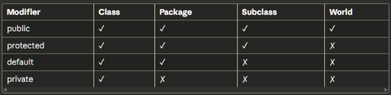
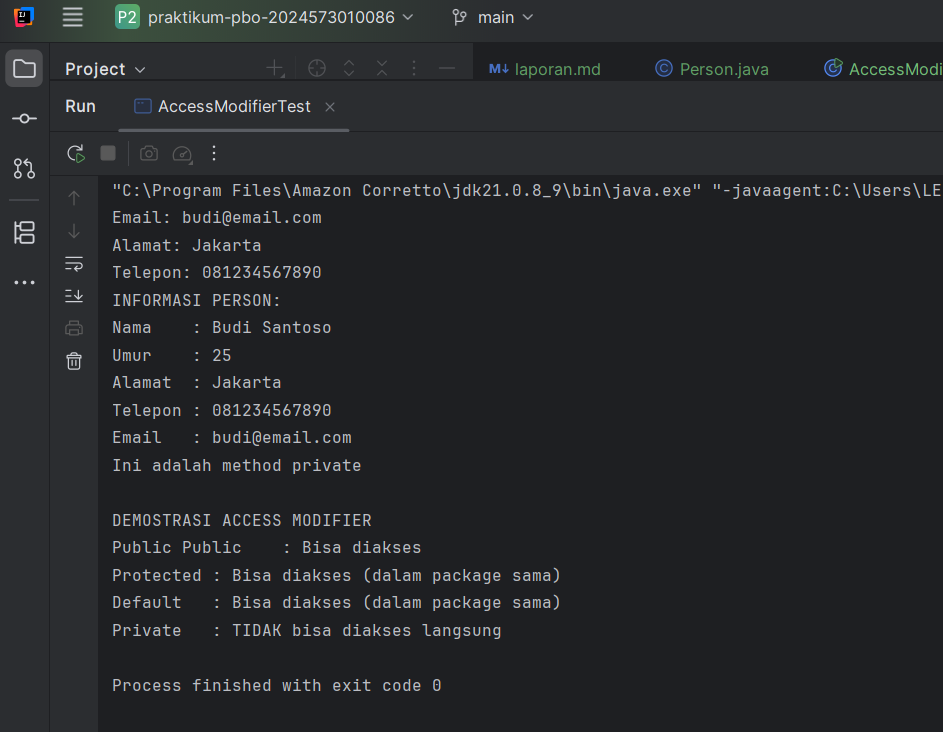
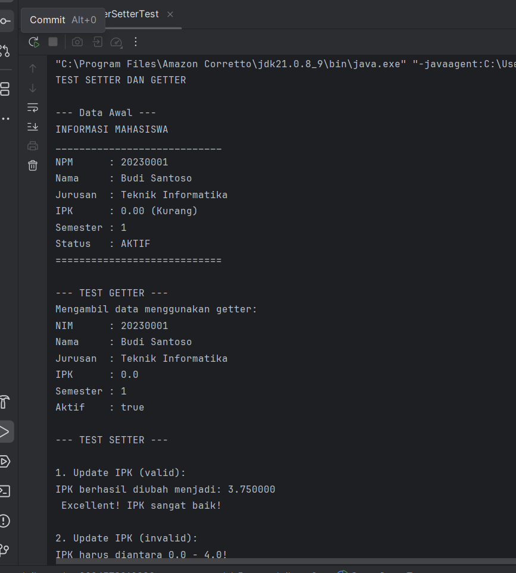
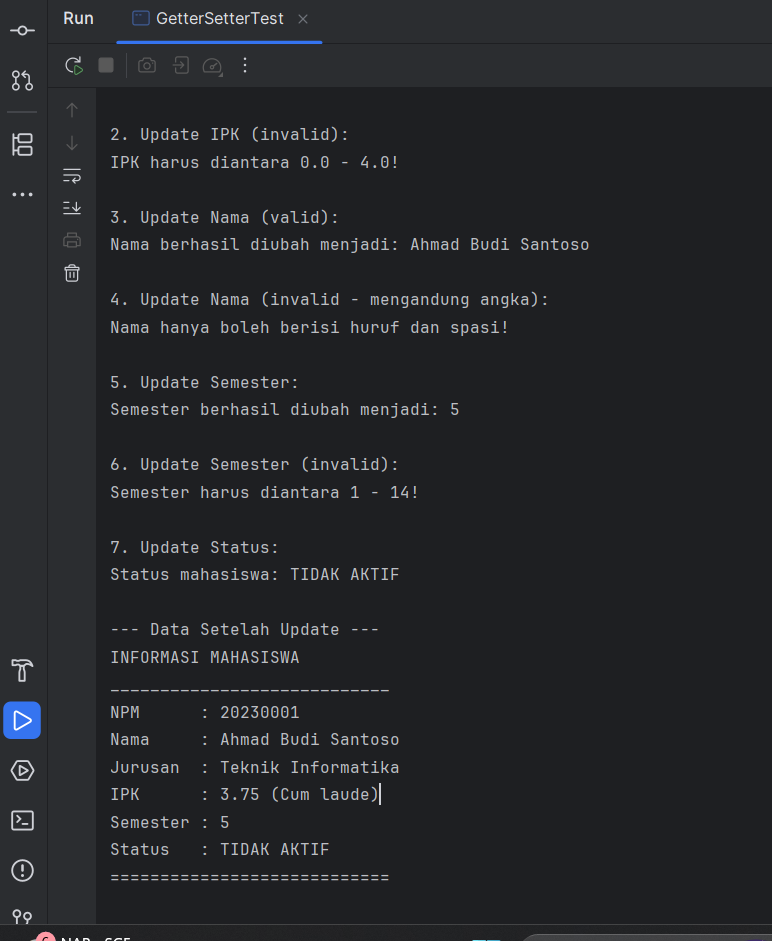
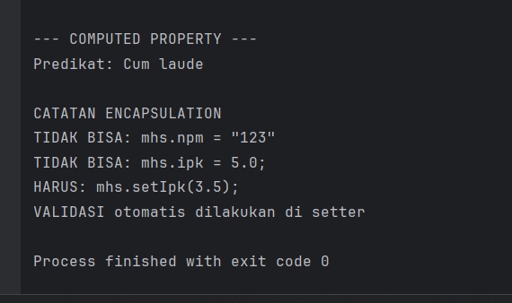
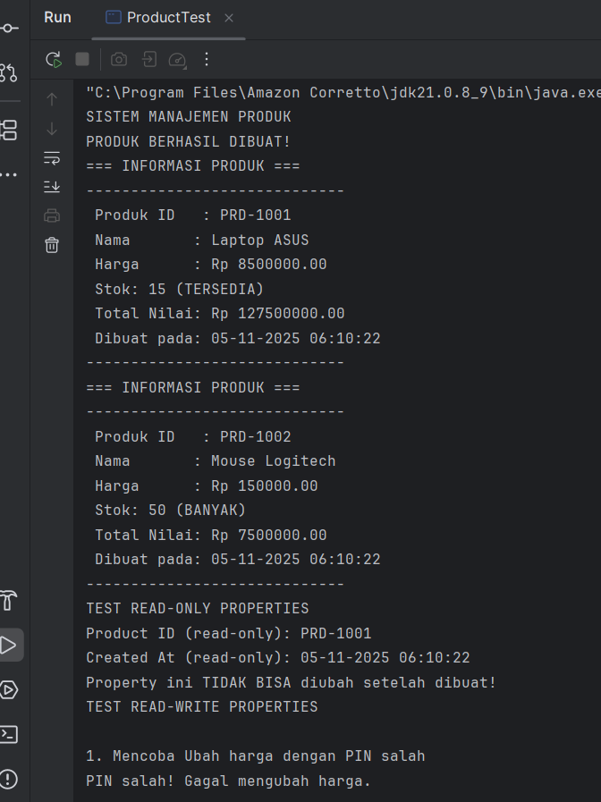
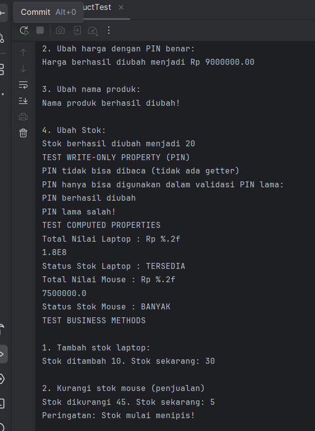
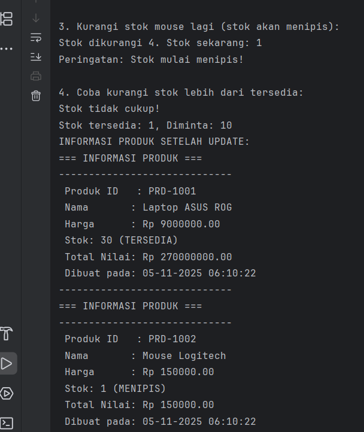
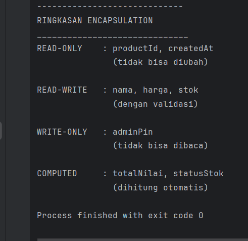

Laporan Modul 5: Enkapsulasi
---
**Mata Kuliah:** Praktikum Pemrograman Berorientasi Objek  
**Nama:** MIRZA FEBERANI  
**NIM:** 2024573010086  
**Kelas:** TI 2E  
**Tanggal Praktikum:** 23 Oktober 2025

---

## 1. Abstrak

Enkapsulasi merupakan salah satu pilar utama dalam paradigma **Pemrograman Berorientasi Objek (PBO)** yang berfungsi
untuk membatasi akses langsung terhadap data di dalam suatu kelas. Praktikum ini bertujuan untuk memahami penerapan
konsep enkapsulasi dalam bahasa pemrograman **Java**, terutama bagaimana penggunaan **access modifier** seperti
`private`, `public`, dan `protected` dapat menjaga keamanan data serta meningkatkan modularitas program.

Melalui pembuatan kelas dengan atribut privat dan metode *getter* serta *setter*, mahasiswa dapat mempelajari bagaimana
data dikontrol agar tidak dapat diubah secara langsung dari luar kelas. Hasil praktikum menunjukkan bahwa dengan
menerapkan enkapsulasi, struktur kode menjadi lebih terorganisasi, mudah dikelola, serta meminimalisasi kesalahan akibat
manipulasi data yang tidak diinginkan.


---

## 2. Praktikum

### Dasar Teori

Encapsulation (Enkapsulasi) adalah salah satu prinsip fundamental dalam Object-Oriented Programming (OOP) yang
membungkus data (attributes) dan method yang bekerja pada data tersebut dalam satu unit (class), serta menyembunyikan
detail implementasi internal dari dunia luar.

**Tujuan Encapsulation**

1. Data Protection - Melindungi data dari akses dan modifikasi yang tidak sah.
2. Data Validation - Memastikan data yang masuk valid sebelum disimpan.
3. Flexibility - Mudah mengubah implementasi internal tanpa mempengaruhi kode luar.
4. Maintainability - Kode lebih mudah dipelihara dan di-debug.
5. Modularity - Membuat kode lebih modular dan terorganisir

**Prinsip Utama:**


---

**Cara Implementasi**

1. Deklarasikan attributes sebagai private.
2. Buat getter methods untuk membaca nilai attributes.
3. Buat setter methods untuk mengubah nilai attributes dengan validasi.
4. Tambahkan business logic di dalam class.

**Access Modifier:**

Access modifier menentukan tingkat akses terhadap class, attributes, dan methods. Java memiliki 4 jenis access modifier:


---

### Praktikum 1 : Memahami Access Modifier

**Tujuan:**

Memahami perbedaan dan penggunaan berbagai access modifier.

#### Langkah Praktikum : Memahami Access Modifier

1. Buat class baru `Person`.
2. Ketik kode berikut:

```
package modul_5.praktikum_1;

public class Person {
    // Private - hanya bisa diakses dalam class ini
    private String nama;
    private int umur;

    // Default (package-private) - bisa diakses dalam package yang sama
    String alamat;

    // Protected - bisa diakses dalam package dan subclass
    protected String telepon;

    // Public - bisa diakses dari mana saja
    public String email;

    // Constructor
    public Person(String nama, int umur) {
        this.nama = nama;
        this.umur = umur;
    }

    // Public method untuk menampilkan info
    public void tampilkanInfo() {
        System.out.println("INFORMASI PERSON:");
        System.out.println("Nama    : " + nama);            // OK - dalam class yang sama
        System.out.println("Umur    : " + umur);            // OK - dalam class yang sama
        System.out.println("Alamat  : " + alamat);          // OK - dalam class yang sama
        System.out.println("Telepon : " + telepon);         // OK - dalam class yang sama
        System.out.println("Email   : " + email);           // OK - dalam class yang sama
    }

    // Private method - hanya bisa dipanggil dalam class ini
    private void metodePribadi() {
        System.out.println("Ini adalah method private");
    }

    // Protected method
    protected void metodeProtected() {
        System.out.println("Ini adalah method protected");
    }

    // Method untuk mengakses private method
    public void panggilMetodePribadi() {
        metodePribadi(); // OK - dalam class yang sama
    }
}
```

- Kemudian Buat class `AccessModifierTest` dan isikan kode berikut:

```
package modul_5.praktikum_1;

public class AccessModifierTest {
    public static void main(String[] args) {
        Person person = new Person("Budi Santoso", 25);

        // Test akses public
        person.email = "budi@email.com";    // OK - public
        System.out.println("Email: " + person.email);

        // Test akses default (dalam package yang sama)
        person.alamat = "Jakarta";          // OK - dalam package yang sama
        System.out.println("Alamat: " + person.alamat);

        // Test akses protected (dalam package yang sama)
        person.telepon = "081234567890";    // OK - dalam package yang sama
        System.out.println("Telepon: " + person.telepon);

        // Test akses private - AKAN ERROR jika uncomment
        // person.nama = "Andi";            // ERROR - private
        // person.umur = 30;                // ERROR - private
        // person.metodePribadi();          // ERROR - private

        // Mengakses data private melalui public method
        person.tampilkanInfo();

        // Mengakses method private melalui public method
        person.panggilMetodePribadi();

        System.out.println("\nDEMOSTRASI ACCESS MODIFIER");
        System.out.println("Public Public    : Bisa diakses");
        System.out.println("Protected : Bisa diakses (dalam package sama)");
        System.out.println("Default   : Bisa diakses (dalam package sama)");
        System.out.println("Private   : TIDAK bisa diakses langsung");
    }
}
```

- Jalankan program, kemudian lihat hasilnya.
- Amati program, juga bagaimana method bekerja.

#### Screenshot Hasil

**Hasil Program**


---

### Analisa dan Pembahasan

**1. Deskripsi Umum Program**

Terdapat dua kelas utama:

- **Person** – berisi atribut dan metode dengan berbagai tingkat akses untuk menunjukkan bagaimana enkapsulasi bekerja.
- **AccessModifierTest** – berfungsi sebagai kelas pengujian untuk mencoba mengakses atribut dan metode dari kelas
  `Person` sesuai tingkat akses yang diizinkan.

**2. Analisis Kelas Person**

**Struktur dan Atribut**

Kelas `Person` memiliki beberapa atribut dengan tingkat akses berbeda:

| Modifier    | Atribut        | Keterangan                                                                              |
|-------------|----------------|-----------------------------------------------------------------------------------------|
| `private`   | `nama`, `umur` | Hanya dapat diakses dari dalam kelas `Person`. Menunjukkan inti konsep **enkapsulasi**. |
| *(default)* | `alamat`       | Dapat diakses oleh kelas lain dalam **package yang sama**.                              |
| `protected` | `telepon`      | Dapat diakses dari kelas dalam package yang sama dan oleh **subclass** di package lain. |
| `public`    | `email`        | Dapat diakses dari **mana pun**, tanpa batasan.                                         |

**Constructor**

```
public Person(String nama, int umur) {
    this.nama = nama;
    this.umur = umur;
}
```

Constructor ini digunakan untuk menginisialisasi objek `Person` sekaligus mengatur nilai awal atribut `nama` dan `umur`
yang
bersifat privat.

**Metode Utama**

- `tampilkanInfo()`
  Menampilkan semua informasi atribut dalam kelas. Karena metode ini berada di dalam kelas `Person`, ia dapat mengakses
  semua atribut termasuk yang `private`.

- `metodePribadi()`
  Contoh private method yang hanya bisa dipanggil dari dalam kelas yang sama.

- `metodeProtected()`
  Contoh protected method yang bisa dipanggil dari subclass atau dalam package yang sama.

- `panggilMetodePribadi()`
  Metode publik untuk memanggil metode privat. Ini adalah contoh praktik enkapsulasi, karena data atau perilaku privat
  hanya bisa diakses secara tidak langsung melalui metode publik.

**3. Analisis Kelas AccessModifierTest**

Kelas ini berfungsi untuk menguji bagaimana setiap modifier berperilaku.

```
Person person = new Person("Budi Santoso", 25);
```

Objek `person` dibuat dengan nama dan umur tertentu.
Kemudian dilakukan pengujian akses terhadap atribut dan metode:

- `person.email` → Berhasil karena `public`.
- `person.alamat` → Berhasil karena kelas ini masih dalam package yang sama.
- `person.telepon` → Berhasil karena `protected` masih bisa diakses dari package yang sama.
- `person.nama` dan `person.umur` → Error jika diakses langsung, karena private.
  Dapat diakses tidak langsung melalui metode publik tampilkanInfo().

Hasil keluaran program menunjukkan perbedaan jelas antara keempat modifier.\

**4. Pembahasan**

Dari hasil di atas dapat disimpulkan bahwa:

- **Enkapsulasi** tercapai dengan menyembunyikan data (`nama`, `umur`) menggunakan `private`, dan hanya mengaksesnya
  melalui metode publik.
- **Access Modifier** mengatur **batasan visibilitas** setiap atribut/metode untuk melindungi data dari akses yang tidak
  diinginkan.
- Penerapan **getter/setter** atau metode publik menjadi solusi standar untuk menjaga keamanan dan integritas data.
- Dengan enkapsulasi, program menjadi lebih aman, terstruktur, dan mudah dirawat.

---

### Praktikum 2 : Getter dan Setter

**Teori Dasar**

Getter dan Setter adalah method yang digunakan untuk mengakses dan mengubah nilai private attributes.

**Naming Convention:**

- Getter: get + NamaAttribute (contoh: getNama())
- Setter: set + NamaAttribute (contoh: setNama())
- Boolean Getter: is + NamaAttribute (contoh: isActive())

**Keuntungan Menggunakan Getter/Setter:**

- Kontrol akses terhadap data
- Validasi data sebelum disimpan
- Read-only atau write-only attributes
- Computed attributes
- Lazy initialization

**Tujuan:**

Memahami cara membuat dan menggunakan getter dan setter dengan benar.

#### Langkah Praktikum : Getter dan Setter

1. Buat class baru `Mahasiswa`.
2. Ketik kode berikut:

```
package modul_5.praktikum_2;

public class Mahasiswa {
    // private attributes
    private String npm;
    private String nama;
    private String jurusan;
    private double ipk;
    private int semester;
    private boolean aktif;

    // CONSTRUCTOR
    public Mahasiswa(String npm, String nama, String jurusan) {
        this.npm = npm;
        this.nama = nama;
        this.jurusan = jurusan;
        this.ipk = 0.0;
        this.semester = 1;
        this.aktif = true;
    }

    // GETTER Methods
    public String getNpm() {
        return npm;
    }

    public String getNama() {
        return nama;
    }

    public String getJurusan() {
        return jurusan;
    }

    public double getIpk() {
        return ipk;
    }

    public int getSemester() {
        return semester;
    }

    // Getter khusus untuk boolean is/get
    public boolean isAktif() {
        return aktif;
    }

    // SETTER METHODS DENGAN VALIDASI

    // NPM: Read-Only (tidak ada setter)
    // Alasan: NPM tidak boleh diubah setelah dibuat
    public void setNama(String nama) {
        // Validasi: Nama tidak boleh kosong
        if (nama == null || nama.trim().isEmpty()) {
            System.out.println("Nama tidak boleh kosong!");
            return;
        }

        // Validasi: Nama hanya huruf dan spasi
        if (!nama.matches("[a-zA-Z ]+")) {
            System.out.println("Nama hanya boleh berisi huruf dan spasi!");
            return;
        }

        this.nama = nama;
        System.out.println("Nama berhasil diubah menjadi: " + nama);
    }

    public void setJurusan(String jurusan) {
        if (jurusan == null || jurusan.trim().isEmpty()) {
            System.out.println("Jurusan tidak boleh kosong!");
            return;
        }
        this.jurusan = jurusan;
        System.out.println("Jurusan berhasil diubah menjadi: " + jurusan);
    }

    public void setIpk(double ipk) {
        // Validasi: IPK
        if (ipk < 0.0 || ipk > 4.0) {
            System.out.println("IPK harus diantara 0.0 - 4.0!");
            return;
        }
        this.ipk = ipk;
        System.out.printf("IPK berhasil diubah menjadi: %2f\n ", ipk);

        // Cek Status akademik berdasarkan IPK
        cekStatusAkademik();
    }

    public void setSemester(int semester) {
        // Validasi: Semester
        if (semester < 1 || semester > 14) {
            System.out.println("Semester harus diantara 1 - 14!");
            return;
        }
        this.semester = semester;
        System.out.println("Semester berhasil diubah menjadi: " + semester);
    }

    public void setAktif(boolean aktif) {
        this.aktif = aktif;
        String status = aktif ? "AKTIF" : "TIDAK AKTIF";
        System.out.println("Status mahasiswa: " + status);
    }

    // HELPER METHODS (private)
    public void cekStatusAkademik() {
        if (ipk < 2.0) {
            System.out.println("Peringatan: IPK di bawah standar!");
        } else {
            System.out.println("Excellent! IPK sangat baik!");
        }
    }

    // Public Methods
    public String getPredikat() {
        if (ipk >= 3.5) return "Cum laude";
        else if (ipk >= 3.0) return "Sangat Baik";
        else if (ipk >= 2.5) return "Baik";
        else if (ipk >= 2.0) return "Cukup";
        else return "Kurang";
    }

    public void tampilkanInfo() {
        System.out.println("INFORMASI MAHASISWA      ");
        System.out.println("____________________________");
        System.out.println("NPM      : " + npm);
        System.out.println("Nama     : " + nama);
        System.out.println("Jurusan  : " + jurusan);
        System.out.printf("IPK      : %.2f (%s)\n", ipk, getPredikat());
        System.out.println("Semester : " + semester);
        System.out.println("Status   : " + (aktif ? "AKTIF" : "TIDAK AKTIF"));
        System.out.println("============================");
    }
}
```

- Kemudian Buat class `GetterSetterTest` dan isikan kode berikut:

```
package modul_5.praktikum_2;

public class GetterSetterTest {
    public static void main(String[] args) {
        System.out.println("TEST SETTER DAN GETTER\n");

        // Membuat object mahasiswa
        Mahasiswa mhs = new Mahasiswa("20230001", "Budi Santoso", "Teknik Informatika");

        System.out.println("--- Data Awal ---");
        mhs.tampilkanInfo();

        // Test GETTER
        System.out.println("\n--- TEST GETTER ---");
        System.out.println("Mengambil data menggunakan getter:");
        System.out.println("NIM      : " + mhs.getNpm());
        System.out.println("Nama     : " + mhs.getNama());
        System.out.println("Jurusan  : " + mhs.getJurusan());
        System.out.println("IPK      : " + mhs.getIpk());
        System.out.println("Semester : " + mhs.getSemester());
        System.out.println("Aktif    : " + mhs.isAktif());

        // Test SETTER dengan validasi
        System.out.println("\n--- TEST SETTER ---");

        // Test 1: Update IPK valid
        System.out.println("\n1. Update IPK (valid):");
        mhs.setIpk(3.75);

        // Test 2: Update IPK invalid
        System.out.println("\n2. Update IPK (invalid):");
        mhs.setIpk(5.0); // Akan ditolak

        // Test 3: Update Nama valid
        System.out.println("\n3. Update Nama (valid):");
        mhs.setNama("Ahmad Budi Santoso");

        // Test 4: Update Nama invalid
        System.out.println("\n4. Update Nama (invalid - mengandung angka):");
        mhs.setNama("Budi123"); // Akan ditolak

        // Test 5: Update semester
        System.out.println("\n5. Update Semester:");
        mhs.setSemester(5);

        // Test 6: Update semester invalid
        System.out.println("\n6. Update Semester (invalid):");
        mhs.setSemester(20); // Akan ditolak

        // Test 7: Update status
        System.out.println("\n7. Update Status:");
        mhs.setAktif(false);

        // Tampilkan data akhir
        System.out.println("\n--- Data Setelah Update ---");
        mhs.tampilkanInfo();

        // Demonstrasi computed property
        System.out.println("\n--- COMPUTED PROPERTY ---");
        System.out.println("Predikat: " + mhs.getPredikat());

        // Tidak bisa akses langsung (akan error)
        System.out.println("\nCATATAN ENCAPSULATION");
        System.out.println("TIDAK BISA: mhs.npm = \"123\"");
        System.out.println("TIDAK BISA: mhs.ipk = 5.0;");
        System.out.println("HARUS: mhs.setIpk(3.5);");
        System.out.println("VALIDASI otomatis dilakukan di setter");
    }
}
```

- Jalankan program, kemudian lihat hasilnya.
- Amati program, juga bagaimana method bekerja.

#### Screenshot Hasil

**Hasil Program**




- Getter berfungsi untuk membaca data
- Setter melakukan validasi sebelum mengubah data
- Beberapa attribute bersifat read-only (tidak ada setter)

---

### Analisa dan Pembahasan

**1. Deskripsi Umum Program**

Program pada package `modul_5.praktikum_2` berjudul **"Enkapsulasi"**.  
Tujuan program ini adalah untuk mendemonstrasikan konsep **enkapsulasi** dalam Java dengan cara menyembunyikan atribut (
`private`) di dalam kelas `Mahasiswa` dan mengaksesnya secara aman menggunakan **getter** dan **setter**.  
Selain itu, kelas `GetterSetterTest` digunakan untuk **menguji** cara kerja getter, setter, serta validasi yang
diterapkan pada setiap atribut.

---

**2. Analisis Class Mahasiswa**

**Struktur Atribut**

Kelas `Mahasiswa` memiliki beberapa atribut penting yang semuanya bersifat `private`, yaitu:

- `npm` Nomor Pokok Mahasiswa (tidak dapat diubah setelah objek dibuat)
- `nama`
- `jurusan`
- `ipk`
- `semester`
- `aktif`

Semua atribut tersebut tidak bisa diakses langsung dari luar kelas karena bersifat **tertutup (private)**.  
Untuk mengakses atau mengubah nilai atribut, digunakan **getter** dan **setter** yang menyediakan **kendali validasi**.

**Constructor**

```
public Mahasiswa(String npm, String nama, String jurusan) {
    this.npm = npm;
    this.nama = nama;
    this.jurusan = jurusan;
    this.ipk = 0.0;
    this.semester = 1;
    this.aktif = true;
}
```

Constructor ini otomatis memberikan nilai awal (`default`) kepada objek mahasiswa ketika dibuat.

Nilai `ipk` diatur menjadi 0.0, `semester` dimulai dari 1, dan status `aktif` bernilai `true`.

**Getter Methods**

Getter digunakan untuk mengambil nilai atribut tanpa bisa mengubahnya.

Contohnya:

```
public String getNpm() { return npm; }
public double getIpk() { return ipk; }
public boolean isAktif() { return aktif; }
```

Semua getter bersifat public, sehingga dapat digunakan dari luar kelas untuk membaca data mahasiswa dengan aman.

**Setter Methods dengan Validasi**

Setter digunakan untuk mengubah nilai atribut, tetapi dengan syarat tertentu agar data tetap valid.

Contoh validasi:

- Nama tidak boleh kosong dan hanya huruf:

```
if (nama == null || nama.trim().isEmpty()) { ... }
if (!nama.matches("[a-zA-Z ]+")) { ... }
```

- IPK harus di antara 0.0 hingga 4.0:

```
if (ipk < 0.0 || ipk > 4.0) {
    System.out.println("IPK harus diantara 0.0 - 4.0!");
    return;
}
```

- Semester hanya 1 sampai 14.
- Status aktif/tidak aktif ditentukan dengan boolean.

Setiap setter juga memberikan umpan balik melalui `System.out.println()` agar pengguna tahu apakah perubahan berhasil
atau tidak.

**Metode Tambahan**

- `cekStatusAkademik()`  Mengevaluasi apakah IPK mahasiswa di bawah standar (2.0).
- `getPredikat()`  Mengembalikan string berdasarkan nilai IPK (misalnya “Cum laude”, “Sangat Baik”, dll).
- `tampilkanInfo()`  Menampilkan seluruh informasi mahasiswa dengan format rapi di konsol.

**3. Analisis Class GetterSetterTest**

Kelas ini digunakan untuk menguji fungsi-fungsi getter dan setter dari kelas `Mahasiswa`.

**Langkah Pengujian**

- Membuat objek mahasiswa:
```
Mahasiswa mhs = new Mahasiswa("20230001", "Budi Santoso", "Teknik Informatika");
```

- Menampilkan data awal mahasiswa dengan:
```
mhs.tampilkanInfo();
```

- Menguji getter untuk mengambil data seperti `npm`, `nama`, `jurusan`, `ipk`, dan `semester`.

- Menguji setter dengan berbagai kasus:
1. Update IPK valid (`3.75`) diterima.
2. Update IPK invalid (`5.0`) ditolak dan muncul pesan kesalahan.
3. Update Nama valid (`Ahmad Budi Santoso`) diterima.
4. Update Nama invalid (`Budi123`) ditolak karena mengandung angka.
5. Update Semester valid (`5`) diterima.
6. Update Semester invalid (`20`) ditolak.
7. Update Status (`false`) status berubah menjadi tidak aktif. 

- Menampilkan kembali data akhir mahasiswa dan mengecek predikat IPK.
- Menampilkan catatan enkapsulasi — contoh variabel `npm` dan `ipk` tidak dapat diubah langsung tanpa melalui setter.

**4. Pembahasan**

Dari hasil pengujian di atas, konsep enkapsulasi berjalan dengan baik.
Semua atribut `private` terlindungi dari akses langsung, dan perubahan nilai hanya dapat dilakukan melalui setter yang memiliki validasi logis.
Hal ini memastikan integritas data mahasiswa tetap terjaga, serta mencegah nilai yang tidak masuk akal seperti IPK 5.0 atau semester 20.

Penerapan getter dan setter juga memudahkan:

- Pengendalian logika internal kelas tanpa mengubah struktur luar.
- Penambahan validasi baru tanpa mengganggu kode yang sudah ada.
- Meningkatkan keamanan data dan mencegah kesalahan input.

Program juga memperlihatkan bagaimana computed property (`getPredikat()`) dapat menghasilkan nilai turunan dari atribut lain (IPK).

---

### Praktikum 3 : Read-Only dan Write-Only Properties

**Tujuan:**

Memahami konsep read-only dan write-only properties menggunakan getter/setter.

#### Langkah Praktikum : Read-Only dan Write-Only Properties

1. Buat class baru `Product`.
2. Ketik kode berikut:

```
package modul_5.praktikum_3;

import java.time.LocalDateTime;
import java.time.format.DateTimeFormatter;

public class Product {
    // Read-only (hanya getter)
    private final String productId;
    private final LocalDateTime createdAt;

    // Read-write (getter dan setter)
    private String nama;
    private double harga;
    private int stok;

    // Write-only (hanya setter) - untuk password/PIN
    private String adminPin;

    // Computed property (tidak ada attribute, hanya getter)
    // Total nilai = harga * stok

    // Counter untuk ID otomatis
    private static int counter = 1000;

    // CONSTRUCTOR
    public Product(String nama, double harga, int stok, String adminPin) {
        this.productId = generateProductId();
        this.createdAt = LocalDateTime.now();
        this.nama = nama;
        this.harga = harga;
        this.stok = stok;
        this.adminPin = adminPin;
    }

    // PRIVATE HELPER METHODS
    private String generateProductId() {
        counter++;
        return "PRD-" + counter;
    }

    private boolean validatePin(String inputPin) {
        return this.adminPin.equals(inputPin);
    }

    // READ-ONLY PROPERTIES (hanya getter)
    public String getProductId() {
        return productId;
    }

    public String getCreatedAt() {
        DateTimeFormatter formatter = DateTimeFormatter.ofPattern("dd-MM-yyyy HH:mm:ss");
        return createdAt.format(formatter);
    }

    // READ-WRITE PROPERTIES (getter dan setter)
    public String getNama() {
        return nama;
    }

    public void setNama(String nama, String pin) {
        if (!validatePin(pin)) {
            System.out.println("PIN salah! Gagal mengubah nama.");
            return;
        }

        if (nama == null || nama.trim().isEmpty()) {
            System.out.println("Nama produk tidak boleh kosong!");
            return;
        }

        this.nama = nama;
        System.out.println("Nama produk berhasil diubah!");
    }

    public double getHarga() {
        return harga;
    }

    public void setHarga(double harga, String pin) {
        if (!validatePin(pin)) {
            System.out.println("PIN salah! Gagal mengubah harga.");
            return;
        }

        if (harga < 0) {
            System.out.println("Harga tidak boleh negatif!");
            return;
        }

        this.harga = harga;
        System.out.printf("Harga berhasil diubah menjadi Rp %.2f\n", harga);
    }

    public int getStok() {
        return stok;
    }

    public void setStok(int stok, String pin) {
        if (!validatePin(pin)) {
            System.out.println("PIN Anda salah! Gagal mengubah stok!");
            return;
        }

        if (stok < 0) {
            System.out.println("Stok tidak boleh negatif!");
            return;
        }

        this.stok = stok;
        System.out.println("Stok berhasil diubah menjadi " + stok);
    }

    // WRITE-ONLY PROPERTY (hanya setter)
    // Tidak ada getAdminPin() – untuk keamanan!

    public void changeAdminPin(String oldPin, String newPin) {
        if (!validatePin(oldPin)) {
            System.out.println("PIN lama salah!");
            return;
        }

        if (newPin.length() < 4) {
            System.out.println("PIN baru minimal 4 karakter!");
            return;
        }

        this.adminPin = newPin;
        System.out.println("PIN berhasil diubah");
    }

    // COMPUTED PROPERTIES (calculated on-the-fly)
    public double getTotalNilai() {
        return harga * stok;
    }

    public String getStatusStok() {
        if (stok == 0) return "HABIS";
        else if (stok < 10) return "MENIPIS";
        else if (stok < 50) return "TERSEDIA";
        else return "BANYAK";
    }

    // PUBLIC METHODS
    public boolean tambahStok(int jumlah, String pin) {
        if (!validatePin(pin)) {
            System.out.println("PIN salah!");
            return false;
        }

        if (jumlah <= 0) {
            System.out.println("Jumlah harus lebih dari 0!");
            return false;
        }

        stok += jumlah;
        System.out.printf("Stok ditambah %d. Stok sekarang: %d\n", jumlah, stok);
        return true;
    }

    public boolean kurangiStok(int jumlah) {
        if (jumlah <= 0) {
            System.out.println("Jumlah harus lebih dari 0!");
            return false;
        }

        if (jumlah > stok) {
            System.out.println("Stok tidak cukup!");
            System.out.printf("Stok tersedia: %d, Diminta: %d\n", stok, jumlah);
            return false;
        }

        stok -= jumlah;
        System.out.printf("Stok dikurangi %d. Stok sekarang: %d\n", jumlah, stok);

        // Warning jika stok menipis
        if (stok < 10) {
            System.out.println("Peringatan: Stok mulai menipis!");
        }

        return true;
    }

    public void tampilkanInfo() {
        System.out.println("=== INFORMASI PRODUK ===");
        System.out.println("-----------------------------");
        System.out.println(" Produk ID   : " + productId);
        System.out.println(" Nama       : " + nama);
        System.out.printf(" Harga      : Rp %.2f\n", harga);
        System.out.println(" Stok: " + stok + " (" + getStatusStok() + ")");
        System.out.printf(" Total Nilai: Rp %.2f\n", getTotalNilai());
        System.out.println(" Dibuat pada: " + getCreatedAt());
        System.out.println("-----------------------------");
    }
}
```

- Kemudian Buat class `ProductTest` dan isikan kode berikut:

```
package modul_5.praktikum_3;

import java.util.Scanner;

public class ProductTest {
    public static void main(String[] args) {
        Scanner input = new Scanner(System.in);

        System.out.println("SISTEM MANAJEMEN PRODUK");

        // Membuat produk dengan PIN
        Product laptop = new Product("Laptop ASUS", 8500000, 15, "1234");
        Product mouse = new Product("Mouse Logitech", 150000, 50, "1234");

        System.out.println("PRODUK BERHASIL DIBUAT!");
        laptop.tampilkanInfo();
        mouse.tampilkanInfo();

        // TEST READ-ONLY PROPERTIES
        System.out.println("TEST READ-ONLY PROPERTIES");
        System.out.println("Product ID (read-only): " + laptop.getProductId());
        System.out.println("Created At (read-only): " + laptop.getCreatedAt());
        System.out.println("Property ini TIDAK BISA diubah setelah dibuat!");

        // TEST READ-WRITE PROPERTIES
        System.out.println("TEST READ-WRITE PROPERTIES");

        // Test 1: Ubah harga tanpa PIN (akan gagal)
        System.out.println("\n1. Mencoba Ubah harga dengan PIN salah");
        laptop.setHarga(9000000, "0000");

        // Test 2: Ubah harga dengan PIN benar
        System.out.println("\n2. Ubah harga dengan PIN benar:");
        laptop.setHarga(    9000000, "1234");

        // Test 3: Ubah Nama
        System.out.println("\n3. Ubah nama produk:");
        laptop.setNama("Laptop ASUS ROG", "1234");

        // Test 4: Ubah Stok
        System.out.println("\n4. Ubah Stok:");
        laptop.setStok(20, "1234");

        // Test WRITE-ONLY PROPERTY
        System.out.println("TEST WRITE-ONLY PROPERTY (PIN)");
        System.out.println("PIN tidak bisa dibaca (tidak ada getter)");
        System.out.println("PIN hanya bisa digunakan dalam validasi PIN lama:");
        laptop.changeAdminPin("1234", "5678");
        laptop.changeAdminPin("0000", "9999"); // Akan gagal

        // TEST COMPUTED PROPERTIES
        System.out.println("TEST COMPUTED PROPERTIES");
        System.out.println("Total Nilai Laptop : Rp %.2f\n" + laptop.getTotalNilai());
        System.out.println("Status Stok Laptop : " + laptop.getStatusStok());
        System.out.println("Total Nilai Mouse : Rp %.2f\n" + mouse.getTotalNilai());
        System.out.println("Status Stok Mouse : " + mouse.getStatusStok());

        // TEST BUSINESS METHODS
        System.out.println("TEST BUSINESS METHODS");

        System.out.println("\n1. Tambah stok laptop:");
        laptop.tambahStok(10, "5678"); // PIN sudah diubah

        System.out.println("\n2. Kurangi stok mouse (penjualan)");
        mouse.kurangiStok(45);

        System.out.println("\n3. Kurangi stok mouse lagi (stok akan menipis):");
        mouse.kurangiStok(4);

        System.out.println("\n4. Coba kurangi stok lebih dari tersedia:");
        mouse.kurangiStok(10);

        // TAMPILKAN INFO AKHIR
        System.out.println("INFORMASI PRODUK SETELAH UPDATE:");
        laptop.tampilkanInfo();
        mouse.tampilkanInfo();

        // RINGKASAN ENCAPSULATION
        System.out.println("RINGKASAN ENCAPSULATION");
        System.out.println("______________________________");
        System.out.println("READ-ONLY    : productId, createdAt             ");
        System.out.println("               (tidak bisa diubah)              ");
        System.out.println("                                                ");
        System.out.println("READ-WRITE   : nama, harga, stok                ");
        System.out.println("               (dengan validasi)                ");
        System.out.println("                                                ");
        System.out.println("WRITE-ONLY   : adminPin                         ");
        System.out.println("               (tidak bisa dibaca)              ");
        System.out.println("                                                ");
        System.out.println("COMPUTED     : totalNilai, statusStok           ");
        System.out.println("               (dihitung otomatis)              ");
    }
}
```

- Jalankan program, kemudian lihat hasilnya.
- Amati program, juga bagaimana method bekerja.

#### Screenshot Hasil

**Hasil Program**





- Read-only properties tidak bisa diubah
- Write-only properties tidak bisa dibaca
- Computed properties dihitung on-the-fly
- Semua perubahan data memerlukan validasi PIN

---

### Analisa dan Pembahasan

**1. Deskripsi Umum Program**

Program pada package `modul_5.praktikum_3` berjudul **"Enkapsulasi Lanjutan dengan Read-Only, Write-Only, dan Computed Property"**.  
Program ini mengimplementasikan konsep **enkapsulasi tingkat lanjut** dalam Java dengan menerapkan berbagai tipe akses terhadap atribut melalui **getter dan setter** yang dikombinasikan dengan **validasi keamanan menggunakan PIN admin**.

Terdapat dua kelas utama:
1. **Product** : Merepresentasikan entitas produk dengan berbagai tipe properti (read-only, read-write, write-only, dan computed).
2. **ProductTest** : Berfungsi untuk menguji dan mendemonstrasikan setiap fitur yang ada di kelas `Product`.

---

**2. Analisis Kelas Product**

**Atribut dan Tipe Akses**
Kelas `Product` menggunakan empat jenis properti berbeda:

| Jenis Properti | Atribut | Akses | Keterangan |
|----------------|----------|--------|-------------|
| **Read-Only** | `productId`, `createdAt` | `getter` saja | Nilai dihasilkan otomatis oleh sistem dan tidak dapat diubah. |
| **Read-Write** | `nama`, `harga`, `stok` | `getter` dan `setter` | Dapat dibaca dan diubah, tetapi hanya dengan PIN valid. |
| **Write-Only** | `adminPin` | `setter` saja | Tidak memiliki `getter` demi keamanan. |
| **Computed** | `totalNilai`, `statusStok` | hanya `getter` | Nilai dihitung otomatis dari atribut lain. |

Selain itu, terdapat atribut `counter` (static) yang digunakan untuk menghasilkan **ID produk otomatis**.

---

### **Constructor**
```
public Product(String nama, double harga, int stok, String adminPin) {
    this.productId = generateProductId();
    this.createdAt = LocalDateTime.now();
    this.nama = nama;
    this.harga = harga;
    this.stok = stok;
    this.adminPin = adminPin;
}
```
Constructor secara otomatis:

- Membuat product ID unik menggunakan metode `generateProductId()`.
- Menyimpan waktu pembuatan produk (`createdAt`).
- Menginisialisasi atribut produk dengan nilai yang diberikan.

**Private Helper Methods**

- `generateProductId()`  Menghasilkan ID unik dengan format `"PRD-" + counter`.
- `validatePin(String inputPin)`  Mengecek apakah PIN yang dimasukkan sama dengan `adminPin`.

Kedua metode ini bersifat privat untuk menjaga keamanan data agar tidak bisa diakses dari luar kelas.

**Getter (Read-Only & Read-Write)**

Contoh getter:
```
public String getProductId() { return productId; }
public String getCreatedAt() {
    DateTimeFormatter formatter = DateTimeFormatter.ofPattern("dd-MM-yyyy HH:mm:ss");
    return createdAt.format(formatter);
}
```
Getter ini hanya menampilkan data produk tanpa memberi izin perubahan.
Untuk properti read-write seperti `nama`, `harga`, dan `stok`, getter disediakan agar data bisa dibaca dengan aman.

**Setter (Dengan Validasi dan PIN)**

Semua setter untuk atribut sensitif seperti `nama`, `harga`, dan `stok` memerlukan validasi PIN:
```
if (!validatePin(pin)) {
    System.out.println("PIN salah! Gagal mengubah data.");
    return;
}
```
Selain itu, setiap setter memiliki validasi tambahan:

- `setNama()` : tidak boleh kosong.
- `setHarga()` : tidak boleh negatif.
- `setStok()` : tidak boleh kurang dari 0.

Jika semua validasi lolos, perubahan diterapkan dan pesan konfirmasi ditampilkan di konsol.

**Write-Only Property**

Atribut `adminPin` tidak memiliki getter, hanya bisa diubah menggunakan:
```
public void changeAdminPin(String oldPin, String newPin)
```

Metode ini memverifikasi PIN lama terlebih dahulu dan memastikan PIN baru minimal 4 karakter.

Hal ini menunjukkan keamanan data yang kuat karena PIN tidak pernah terekspos keluar kelas.

**Computed Properties**

- `getTotalNilai()` : Menghitung total nilai stok produk:
```
return harga * stok;
```
- `getStatusStok()` : Menilai kondisi stok berdasarkan jumlah:

0 → HABIS

<10 → MENIPIS

<50 → TERSEDIA

≥50 → BANYAK

Computed property ini tidak menyimpan nilai secara fisik, tetapi menghitung secara real-time setiap kali dipanggil.

**Metode Bisnis (Public Methods)**

1. `tambahStok(int jumlah, String pin)` Menambah stok produk jika PIN benar dan jumlah > 0.
2. `kurangiStok(int jumlah)` Mengurangi stok produk, menolak jika stok tidak cukup, dan memberi peringatan jika stok menipis.
3. `tampilkanInfo()` Menampilkan seluruh informasi produk, termasuk status stok dan waktu pembuatan.

**3. Analisis Kelas ProductTest**

Kelas `ProductTest` berfungsi sebagai pengujian (testing class) untuk memastikan seluruh fitur pada kelas `Product` berjalan dengan benar.

Langkah Pengujian

- Membuat objek produk:
```
Product laptop = new Product("Laptop ASUS", 8500000, 15, "1234");
Product mouse = new Product("Mouse Logitech", 150000, 50, "1234");
```
Setiap produk langsung memiliki `productId` dan `createdAt` otomatis.

- Menguji Read-Only Property:
```
System.out.println(laptop.getProductId());
System.out.println(laptop.getCreatedAt());
```
Nilai ini bisa dibaca tapi tidak bisa diubah.

- Menguji Read-Write Property:

1. Mengubah harga dengan PIN salah → gagal.
2. Mengubah harga dengan PIN benar → berhasil.
3. Mengubah nama dan stok → berhasil setelah validasi PIN.

- Menguji Write-Only Property (PIN):

1. Mengubah PIN lama menjadi baru menggunakan `changeAdminPin()`.
2. Percobaan dengan PIN lama salah ditolak.

- Menguji Computed Property:

1. Menampilkan hasil dari `getTotalNilai()` dan `getStatusStok()` untuk setiap produk.

- Menguji Metode Bisnis:

1. Menambah stok laptop dengan PIN benar.
2. Mengurangi stok mouse dalam beberapa percobaan untuk melihat perubahan status stok.
3. Percobaan pengurangan stok melebihi ketersediaan gagal dengan pesan kesalahan.

**4. Pembahasan**

Program ini memperlihatkan penerapan konsep enkapsulasi yang lengkap dan realistis.
Berbeda dari contoh dasar sebelumnya, kelas `Product` memperkenalkan variasi jenis properti:

- Read-Only : Melindungi data agar tidak diubah setelah inisialisasi.
- Write-Only : Melindungi informasi sensitif seperti PIN agar tidak terekspos.
- Computed Property : Memberikan nilai dinamis tanpa menyimpan data tambahan.
- Read-Write dengan Validasi : Memastikan perubahan dilakukan hanya oleh pengguna yang memiliki otorisasi.

Fitur **validasi PIN** adalah bentuk penerapan *access control* tambahan di atas enkapsulasi, meniru sistem keamanan dalam aplikasi nyata (misalnya sistem manajemen stok barang atau POS).

Selain itu, metode `kurangiStok()` dan `tambahStok()` menunjukkan bagaimana bisnis logika (business rules) bisa diterapkan dalam kelas model.

---

## 3.Kesimpulan

**Kesimpulan**

Berdasarkan seluruh praktikum dan program yang telah dibuat pada materi **Enkapsulasi (Encapsulation)** dalam mata kuliah **Pemrograman Berorientasi Objek (PBO)**, dapat disimpulkan beberapa hal penting sebagai berikut:

---

**1. Pemahaman Konsep Enkapsulasi**

Enkapsulasi merupakan prinsip utama dalam PBO yang bertujuan untuk **menyembunyikan data (data hiding)** dari akses langsung oleh pihak luar kelas, serta menyediakan mekanisme kontrol melalui **getter** dan **setter**.  
Prinsip ini menjamin bahwa setiap atribut atau perilaku objek hanya bisa diakses dan dimodifikasi melalui cara yang aman dan terkontrol.

---

**2. Hasil Penerapan pada Program**

Dari tiga praktikum yang telah dibuat (`praktikum_1`, `praktikum_2`, dan `praktikum_3`), penerapan enkapsulasi ditunjukkan dengan berbagai pendekatan:

**a. Praktikum 1 – Access Modifier**
- Menunjukkan perbedaan akses `private`, `protected`, `default`, dan `public`.
- Atribut `private` hanya bisa diakses di dalam kelas yang sama, sementara `protected` dapat diakses di dalam package dan subclass.
- Program membuktikan bahwa dengan mengatur tingkat akses, kita dapat **mengontrol visibilitas dan keamanan data**.

**b. Praktikum 2 – Getter dan Setter dengan Validasi**
- Kelas `Mahasiswa` memperlihatkan bagaimana enkapsulasi digunakan untuk **mengelola data secara aman**.
- Atribut seperti `nama`, `ipk`, dan `semester` tidak dapat diubah sembarangan karena setter dilengkapi dengan **validasi logis**.
- Konsep ini memperkuat integritas data agar nilai yang disimpan selalu valid dan sesuai aturan akademik.

**c. Praktikum 3 – Enkapsulasi Lanjutan**
- Kelas `Product` mengembangkan konsep enkapsulasi menjadi lebih **realistis dan kompleks**, dengan membagi atribut menjadi:
    - **Read-Only Property** (`productId`, `createdAt`)
    - **Read-Write Property** (`nama`, `harga`, `stok`)
    - **Write-Only Property** (`adminPin`)
    - **Computed Property** (`totalNilai`, `statusStok`)
- Setiap perubahan data penting memerlukan **PIN otorisasi**, meniru sistem keamanan pada aplikasi nyata.
- Program ini memperlihatkan bagaimana enkapsulasi tidak hanya melindungi data, tetapi juga dapat digunakan untuk membangun **sistem bisnis yang aman dan terstruktur.**

---

**3. Manfaat Penerapan Enkapsulasi**
- **Keamanan Data:** Melindungi atribut dari manipulasi langsung oleh kelas luar.
- **Konsistensi Data:** Validasi di setter memastikan data selalu dalam kondisi benar.
- **Pemeliharaan Mudah:** Perubahan logika internal tidak memengaruhi kode eksternal.
- **Abstraksi Logika:** Pengguna cukup berinteraksi melalui metode publik tanpa tahu detail internal kelas.
- **Fleksibilitas:** Getter dan setter dapat dikembangkan untuk menambah fitur seperti logging, validasi, atau otorisasi.

---

**4. Kesimpulan Umum**

Secara keseluruhan, seluruh program berhasil menunjukkan penerapan prinsip **Enkapsulasi** dengan baik.  
Dari tingkat dasar (Access Modifier) hingga tingkat lanjutan (Read/Write Property dan Validasi PIN), konsep ini terbukti penting untuk:
- **Menjaga keamanan dan integritas data**,
- **Membatasi akses langsung ke atribut**,
- **Membangun struktur program yang modular, fleksibel, dan mudah dikelola.**

Dengan memahami dan menerapkan enkapsulasi secara benar, mahasiswa dapat merancang kelas yang **aman, efisien, dan sesuai dengan prinsip desain PBO modern.**

---

**Kesimpulan akhir:**

> Enkapsulasi bukan hanya tentang menyembunyikan data, tetapi tentang **mengendalikan cara data digunakan**, memastikan program berjalan secara konsisten, aman, dan mudah dikembangkan.

---

## 4. Referensi

- Oracle. *Java SE Documentation*. https://docs.oracle.com/javase
- Modul Praktikum PBO, Modul 2: Dasar Pemrograman Java 
- Deitel, P. J., & Deitel, H. M. (2017). *Java: How to Program (Early Objects), 11th Edition.* Pearson Education. 
- Oracle. (2025). *The Java™ Tutorials – Object-Oriented Programming Concepts.*  
   Diperoleh dari: [https://docs.oracle.com/javase/tutorial/java/concepts/index.html](https://docs.oracle.com/javase/tutorial/java/concepts/index.html)
- Wirth, N. (2018). *Object-Oriented Programming in Java.* Springer. 
- Sun Microsystems. (2005). *Java Language Specification.* Addison-Wesley. 
- Sebesta, R. W. (2016). *Concepts of Programming Languages (11th Edition).* Pearson Education. 
- Santoso, B. (2023). *Pemrograman Berorientasi Objek dengan Java.* Jakarta: Elex Media Komputindo. 
- Kurniawan, D. (2022). *Pengenalan Pemrograman Berorientasi Objek (PBO) dalam Java.* Yogyakarta: Andi Publisher. 
- Tutorialspoint. (2024). *Java - Encapsulation.*  
   Diperoleh dari: [https://www.tutorialspoint.com/java/java_encapsulation.htm](https://www.tutorialspoint.com/java/java_encapsulation.htm)
- GeeksforGeeks. (2024). *Encapsulation in Java with Examples.*  
   Diperoleh dari: [https://www.geeksforgeeks.org/encapsulation-in-java/](https://www.geeksforgeeks.org/encapsulation-in-java/)
- Oracle Documentation. (2025). *Java Platform, Standard Edition 21 API Specification.*  
    Diperoleh dari: [https://docs.oracle.com/en/java/javase/21/docs/api/](https://docs.oracle.com/en/java/javase/21/docs/api/)
