Laporan Modul 6: Inheritance
---
**Mata Kuliah:** Praktikum Pemrograman Berorientasi Objek  
**Nama:** MIRZA FEBERANI  
**NIM:** 2024573010086  
**Kelas:** TI 2E  
**Tanggal Praktikum:** 29 Oktober 2025

---

## 1. Abstrak

Inheritance atau pewarisan merupakan salah satu pilar utama dalam **Pemrograman Berorientasi Objek (PBO)** yang
memungkinkan sebuah kelas untuk mewarisi atribut dan metode dari kelas lain. Melalui konsep ini, pengembang dapat
membangun struktur program yang lebih efisien, terorganisasi, dan mudah dikembangkan tanpa perlu menulis ulang kode yang
sama.

Praktikum ini bertujuan untuk memahami bagaimana mekanisme **inheritance** diterapkan dalam bahasa pemrograman **Java**,
terutama dalam konteks hubungan antara **superclass** dan **subclass**. Dalam penerapannya, konsep ini membantu
menciptakan **reusability (penggunaan ulang kode)** dan **polymorphism**, di mana subclass dapat memodifikasi atau
memperluas perilaku superclass sesuai kebutuhan.

Melalui praktikum ini, mahasiswa diharapkan mampu menjelaskan bagaimana pewarisan digunakan untuk membentuk hierarki
kelas, menerapkan *method overriding*, dan memahami bagaimana pemanggilan konstruktor superclass dilakukan. Hasil dari
praktikum menunjukkan bahwa penggunaan inheritance dapat menyederhanakan desain sistem, mengurangi duplikasi kode, serta
memperkuat konsep modularitas dalam pengembangan perangkat lunak berbasis objek.

---

## 2. Praktikum

### Dasar Teori

Inheritance (Pewarisan) adalah salah satu prinsip fundamental dalam Object-Oriented Programming (OOP) yang memungkinkan
sebuah class (subclass/child class) mewarisi sifat dan perilaku dari class lain (superclass/parent class). Dengan
inheritance, kita dapat menghindari duplikasi kode dan meningkatkan reusability.

**Tujuan Inheritance**

- Code Reusability - Menggunakan kembali kode yang sudah ada tanpa menulis ulang.
- Method Overriding - Memungkinkan subclass mengimplementasikan ulang method dari parent class.
- Polymorphism - Memungkinkan objek subclass diperlakukan sebagai objek superclass.
- Extensibility - Memperluas fungsionalitas class yang sudah ada.
- Hierarchical Classification - Membuat hubungan hierarki antar class.

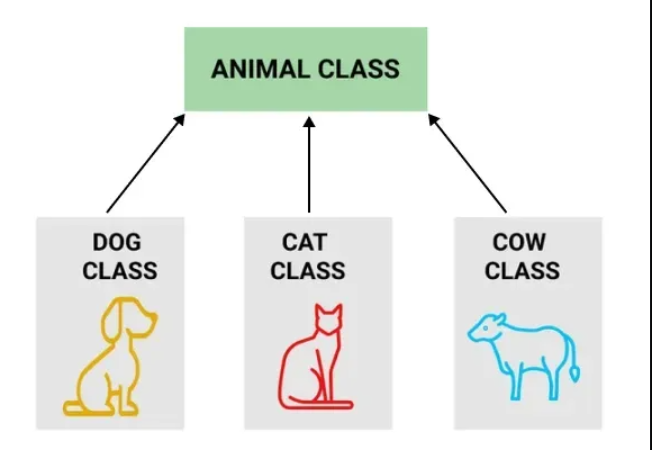

**Cara Implementasi**

1. Gunakan kata kunci `extends` untuk mewarisi dari sebuah class.
2. Subclass dapat mengakses anggota (fields dan methods) yang bersifat `protected` dan `public` dari superclass.
3. Subclass dapat mengoverride method dari superclass.
4. Gunakan kata kunci `super` untuk mengakses anggota superclass.

**Jenis-jenis Inheritance:**

#### 1. Single Inheritance

Single inheritance terjadi ketika sebuah class turunan hanya mewarisi dari satu class induk. Ini adalah bentuk pewarisan
yang paling sederhana, di mana class turunan mendapatkan semua metode dan properti dari satu class induk saja.

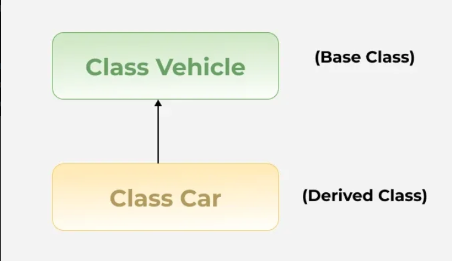

Contoh:

```
//Super class
class Vehicle {
    Vehicle() {
        System.out.println("This is a Vehicle");
    }
}

// Subclass 
class Car extends Vehicle {
    Car() {
        System.out.println("This Vehicle is Car");
    }
}

public class Test {
    public static void main(String[] args) {
        // Creating object of subclass invokes base class constructor
        Car obj = new Car();
    }
}

```

---

#### 2. Multiple Inheritance

Multiple inheritance memungkinkan sebuah class turunan untuk mewarisi dari lebih dari satu class induk. Artinya, class
turunan dapat menggabungkan fungsionalitas dari beberapa class induk. Multiple inheritance lebih kompleks dan harus
ditangani dengan hati-hati untuk menghindari masalah seperti diamond problem, di mana class turunan mewarisi dari dua
class induk yang memiliki class dasar sama.

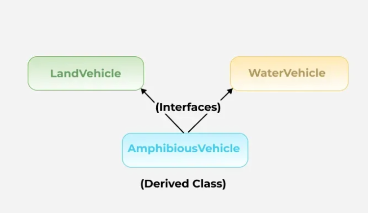

contoh:

```
interface LandVehicle {
    default void landInfo() {
        System.out.println("This is a LandVehicle");
    }
}
interface WaterVehicle {
    default void waterInfo() {
        System.out.println("This is a WaterVehicle");
    }
}
// Subclass implementing both interfaces
class AmphibiousVehicle implements LandVehicle, WaterVehicle {
    AmphibiousVehicle() {
        System.out.println("This is an AmphibiousVehicle");
    }
}
public class Test {
    public static void main(String[] args) {
        AmphibiousVehicle obj = new AmphibiousVehicle();
        obj.waterInfo();
        obj.landInfo();
    }
}
```

#### 3. Hierarchical Inheritance

Hierarchical inheritance terjadi saat beberapa class turunan mewarisi dari satu class induk yang sama. Jenis ini sering
digunakan untuk mengelompokkan fungsionalitas yang serupa ke dalam satu class induk, sementara memungkinkan variasi
dalam class turunan.

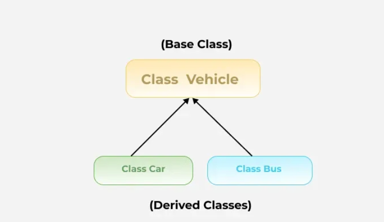

contoh:

```
class Vehicle {
    Vehicle() {
        System.out.println("This is a Vehicle");
    }
}

class Car extends Vehicle {
    Car() {
        System.out.println("This Vehicle is Car");
    }
}

class Bus extends Vehicle {
    Bus() {
        System.out.println("This Vehicle is Bus");
    }
}

public class Test {
    public static void main(String[] args) {
        Car obj1 = new Car(); 
        Bus obj2 = new Bus(); 
    }
}
```

#### 4. Multilevel Inheritance

Dalam multilevel inheritance, sebuah class turunan mewarisi dari class turunan lain, sementara class yang sendiri
mewarisi dari class induk. Jenis ini menciptakan "rantai" pewarisan. Misalnya, class C mewarisi dari class B, dan class
B mewarisi dari class A.

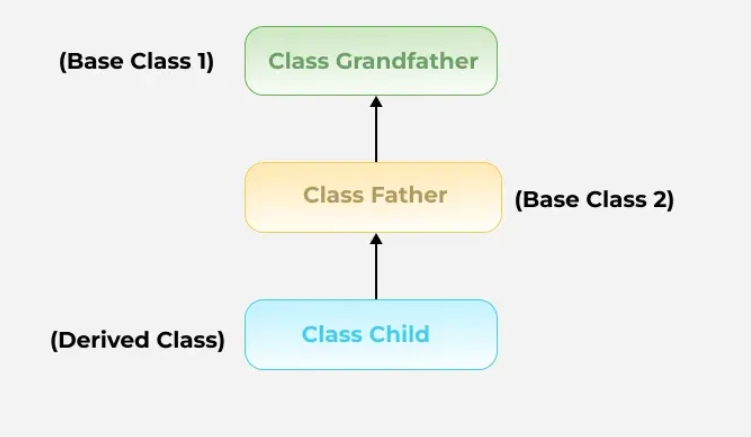

contoh:

```
class Vehicle {
    Vehicle() {
        System.out.println("This is a Vehicle");
    }
}
class FourWheeler extends Vehicle {
    FourWheeler() {
        System.out.println("4 Wheeler Vehicles");
    }
}
class Car extends FourWheeler {
    Car() {
        System.out.println("This 4 Wheeler Vehicle is a Car");
    }
}
public class Geeks {
    public static void main(String[] args) {
        Car obj = new Car(); // Triggers all constructors in order
    }
}
```

#### 5. Hybrid Inheritance

Hybrid inheritance adalah kombinasi dari dua atau lebih jenis inheritance yang sebelumnya sudah disebutkan di atas.
Kondisi ini sering terjadi dalam sistem yang lebih kompleks, di mana berbagai bentuk inheritance dipakai bersama-sama
untuk mencapai fleksibilitas dan efisiensi yang diinginkan.

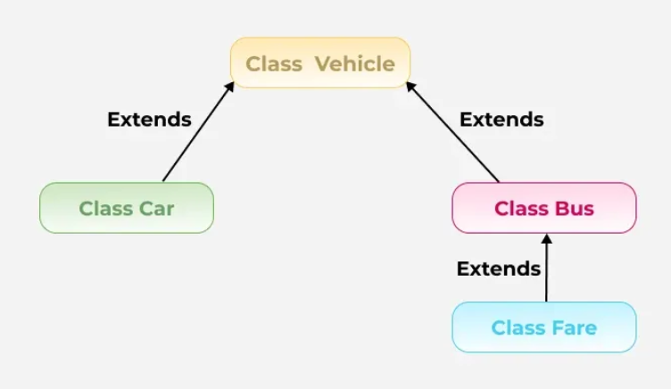

---

### Praktikum 1: Memahami Single Inheritance

**Tujuan:**

Memahami konsep dan implementasi single inheritance.

---

#### Langkah Praktikum : Single Inheritance

1. Buat class baru `Person`.
2. Ketik kode berikut:

```
package modul_6.praktikum_1;

public class Person {
    protected String name;
    protected int age;

    public Person(String name, int age) {
        this.name = name;
        this.age = age;
    }

    public void displayInfo() {
        System.out.println("Name: " + name);
        System.out.println("Age: " + age);
    }

    public void greet() {
        System.out.println("Hello, I am a person.");
    }
}
```

- Buat class `Student` sebagai subclass yang mewarisi Person:

```
package modul_6.praktikum_1;

public class Student extends Person{
    private String studentId;

    public Student(String name, int age, String studentId) {
        super(name, age); // Memanggil constructor superclass
        this.studentId = studentId;
    }

    public void  study(){
        System.out.println(name + " is studying.");
    }

    @Override
    public void greet() {
        System.out.println("Hello, I am a student named." + name);
    }
}
```

- Buat class `InheritanceTest` untuk testing:

```
package modul_6.praktikum_1;

public class InheritanceTest {
    public static void main(String[] args) {
        Student student = new Student("Alice", 20, "S12345");

        // Memanggil method dari superclass
        student.displayInfo();

        // Memanggil method dari subclass
        student.study();

        // Memanggil overridden method
        student.greet();

        // Polymorphism: Student sebagai Person
        Person person = new Student("Bob", 22, "S67890");
        person.greet(); // Memanggil method yang di-override
    }
}
```

- Jalankan program dan amati hasil.
- Perhatikan bagaimana subclass mewarisi dan memperluas fungsionalitas superclass.

#### Screenshot Hasil

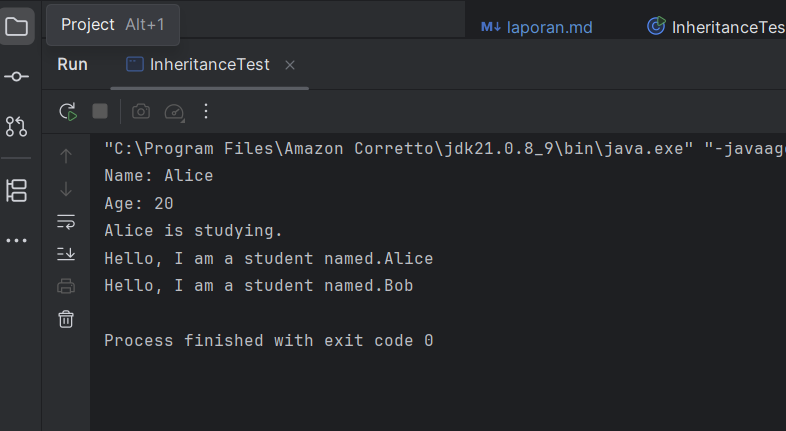

---

### Analisa dan Pembahasan

**1. Deskripsi Umum Program**

Program pada package `modul_6.praktikum_1` berjudul **“Inheritance (Pewarisan)”**, yang bertujuan untuk
mendemonstrasikan bagaimana konsep pewarisan kelas (*class inheritance*) diterapkan dalam bahasa pemrograman **Java**.

Program ini terdiri dari tiga kelas utama:

1. **Person** - berfungsi sebagai *superclass* (kelas induk).
2. **Student** - merupakan *subclass* (kelas turunan) dari `Person`.
3. **InheritanceTest** - berperan sebagai kelas pengujian (main class) untuk memperlihatkan interaksi antara superclass
   dan subclass.

Konsep utama yang ditunjukkan dalam program ini adalah **inheritance (pewarisan)**, **method overriding**, dan
**polymorphism**, yang merupakan inti dari paradigma PBO.

**2. Analisis class Person**

**Struktur dan Fungsi**

Kelas `Person` dideklarasikan sebagai kelas dasar yang memiliki dua atribut:

- `name` (tipe `String`)
- `age` (tipe `int`)

Kedua atribut tersebut memiliki modifier `protected`, yang artinya dapat diakses oleh kelas turunan (`Student`) tetapi
tidak secara langsung oleh kelas di luar hierarki pewarisan.

**Constructor**

```
public Person(String name, int age) {
    this.name = name;
    this.age = age;
}
```

Constructor digunakan untuk menginisialisasi objek Person dengan nama dan umur.
Kelas ini juga memiliki dua metode publik:

- `displayInfo()` - menampilkan data pribadi (nama dan umur).
- `greet()` - mencetak pesan umum “Hello, I am a person.”

Kelas `Person` menjadi dasar yang menyediakan perilaku umum yang nantinya dapat diwarisi dan dimodifikasi oleh subclass.

**3. Analisis Kelas Student**

**Hubungan Pewarisan**

Deklarasi:

```
public class Student extends Person
```

menunjukkan bahwa `Student` mewarisi seluruh atribut dan metode dari kelas `Person`.
Artinya, kelas `Student` otomatis memiliki:

- `name`, `age` (dari `Person`)
- `displayInfo()` dan `greet()` (dari `Person`)

Namun, `Student` juga dapat menambah atribut atau memodifikasi perilaku tertentu.

**Atribut dan Constructor**

`Student` memiliki atribut tambahan:

```
private String studentId;
```

yang merepresentasikan identitas mahasiswa.

Constructor-nya memanggil constructor superclass menggunakan:

```
super(name, age);
```

Pemanggilan `super()` ini penting untuk menginisialisasi atribut yang berasal dari kelas induk (`Person`), sebelum
menambahkan atribut spesifik di kelas `Student`.

**Metode Tambahan dan Overriding**

- Metode baru:
  ```
  public void study() {
  System.out.println(name + " is studying.");
  }
  ```
  Menampilkan aktivitas khusus dari objek `Student`.


- Overriding (Menimpa metode superclass):
    ```
    @Override
    public void greet() {
    System.out.println("Hello, I am a student named " + name);
    }
    ```

Metode `greet()` di-override agar memberikan perilaku berbeda dari superclass.
Saat objek `Student` memanggil `greet()`, yang dipanggil adalah versi milik `Student`, bukan Person.

**4. Analisis class InheritanceTest**

Kelas ini berfungsi untuk menguji mekanisme **inheritance**, **overriding**, dan **polymorphism**.

**Langkah Pengujian**

- Membuat objek `Student`:
    ```
    Student student = new Student("Alice", 20, "S12345");
    ```
    - Memanggil constructor dari `Student`, yang kemudian memanggil constructor `Person` melalui `super()`.

- Memanggil method dari superclass:
    ```
    student.displayInfo();
  ```
    - Dapat dipanggil karena diwarisi dari `Person`.

- Memanggil method dari subclass:
    ```
    student.study();
  ```
    - Hanya ada di `Student`, menampilkan aktivitas belajar.

- Memanggil method yang di-override:
    ```
    student.greet(); 
  ```
    - Menghasilkan output dari versi `Student`, bukan `Person`.

- Demonstrasi Polymorphism:
    ```
    Person person = new Student("Bob", 22, "S67890");
    person.greet();
  ```
    - Meskipun referensi bertipe `Person`, objek sebenarnya adalah `Student`.
    - Oleh karena itu, method yang dijalankan adalah milik `Student`.
    - Ini menunjukkan polymorphism, di mana objek subclass dapat diperlakukan sebagai objek superclass, namun tetap
      menjalankan perilaku spesifiknya sendiri.

**5. Pembahasan**

Dari hasil eksekusi program, dapat disimpulkan bahwa:

1. **Inheritance** memungkinkan `Student` untuk mewarisi atribut dan method dari `Person` tanpa harus menulis ulang
   kode.
2. **Keyword `super`** digunakan untuk mengakses constructor atau method dari superclass.
3. **Method overriding** memungkinkan subclass untuk mengubah perilaku dari method superclass sesuai kebutuhan.
4. **Polymorphism** memungkinkan referensi bertipe superclass (`Person`) menunjuk ke objek subclass (`Student`), tetapi
   tetap menjalankan implementasi method milik subclass.
5. Struktur hierarki ini membantu program menjadi lebih modular, efisien, dan mudah dikembangkan.

---

### Praktikum 2: Method Overriding dan Kata Kunci `super`

**Teori Dasar**

Method overriding memungkinkan subclass memberikan implementasi spesifik untuk method yang sudah didefinisikan di
superclass. Kata kunci super digunakan untuk mengakses anggota superclass.

Aturan Method Overriding:

1. Method harus memiliki nama dan parameter yang sama
2. Return type harus sama atau subtype (covariant return type)
3. Access modifier tidak boleh lebih restriktif
4. Tidak bisa override method yang final atau static

Penggunaan super:

1. `super()` - Memanggil constructor superclass
2. `super.methodName()` - Memanggil method superclass
3. `super.variableName` - Mengakses variable superclass

**Tujuan:**

Memahami cara melakukan method overriding dan penggunaan kata kunci `super`.

---

#### Langkah Praktikum : Method Overriding dan Kata Kunci `super`

1. Buat class baru `Vehicle`.
2. Ketik kode berikut:

```
package modul_6.praktikum_2;

public class Vehicle {
    protected String brand;
    protected int speed;

    public  Vehicle(String brand, int speed) {
        this.brand = brand;
        this.speed = speed;
    }

    public void start() {
        System.out.println("Vehicle is starting...");
    }

    public void displayInfo() {
        System.out.println("Brand: " + brand);
        System.out.println("Speed: " + speed + " km/h");
    }
}
```

- Buat class `Car` sebagai subclass yang mewarisi `Vehicle`:

```
package modul_6.praktikum_2;

public class Car extends Vehicle {
    private int numberOfDoors;

    public Car(String brand, int speed, int numberOfDoors) {
        super(brand, speed);
        this.numberOfDoors = numberOfDoors;
    }

    @Override
    public void start() {
        super.start();
        System.out.println("Car engine is running smoothly");
    }

    @Override
    public void displayInfo() {
        super.displayInfo();
        System.out.println("Number of Doors: " + numberOfDoors);
    }

    public void honk() {
        System.out.println("Beep beep!");
    }
}
```

- Buat class `OverrideTest` untuk testing:

```
package modul_6.praktikum_2;

public class OverrideTest {
    public static void main(String[] args) {
        Car car = new Car("Toyota", 180, 4);

        // Memanggil overridden method
        car.start();
        car.displayInfo();
        car.honk();

        // Demonstrasi polymorphism
        Vehicle vehicle = new Car("Honda", 200, 2);
        vehicle.start(); // Memanggil method yang di-override
        vehicle.displayInfo(); // Memanggil method yang di-override
    }
}
```

- Jalankan program dan amati
- Cara method overriding bekerja
- Penggunaan kata kunci super untuk mengakses superclass
- Konsep polymorphism dalam inheritance

#### Screenshot Hasil

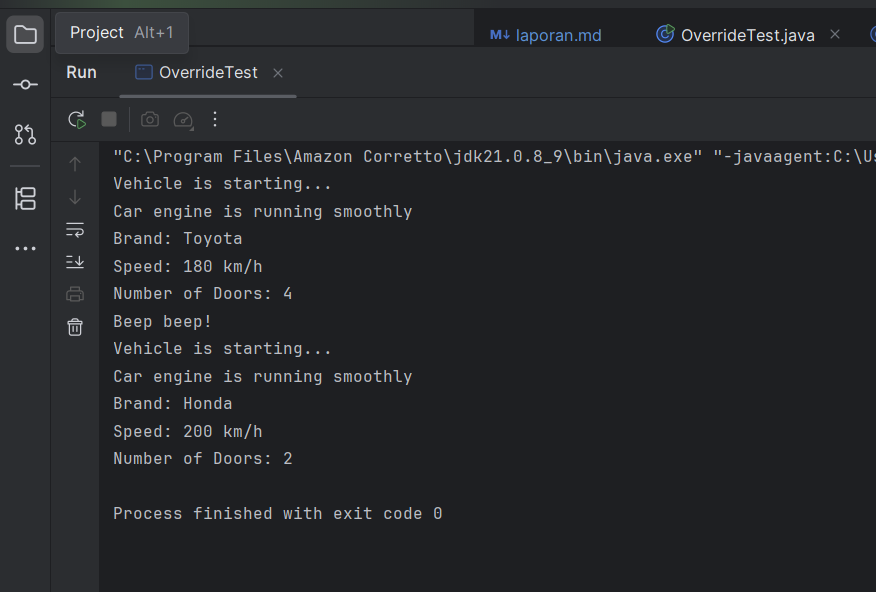

---

### Analisa dan Pembahasan

**1. Deskripsi Umum Program**

Program pada package `modul_6.praktikum_2` berjudul **“Method Overriding dan Polymorphism”**.

Program ini bertujuan untuk mendemonstrasikan bagaimana **subclass** dapat **mengubah (override)** perilaku dari method
milik superclass, serta menunjukkan konsep **polymorphism** di mana objek subclass dapat diperlakukan sebagai objek
superclass tanpa kehilangan perilaku khasnya.

Terdapat tiga kelas dalam program ini:

1. **Vehicle** - sebagai *superclass* (kelas induk).
2. **Car** - sebagai *subclass* yang mewarisi `Vehicle` dan melakukan *method overriding*.
3. **OverrideTest** - sebagai kelas pengujian untuk menampilkan hasil penerapan inheritance, overriding, dan
   polymorphism.

**2. Analisis class Vehicle**

**Struktur dan Fungsi**

Kelas `Vehicle` merupakan kelas induk dengan dua atribut yang bersifat `protected`:

- `brand` → merepresentasikan merek kendaraan.
- `speed` → menunjukkan kecepatan kendaraan.

Atribut `protected` memungkinkan subclass (`Car`) untuk mengaksesnya langsung tanpa melalui setter/getter.

**Constructor**

```
public Vehicle(String brand, int speed) {
    this.brand = brand;
    this.speed = speed;
}
```

Constructor digunakan untuk menginisialisasi atribut kendaraan ketika objek dibuat.

**Method Utama**

**1. `start()`**

Menampilkan pesan bahwa kendaraan sedang dinyalakan:

```
System.out.println("Vehicle is starting...");
```

**2. `displayInfo()`**

Menampilkan informasi dasar kendaraan:

```
Brand: <nama merek>
Speed: <kecepatan> km/h
```

Kelas ini berperan sebagai dasar untuk semua jenis kendaraan yang mungkin memiliki karakteristik berbeda di
subclass-nya.

**3. Analisis class Car**

**Hubungan Pewarisan**

Kelas `Car` dideklarasikan dengan:

```
public class Car extends Vehicle
```

yang berarti `Car` mewarisi semua atribut dan metode dari `Vehicle`.

**Atribut Tambahan**

**Constructor**

```
public Car(String brand, int speed, int numberOfDoors) {
    super(brand, speed);
    this.numberOfDoors = numberOfDoors;
}
```

Pemanggilan `super(brand, speed)` digunakan untuk menginisialisasi atribut dari superclass (`Vehicle`) sebelum atribut
tambahan (`numberOfDoors`) diatur.

**Method Overriding**

`Car` mengubah dua perilaku dari `Vehicle`:

**1. `start()`**

```
@Override
public void start() {
    super.start();
    System.out.println("Car engine is running smoothly");
}
```

Method ini menambahkan perilaku baru setelah memanggil `super.start()` dari superclass.

Hasilnya, ketika mobil dinyalakan, akan muncul dua pesan:

- “Vehicle is starting...”
- “Car engine is running smoothly”

**2. `displayInfo()`**

```
@Override
public void displayInfo() {
    super.displayInfo();
    System.out.println("Number of Doors: " + numberOfDoors);
}
```

Method ini memperluas tampilan informasi dengan menambahkan jumlah pintu mobil.

Selain itu, kelas `Car` juga menambahkan method baru:

```
public void honk() {
    System.out.println("Beep beep!");
}
```

yang merupakan fungsi spesifik milik `Car` dan tidak dimiliki oleh `Vehicle`.

**4. Analisis class OverrideTest**

Kelas `OverrideTest` berfungsi untuk menguji konsep overriding dan polymorphism secara langsung.

Langkah Pengujian

**1. Membuat objek Car dan memanggil metode yang di-override:**

```
Car car = new Car("Toyota", 180, 4);
car.start();
car.displayInfo();
car.honk();
```

Hasilnya:

```
Vehicle is starting...
Car engine is running smoothly
Brand: Toyota
Speed: 180 km/h
Number of Doors: 4
Beep beep!
```

**2. Demonstrasi Polymorphism:**

```
Vehicle vehicle = new Car("Honda", 200, 2);
vehicle.start();
vehicle.displayInfo();
```

Meskipun variabel `vehicle` bertipe `Vehicle`, objek yang direferensikan adalah `Car`.
Sehingga yang dipanggil adalah versi overridden milik `Car`, bukan milik `Vehicle`.

Output-nya:

```
Vehicle is starting...
Car engine is running smoothly
Brand: Honda
Speed: 200 km/h
Number of Doors: 2
```

**5. Pembahasan**

Dari hasil eksekusi, dapat diamati hal-hal berikut:

**1. Inheritance (Pewarisan):**

Kelas `Car` mewarisi semua atribut dan metode dari `Vehicle`, memungkinkan penggunaan kembali kode tanpa duplikasi.

**2. Method Overriding:**

Subclass (`Car`) mengubah perilaku `start()` dan `displayInfo()` dari superclass (`Vehicle`) untuk menambahkan detail
yang lebih spesifik.
Hal ini menunjukkan bahwa overriding memungkinkan subclass untuk memperluas atau menyesuaikan perilaku bawaan
superclass.

**3. Pemanggilan super:**

Keyword `super` digunakan untuk memanggil versi metode dari superclass, memastikan bahwa perilaku dasar tetap dijalankan
sebelum ditambahkan perilaku baru.

**4. Polymorphism:**

Dengan mendeklarasikan objek subclass (`Car`) menggunakan referensi superclass (`Vehicle`), program memperlihatkan bahwa
Java akan memilih implementasi metode yang sesuai dengan objek aktual, bukan tipe referensinya.
Ini membuktikan prinsip *runtime polymorphism*.

**5. Ekstensi Fungsionalitas:**

Kelas `Car` tidak hanya mewarisi tetapi juga menambahkan fungsionalitas baru seperti `honk()`, memperlihatkan
fleksibilitas pewarisan dalam memperluas perilaku kelas dasar.

---

### Praktikum 3: Multilevel dan Hierarchical Inheritance

**Tujuan:**

Memahami konsep multilevel dan hierarchical inheritance.

---

#### Langkah Praktikum : Multilevel dan Hierarchical Inheritance

1. Buat class baru `Animal`.
2. Ketik kode berikut:

```
package modul_6.praktikum_3;

public class Animal {
    protected String name;

    public Animal(String name) {
        this.name = name;
    }

    public void eat() {
        System.out.println(name + " is eating.");
    }

    public void sleep() {
        System.out.println(name + " is sleeping.");
    }
}
```

- Buat class `Mammal ` yang mewarisi Animal (multilevel inheritance):

```
package modul_6.praktikum_3;

public class Mammal extends Animal {
    protected String furColor;

    public Mammal(String name, String furColor) {
        super(name);
        this.furColor = furColor;
    }

    public void giveBirth() {
        System.out.println(name + " is giving birth to live young.");
    }
}
```

- Buat class `Dog` yang mewarisi `Mammal` (multilevel inheritance):

```
package modul_6.praktikum_3;

public class Dog extends Mammal {
    private String breed;

    public Dog(String name, String furColor, String breed) {
        super(name, furColor);
        this.breed = breed;
    }

    public void bark() {
        System.out.println(name + " is barking: Woof woof!");
    }

    @Override
    public void eat() {
        System.out.println(name + " the dog is eating dog food.");
    }
}
```

- Buat class `Cat` yang mewarisi `Mammal` (hierarchical inheritance):

```
package modul_6.praktikum_3;

public class Cat extends Mammal {
    private boolean isIndoor;

    public Cat(String name, String furColor, boolean isIndoor) {
        super(name, furColor);
        this.isIndoor = isIndoor;
    }

    public void meow() {
        System.out.println(name + " is meowing: Meow meow!");
    }

    @Override
    public void eat() {
        System.out.println(name + " the cat is eating cat food.");
    }
}
```

- Buat class `InheritanceTypeTest` untuk testing:

```
package modul_6.praktikum_3;

public class InheritanceTypeTest {
    public static void main(String[] args) {
        // Multilevel inheritance test
        Dog dog = new Dog("Buddy", "Brown", "Golden Retriever");
        dog.eat(); // dari animal, di-override di dog
        dog.sleep(); // dari animal
        dog.giveBirth(); // dari mammal
        dog.bark(); // dari dog

        System.out.println();

        // Hierarchical inheritance test
        Cat cat = new Cat("Whiskers", "White", true);
        cat.eat(); // dari animal, di-override di cat
        cat.sleep(); // dari animal
        cat.giveBirth(); // dari mammal
        cat.meow(); // dari cat

        System.out.println();

        // Polymorphism dengan hierarchical inheritance
        Animal[] animals = {new Dog("Max", "Black", "labrador"),
                            new Cat("Luna", "Gray", false)};

        for (Animal animal : animals) {
            animal.eat(); // akan memanggil method yg sesuai dengan objek sebenarnya
        }
    }
}
```

- Jalankan program dan amati
- Cara multilevel inheritance membentuk rantai pewarisan.
- Cara hierarchical inheritance memungkinkan multiple class mewarisi dari satu superclass.
- Polymorphism bekerja dengan inheritance hierarchy.

#### Screenshot Hasil

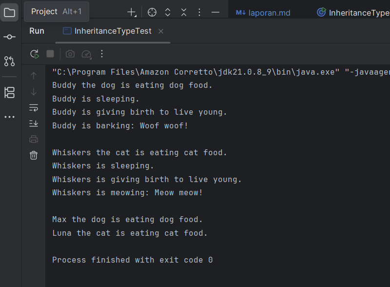

---

### Analisa dan Pembahasan

**1. Deskripsi Umum Program**

Program pada package `modul_6.praktikum_3` ini berjudul **“Multilevel dan Hierarchical Inheritance”**, yang bertujuan
untuk mendemonstrasikan penerapan dua bentuk pewarisan dalam **Pemrograman Berorientasi Objek (PBO)**, yaitu:

1. **Multilevel Inheritance** - pewarisan yang terjadi dalam beberapa tingkat (misalnya: `Animal - Mammal - Dog`).
2. **Hierarchical Inheritance** - pewarisan yang memungkinkan beberapa kelas berbeda mewarisi dari satu superclass yang
   sama (misalnya: `Mammal - Dog` dan `Mammal - Cat`).

Program juga memperlihatkan penerapan **method overriding** dan **polymorphism** yang berperan dalam mengatur perilaku
objek berdasarkan tipe aktualnya saat runtime.

**2. Analisis class Animal**

**Peran dan Fungsi**

Kelas `Animal` berperan sebagai **superclass utama** dalam hierarki pewarisan.  
Atribut dan metode yang dimilikinya adalah dasar untuk semua jenis hewan.

**Struktur Kelas**

```
protected String name;
```

Atribut protected memungkinkan kelas turunan (`Mammal`, `Dog`, `Cat`) untuk mengaksesnya langsung.

**Constructor**

```
public Animal(String name) {
    this.name = name;
}
```

Berfungsi untuk menginisialisasi nama hewan saat objek dibuat.

**Method**

1. `eat()` – menampilkan aktivitas makan.
2. `sleep()` – menampilkan aktivitas tidur.

Kedua metode ini bersifat umum dan nantinya dapat di-override oleh subclass agar perilakunya lebih spesifik.

**3. Analisis class Mammal**

**Hubungan Pewarisan**

```
public class Mammal extends Animal
```

Kelas `Mammal` merupakan turunan langsung dari `Animal`. Ini menunjukkan multilevel inheritance ketika kelas lain (
seperti
`Dog`) mewarisi dari `Mammal`.

**Atribut dan Constructor**

```
protected String furColor;
```

Atribut baru yang menunjukkan warna bulu hewan mamalia.

Constructor-nya memanggil constructor superclass menggunakan `super(name)` untuk menginisialisasi nama hewan.

**Method Baru**

```
public void giveBirth() {
System.out.println(name + " is giving birth to live young.");
}
```

Menambahkan perilaku khas mamalia - melahirkan anak hidup.

**4. Analisis class Dog**

**Hubungan Pewarisan**

```
public class Dog extends Mammal
```

Kelas `Dog` mewarisi dari `Mammal`, yang juga mewarisi dari `Animal`.
Artinya, `Dog` adalah bagian dari rantai multilevel inheritance:

```
Animal - Mammal - Dog
```

**Atribut Tambahan**

```
private String breed;
```

Menyimpan informasi jenis anjing (misalnya “Golden Retriever”).

**Constructor**

```
public Dog(String name, String furColor, String breed) {
super(name, furColor);
this.breed = breed;
}
```

Memanggil constructor dari `Mammal` untuk menginisialisasi atribut `name` dan `furColor`.

**Method Baru dan Overriding**

- `bark()` - menampilkan perilaku khas anjing, yaitu menggonggong.
- `eat()` - meng-override method `eat()` dari `Animal` agar menampilkan pesan khusus:

```
System.out.println(name + " the dog is eating dog food.");
```

Overriding ini memperlihatkan bahwa subclass dapat menyesuaikan perilaku metode yang diwarisi dari superclass sesuai
konteksnya.

**5. Analisis class Cat**

**Hubungan Pewarisan**

```
public class Cat extends Mammal
```

Kelas `Cat` juga mewarisi `Mammal`, tetapi bukan dari `Dog`.
Inilah contoh Hierarchical Inheritance, di mana dua subclass (`Dog` dan `Cat`) memiliki induk yang sama (`Mammal`).

**Atribut dan Constructor**

```
private boolean isIndoor;
```

Menyatakan apakah kucing hidup di dalam ruangan atau tidak.

Constructor memanggil `super(name, furColor)` untuk menginisialisasi atribut dari superclass.

**Method Baru dan Overriding**

- `meow()` - menampilkan perilaku khas kucing.
- `eat()` - override method dari Animal agar menampilkan pesan spesifik:

```
System.out.println(name + " the cat is eating cat food.");
```

**6. Analisis class InheritanceTypeTest**

**Peran**

Kelas ini berfungsi sebagai tester untuk membuktikan cara kerja multilevel dan hierarchical inheritance, serta
polymorphism.

**Langkah Uji**

**a. Multilevel Inheritance Test**

```
Dog dog = new Dog("Buddy", "Brown", "Golden Retriever");
dog.eat();
dog.sleep();
dog.giveBirth();
dog.bark();
```

Urutan pemanggilan metode memperlihatkan bahwa objek `Dog` dapat:

- Menggunakan metode dari `Animal` (`sleep()`),
- Menggunakan metode dari `Mammal` (`giveBirth()`),
- Menjalankan perilaku baru (`bark()`),
- Meng-override perilaku `eat()` sesuai karakteristiknya.

**b. Hierarchical Inheritance Test**

```
Cat cat = new Cat("Whiskers", "White", true);
cat.eat();
cat.sleep();
cat.giveBirth();
cat.meow();
```

Objek `Cat` juga dapat mengakses method dari `Animal` dan `Mammal`, menunjukkan bahwa kedua kelas (`Dog` dan `Cat`)
berada pada
level hierarki yang sama.

**c. Polymorphism Test**

```
Animal[] animals = {
new Dog("Max", "Black", "Labrador"),
new Cat("Luna", "Gray", false)
};

for (Animal animal : animals) {
animal.eat();
}
```

Hasil menunjukkan bahwa meskipun array bertipe `Animal`, Java akan memanggil metode sesuai tipe objek aktual (`Dog` atau
`Cat`).

Ini menunjukkan runtime polymorphism atau *dynamic method dispatch*.

**7. Pembahasan**

Dari hasil program dapat disimpulkan beberapa poin penting:

1. **Multilevel Inheritance** membentuk rantai pewarisan di mana subclass dapat mewarisi semua atribut dan metode dari
   seluruh rantai kelas di atasnya.
   Contoh: `Dog` mewarisi dari `Mammal`, dan `Mammal` mewarisi dari `Animal`.
2. **Hierarchical Inheritance** memungkinkan beberapa kelas berbeda mewarisi dari satu superclass yang sama.
   Contohnya, `Dog` dan `Cat` sama-sama turunan dari `Mammal`.
3. **Method Overriding** memungkinkan setiap subclass mengubah perilaku metode yang diwarisi dari superclass agar lebih
   sesuai dengan karakteristik masing-masing.
4. **Polymorphism** membuat program menjadi fleksibel, karena tipe referensi dapat berupa superclass (`Animal`), tetapi
   perilaku yang dijalankan sesuai dengan tipe objek sebenarnya di memori.
5. Penggunaan **protected** memastikan atribut seperti `name` tetap aman tetapi masih dapat digunakan oleh subclass
   tanpa perlu getter/setter.

---

### Praktikum 4: Sistem Manajemen Perpustakaan Sederhana

**Tujuan:**

Menerapkan konsep inheritance dalam project real-world sederhana untuk mengelola sistem perpustakaan.

**Deskripsi Project:**

Kita akan membuat sistem manajemen perpustakaan sederhana yang memiliki berbagai jenis item (buku, majalah, DVD) dengan
karakteristik yang berbeda namun memiliki beberapa kesamaan.
---

#### Langkah Praktikum : Sistem Manajemen Perpustakaan Sederhana

1. Buat class baru `LibraryItem`.
2. Ketik kode berikut:

```
package modul_6.praktikum_4;

public abstract class LibraryItem {
    protected String itemId;
    protected String title;
    protected int year;
    protected boolean isAvailable;

    public LibraryItem(String itemId, String title, int year) {
        this.itemId = itemId;
        this.title = title;
        this.year = year;
        this.isAvailable = true;
    }

    // Getter Methods
    public String getItemId() { return itemId; }
    public String getTitle() { return title; }
    public int getYear() { return year; }
    public boolean isAvailable() { return isAvailable; }

    // Setter methods
    public void setAvailable(boolean isAvailable) { this.isAvailable = isAvailable; }

    // Abstract method yg harus diimplementasikan subclass
    public abstract void displayInfo();

    // Concrete method yg bisa digunakan semua subclass
    public void  borrowItem() {
        if (isAvailable) {
            isAvailable = false;
            System.out.println(title + " berhasil dipinjam");
        } else {
            System.out.println(title + " sedang tidak tersedia");
        }
    }

    public void returnItem() {
        isAvailable = true;
        System.out.println(title + " berhasil dikembalikan");
    }
}
```

- Buat class `Book` yang mewarisi `LibraryItem`:

```
package modul_6.praktikum_4;

public class Book extends LibraryItem {
    private String author;
    private String isbn;
    private int numberOfPages;

    public Book(String itemId, String title, int year, String author, String isbn, int numberOfPages) {
        super(itemId, title, year);
        this.author = author;
        this.isbn = isbn;
        this.numberOfPages = numberOfPages;
    }

    @Override
    public void displayInfo() {
        System.out.println("BUKU");
        System.out.println("__________________________");
        System.out.println("ID: " + itemId);
        System.out.println("judul: " + title);
        System.out.println("Penulis: " + author);
        System.out.println("Tahun: " + year);
        System.out.println("ISBN: " + isbn);
        System.out.println("Jumlah Halaman: " + numberOfPages);
        System.out.println("Status: " + (isAvailable ? "Tersedia" : "Dipinjam"));
        System.out.println("__________________________");
    }

    // Method khusus Book
    public void readSample() {
        System.out.println("Membaca sample dari buku: " + title);
    }
}
```

- Buat class `Magazine` yang mewarisi `LibraryItem`:

```
package modul_6.praktikum_4;

public class Magazine extends LibraryItem {
    private String publisher;
    private int issueNumber;
    private String category;

    public Magazine(String itemId, String title, int year, String publisher, int issueNumber, String category) {
        super(itemId, title, year);
        this.publisher = publisher;
        this.issueNumber = issueNumber;
        this.category = category;
    }

    @Override
    public void displayInfo() {
        System.out.println("--------MAJALAH--------");
        System.out.println("ID: " + itemId);
        System.out.println("Judul: " + title);
        System.out.println("Penerbit: " + publisher);
        System.out.println("Tahun: " + year);
        System.out.println("Edisi: " + issueNumber);
        System.out.println("Kategori: " + category);
        System.out.println("Status: " + (isAvailable ? "Tersedia" : "Dipinjam"));
        System.out.println("-----------------------");
    }

    // Method khusus Magazine
    public void browseArticles() {
        System.out.println("Menelusuri artikel dalam majalah: " + title);
    }
}
```

- Buat class `DVD` yang mewarisi `LibraryItem`:

```
package modul_6.praktikum_4;

public class DVD extends LibraryItem {
    private String director;
    private int duration;
    private String genre;

    public DVD(String itemId, String title, int year, String director, int duration, String genre) {
        super(itemId, title, year);
        this.director = director;
        this.duration = duration;
        this.genre = genre;
    }

    @Override
    public void displayInfo() {
        System.out.println("-----DVD-----");
        System.out.println("ID: " + itemId);
        System.out.println("Judul: " + title);
        System.out.println("Sutradara: " + director);
        System.out.println("Tahun: " + year);
        System.out.println("Durasi: "  + duration + "menit");
        System.out.println("Genre: " + genre);
        System.out.println("Status: " + (isAvailable ? "Tersedia" : "Dipinjam"));
        System.out.println("-------------------------");
    }

    // Method khusus DVD
    public void playTrailer() {
        System.out.println("Memutar trailer DVD: " + title);
    }
}
```

- Buat class `LibraryManagementSystem` sebagai main class:

```
package modul_6.praktikum_4;

import java.util.ArrayList;
import java.util.Scanner;

public class LibraryManagementSystem {
    private static ArrayList<LibraryItem> libraryItems =  new ArrayList<>();
    private static Scanner scanner = new Scanner(System.in);

    public static void main(String[] args) {
        initializeSampleData();

        while (true) {
            displayMenu();
            int choice = scanner.nextInt();
            scanner.nextLine(); // coonsume newline

            switch (choice) {
                case 1:
                    displayAllItems();
                    break;
                case 2:
                    borrowItem();
                    break;
                case 3:
                    returnItem();
                    break;
                case 4:
                    addNewItem();
                    break;
                case 5:
                    searchItem();
                    break;
                case 6:
                    System.out.println("Terimas kasih telah menggunakan sistem perpustakaan!");
                    return;
                default:
                    System.out.println("Pilihan tidak valid!");
            }
        }
    }

    private static void displayMenu() {
        System.out.println("\n--- SISTEMA MANAGEMENT PERPUSTAKAAN ---");
        System.out.println("1. Tampilkan Semua Item");
        System.out.println("2. Pinjam Item");
        System.out.println("3. Kembalikan Item");
        System.out.println("4. Tambah Item Baru");
        System.out.println("5. Cari Item");
        System.out.println("6. Keluar");
        System.out.println("Pilih Menu: ");
    }

    private static void initializeSampleData() {
        // Tambahkan sample data
        libraryItems.add(new Book("B001", "Pemrograman Java", 2023, "Budi Santoso", "978-1234567890", 350));
        libraryItems.add(new Book("B002", "Struktur Data", 2022, "Sari Dewi", "978-0987654321", 280));
        libraryItems.add(new Magazine("M001", "National Geographic", 2024, "NG Media", 245, "Sains"));
        libraryItems.add(new DVD("D001", "The Java Documentary", 2023, "John Programmer", 120, "Edukasi"));
    }

    private static void displayAllItems() {
        System.out.println("\n--- DAFTAR SEMUA ITEM PERPUSTAKAAN ---");
        for (LibraryItem item : libraryItems) {
            item.displayInfo();
            System.out.println();
        }
    }

    private static void borrowItem() {
        System.out.print("Masukkan ID Item yang ingin dipinjam: ");
        String itemId = scanner.nextLine();

        for (LibraryItem item : libraryItems) {
            if (item.getItemId().equalsIgnoreCase(itemId)) {
                item.borrowItem();
                return;
            }
        }
        System.out.println("Item dengan ID " + itemId + " tidak ditemukan!");
    }

    private static void returnItem() {
        System.out.print("Masukkan ID Item yang ingin dikembalikan: ");
        String itemId = scanner.nextLine();

        for (LibraryItem item : libraryItems) {
            if (item.getItemId().equalsIgnoreCase(itemId)) {
                item.returnItem();
                return;
            }
        }
        System.out.println("Item dengan ID " + itemId + " tidak ditemukan!");
    }

    private static void addNewItem() {
        System.out.println("\n--- TAMBAH ITEM BARU ---");
        System.out.println("1. Buku");
        System.out.println("2. Majalah");
        System.out.println("3. DVD");
        System.out.print("Pilih jenis item: ");
        int type = scanner.nextInt();
        scanner.nextLine();

        System.out.print("ID Item: ");
        String itemId = scanner.nextLine();
        System.out.print("Judul: ");
        String title = scanner.nextLine();
        System.out.print("Tahun: ");
        int year = scanner.nextInt();
        scanner.nextLine();

        switch (type) {
            case 1:
                System.out.print("Penulis: ");
                String author = scanner.nextLine();
                System.out.print("ISBN: ");
                String isbn = scanner.nextLine();
                System.out.print("Jumlah Halaman: ");
                int pages = scanner.nextInt();
                libraryItems.add(new Book(itemId, title, year, author, isbn, pages));
                break;
            case 2:
                System.out.print("Penerbit: ");
                String publisher = scanner.nextLine();
                System.out.print("Edisi: ");
                int issue = scanner.nextInt();
                scanner.nextLine();
                System.out.print("Kategori: ");
                String category = scanner.nextLine();
                libraryItems.add(new Magazine(itemId, title, year, publisher, issue, category));
                break;
            case 3:
                System.out.print("Sutradara: ");
                String director = scanner.nextLine();
                System.out.print("Durasi (menit): ");
                int duration = scanner.nextInt();
                scanner.nextLine();
                System.out.print("Genre: ");
                String genre = scanner.nextLine();
                libraryItems.add(new DVD(itemId, title, year, director, duration, genre));
                break;
            default:
                System.out.println("Jenis item tidak valid!");
                break;
            }
            System.out.println("Item berhasil ditambahkan!");
        }

        private static void searchItem() {
            System.out.print("Masukkan kata kunci pencarian (judul/penulis): ");
            String keyword = scanner.nextLine().toLowerCase();

            System.out.println("\n---- HASIL PENCARIIAN ----");
            boolean found = false;

            for (LibraryItem item : libraryItems) {
                if (item.getTitle().toLowerCase().contains(keyword)) {
                    item.displayInfo();
                    System.out.println();
                    found = true;
                }
            }

            if (!found) {
                System.out.println("Tidak ada item yang sesuai dengan pencarian.");
        }
    }
}
```

- Jalankan program dan uji semua fitur:
- Menampilkan semua item
- Meminjam dan mengembalikan item
- Menambah item baru
- Mencari item berdasarkan kata kunci

#### Screenshot Hasil

**Menampilkan semua item**

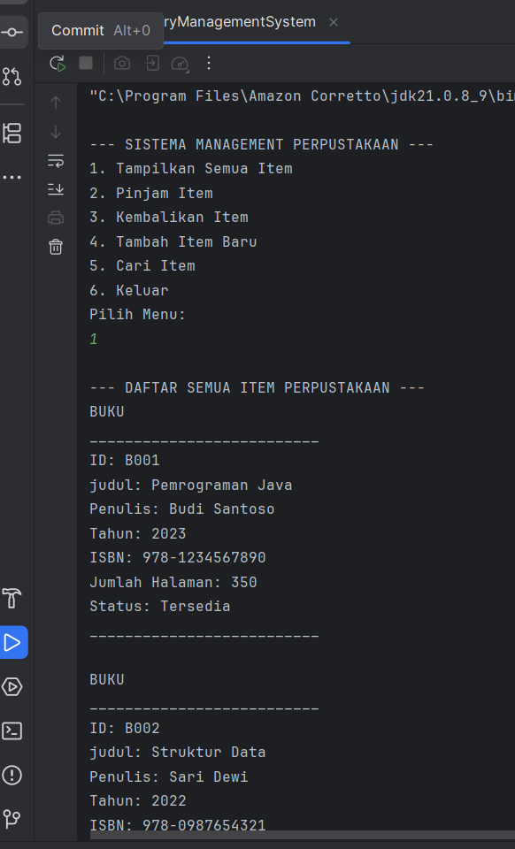
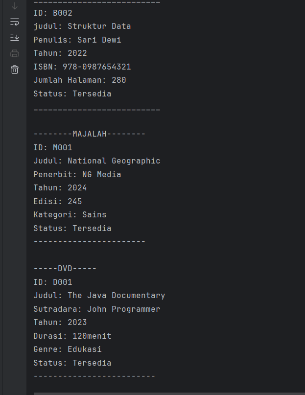

**Meminjam dan mengembalikan item**

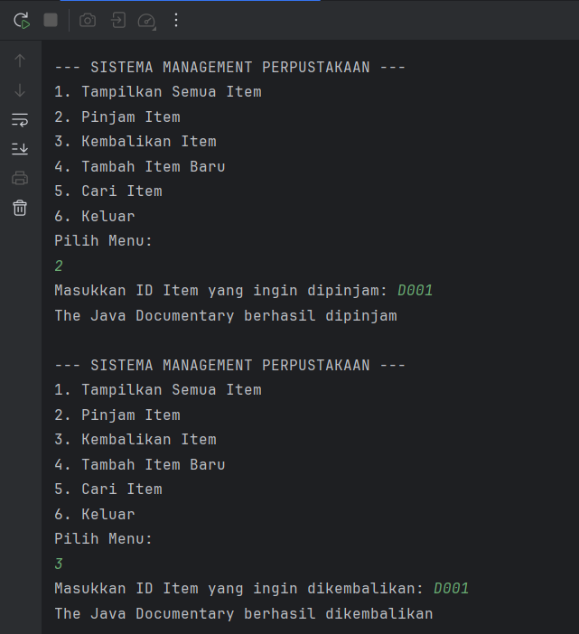

**Menambah item baru**

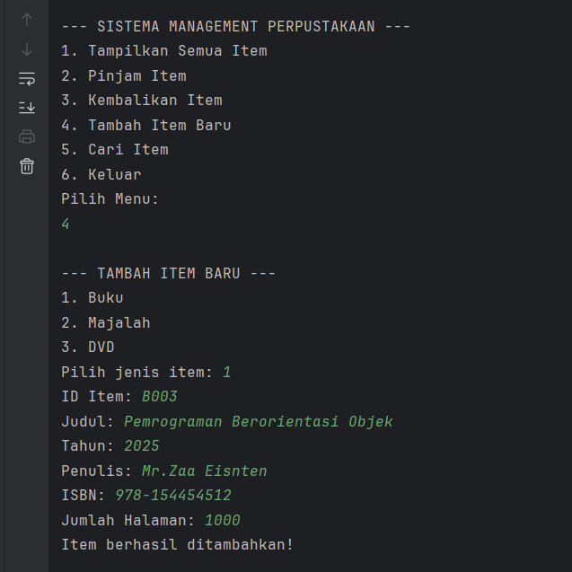

**Mencari item berdasarkan kata kunci**

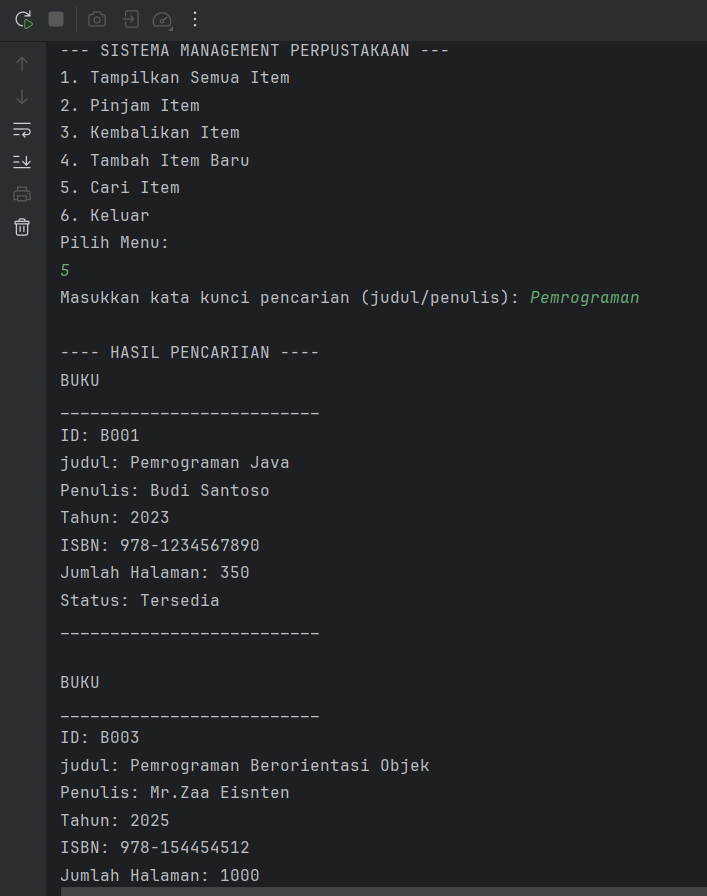

**Mengakhiri program**

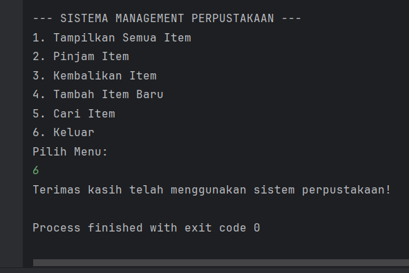

---

### Analisa dan Pembahasan

**1. Deskripsi Umum Program**

Program pada package `modul_6.praktikum_4` ini berjudul **“Sistem Manajemen Perpustakaan Sederhana”**, yang dirancang
untuk memperkenalkan konsep **kelas abstrak (abstract class)**, **inheritance**, **polymorphism**, serta **penerapan
prinsip OOP dalam sistem nyata**.

Program ini mensimulasikan sistem perpustakaan yang mampu:

- Menampilkan daftar seluruh item perpustakaan (buku, majalah, DVD),
- Meminjam dan mengembalikan item,
- Menambah item baru ke dalam koleksi,
- Mencari item berdasarkan kata kunci.

Struktur program terdiri dari beberapa kelas turunan yang mewarisi kelas abstrak `LibraryItem`, yaitu:

- `Book` (buku)
- `Magazine` (majalah)
- `DVD` (film atau video)
  Semua kelas ini digunakan dan dikelola oleh kelas utama `LibraryManagementSystem`.

**2. Analisis Kelas LibraryItem (Superclass Abstrak)**

**Peran dan Fungsi**

Kelas `LibraryItem` merupakan **kelas abstrak** yang tidak dapat diinstansiasi secara langsung. Kelas ini menjadi *
*dasar (template)** bagi semua jenis item yang ada di perpustakaan.

**Atribut**

```
protected String itemId;
protected String title;
protected int year;
protected boolean isAvailable;
```

Atribut-atribut tersebut menggambarkan identitas umum setiap item dalam perpustakaan, seperti ID, judul, tahun terbit,
dan status ketersediaan.

**Constructor**

```
public LibraryItem(String itemId, String title, int year) {
this.itemId = itemId;
this.title = title;
this.year = year;
this.isAvailable = true;
}
```

Menginisialisasi setiap item agar memiliki ID unik dan status awal “tersedia”.

**Method**

- Getter & Setter - memberikan akses aman terhadap atribut.
- borrowItem() dan returnItem() - method konkrit yang dapat digunakan oleh semua subclass untuk mengatur proses
  peminjaman
  dan pengembalian.
- displayInfo() - method abstrak yang wajib diimplementasikan oleh setiap subclass agar masing-masing menampilkan
  informasi dengan format berbeda.

**Konsep yang Ditunjukkan**

- Abstraksi: hanya mendefinisikan struktur umum tanpa detail implementasi.
- Reusability: setiap jenis item perpustakaan cukup mewarisi dan menambahkan perilaku spesifiknya.

**3. Analisis Kelas Book**

**Hubungan Pewarisan**

```
public class Book extends LibraryItem
```

Kelas `Book` adalah turunan dari `LibraryItem`, sehingga mewarisi seluruh atribut dasar seperti `itemId`, `title`,
`year`, dan
`isAvailable`.

**Atribut Tambahan**

```
private String author;
private String isbn;
private int numberOfPages;
```

Menambah atribut khusus buku yang tidak dimiliki jenis item lain.

**Method yang Dioverride**

```
@Override
public void displayInfo() {
    // menampilkan informasi lengkap buku
}
```

Metode ini menampilkan data detail buku termasuk ISBN, penulis, dan jumlah halaman.

**Method Tambahan**

```
public void readSample() {
    System.out.println("Membaca sample dari buku: " + title);
}
```

Menunjukkan perilaku spesifik untuk objek `Book`.

**4. Analisis Kelas Magazine**

**Hubungan Pewarisan**

```
public class Magazine extends LibraryItem
```

Kelas ini juga merupakan subclass dari `LibraryItem`, menunjukkan bentuk hierarchical inheritance, di mana beberapa
kelas (Book, Magazine, DVD) memiliki superclass yang sama.

**Atribut Tambahan**

```
private String publisher;
private int issueNumber;
private String category;
```

Atribut ini menambah informasi khusus untuk majalah.

**Method Overriding**

```
@Override
public void displayInfo() {
    // Menampilkan detail majalah
}
```

Menampilkan data majalah dengan format berbeda, memperlihatkan kemampuan overriding untuk menyesuaikan tampilan
informasi.

**Method Tambahan**

```
public void browseArticles() {
    System.out.println("Menelusuri artikel dalam majalah: " + title);
}
```

Mewakili perilaku spesifik dari objek majalah.

**5. Analisis Kelas DVD**

**Hubungan Pewarisan**

```   
public class DVD extends LibraryItem
```

Kelas `DVD` juga merupakan turunan dari `LibraryItem`, memperlihatkan hierarki pewarisan sejajar dengan `Book` dan
`Magazine`.

**Atribut Tambahan**

```
private String director;
private int duration;
private String genre;
```

Atribut ini menampung data spesifik untuk media DVD.

**Method Overriding**

```
@Override
public void displayInfo() {
    // Menampilkan detail DVD
}
```

Menampilkan data DVD secara lengkap termasuk durasi dan genre.

**Method Tambahan**

```
public void playTrailer() {
    System.out.println("Memutar trailer DVD: " + title);
}
```

Menunjukkan perilaku khas media digital.

**6. Analisis Kelas LibraryManagementSystem**

**Peran dan Fungsi**

Kelas ini bertindak sebagai pengendali utama (controller) dari seluruh operasi sistem perpustakaan.

Kelas ini mengimplementasikan antarmuka berbasis teks untuk interaksi pengguna.

**Struktur Utama**

- **ArrayList<LibraryItem> libraryItems** - menampung seluruh data item dengan tipe induk `LibraryItem`.
  Ini menunjukkan polymorphism, karena satu list dapat berisi berbagai tipe (`Book`, `Magazine`, `DVD`).

**Fitur-Fitur Utama**

**1. Menampilkan semua item**

```
displayAllItems();
```

Memanggil `displayInfo`() dari setiap objek, menunjukkan dynamic method dispatch karena Java secara otomatis memilih
versi
metode yang sesuai dengan tipe objek sebenarnya.

**2. Meminjam item**

```
borrowItem();
```

Memeriksa ketersediaan item dan mengubah status `isAvailable` menjadi `false`.

**3. Mengembalikan item**

```
returnItem();
```

Mengubah status `isAvailable` kembali ke `true`.

**4. Menambah item baru**

```
addNewItem();
```

Menggunakan `switch-case` untuk menentukan jenis item yang akan ditambahkan (Buku, Majalah, atau DVD).

**5. Mencari item**

```
searchItem();
```

Menggunakan pencocokan kata kunci (case-insensitive) terhadap judul item untuk menampilkan hasil pencarian.

**6. Data Awal**

Method `initializeSampleData()` menambahkan data contoh secara otomatis agar sistem siap digunakan sejak awal.

---

**7. Konsep OOP yang Diterapkan**

- `Abstraction`: `LibraryItem` sebagai abstract class yang hanya mendefinisikan struktur umum.
- `Inheritance`: `Book`, `Magazine`, dan `DVD` mewarisi atribut dan method dari `LibraryItem`.
- `Polymorphism`: Pemanggilan `displayInfo()` pada list `libraryItems` menyesuaikan dengan tipe objek sebenarnya.
- `Encapsulation`: Atribut disembunyikan dengan `private` dan diakses melalui getter/setter.
- `Dynamic Binding`: Java memilih versi `displayInfo()` sesuai tipe objek pada runtime.

**8. Pembahasan**

Program ini berhasil menerapkan prinsip-prinsip OOP secara lengkap:

**1. Pewarisan dan Hierarki Kelas:**

Setiap subclass (`Book`, `Magazine`, `DVD`) mewarisi perilaku umum dari `LibraryItem`, tetapi juga memiliki perilaku
khususnya masing-masing.

**2. Polymorphism yang Efektif:**

Penggunaan `ArrayList<LibraryItem>` memungkinkan sistem menangani berbagai jenis objek secara dinamis tanpa harus
mengetahui tipe pastinya.

**3. Abstraksi yang Tepat:**

Kelas `LibraryItem` berfungsi sebagai blueprint bagi semua jenis item, memastikan setiap subclass memiliki struktur yang
konsisten.

**4. Modularitas dan Skalabilitas:**

Program mudah diperluas - misalnya, menambah jenis item baru (seperti `EBook`) cukup dengan membuat subclass baru tanpa
mengubah struktur utama sistem.

**5. Keterpaduan dengan Dunia Nyata:**

Program ini mensimulasikan manajemen perpustakaan sederhana dengan konsep mirip sistem nyata: peminjaman, pengembalian,
dan pencarian item.

---

## 3. Kesimpulan

Dari rangkaian praktikum bertema **Inheritance** pada mata kuliah Pemrograman Berorientasi Objek (PBO), dapat
disimpulkan bahwa konsep pewarisan merupakan fondasi penting dalam membangun sistem yang terstruktur, efisien, dan mudah
dikembangkan. Melalui berbagai implementasi - mulai dari **single inheritance**, **multilevel inheritance**, *
*hierarchical inheritance**, hingga penerapan **abstract class** - mahasiswa dapat memahami bagaimana hubungan antar
kelas dibangun dan dimanfaatkan untuk menciptakan perilaku yang lebih kompleks tanpa harus menulis ulang kode yang sama.

Konsep **inheritance** memungkinkan sebuah kelas (subclass) untuk mewarisi atribut dan method dari kelas lain (
superclass), sehingga:

1. **Meningkatkan reusability (penggunaan ulang kode)** karena logika dasar dapat digunakan oleh banyak kelas turunan.
2. **Mendukung modularitas dan keteraturan kode**, karena setiap kelas memiliki tanggung jawab yang jelas sesuai
   hierarkinya.
3. **Memperkuat konsep polymorphism**, di mana satu referensi dapat merujuk ke banyak bentuk objek dan menjalankan
   perilaku berbeda tergantung jenis aktualnya.
4. **Mendorong abstraksi**, dengan menggunakan *abstract class* sebagai cetak biru perilaku umum yang dapat
   diimplementasikan secara spesifik oleh subclass.

Dari serangkaian eksperimen (seperti `Person-Student`, `Vehicle-Car`, `Animal-Mammal-Dog/Cat`, hingga
`LibraryItem-Book/Magazine/DVD`), terlihat bahwa:

- **Method overriding** menjadi kunci utama untuk menyesuaikan perilaku subclass tanpa mengubah struktur superclass.
- **Super keyword** digunakan untuk mengakses anggota superclass dalam pewarisan berantai.
- **Polymorphism dinamis** menjadikan program lebih fleksibel dan mudah dikembangkan.

Secara keseluruhan, penerapan konsep inheritance tidak hanya memperkuat pemahaman mahasiswa terhadap prinsip OOP, tetapi
juga menunjukkan bagaimana teori pewarisan dapat diterapkan secara praktis dalam perancangan sistem nyata seperti
manajemen data, kendaraan, hewan, hingga perpustakaan digital.  
Dengan demikian, konsep ini merupakan pondasi yang esensial untuk melangkah ke tingkat desain perangkat lunak yang lebih
kompleks dan efisien.

---

## 4. Referensi

- Oracle. *Java SE Documentation*. https://docs.oracle.com/javase
- Modul Praktikum PBO, Modul 2: Dasar Pemrograman Java
- Deitel, P. J., & Deitel, H. M. (2017). Java: How to Program (10th Edition). Pearson Education.
- Nugroho, Adi. (2010). Rekayasa Perangkat Lunak Berorientasi Objek dengan Metode UML dan Java. Andi Offset.
- Wahana Komputer. (2019). Pemrograman Java untuk Pemula. Elex Media Komputindo.
- Sutanta, Edhy. (2011). Basis Data dalam Tinjauan Konseptual. Andi Offset.
- Pressman, Roger S. (2010). Software Engineering: A Practitioner’s Approach (7th Edition). McGraw-Hill.
- Tutorialspoint. (2024). JavaObject Oriented Programming Concepts. Retrieved
  from https://www.tutorialspoint.com/java/index.htm
- Oracle. (2024). The Java™ Tutorials – Object-Oriented Programming Concepts. Retrieved
  from https://docs.oracle.com/javase/tutorial/java/concepts/