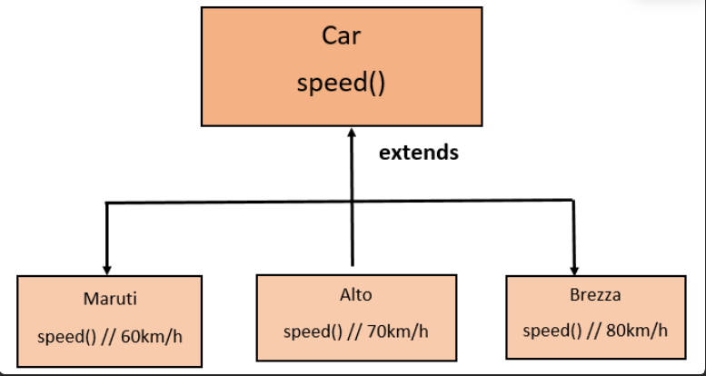
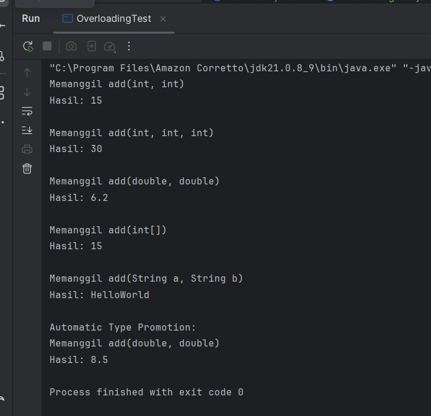
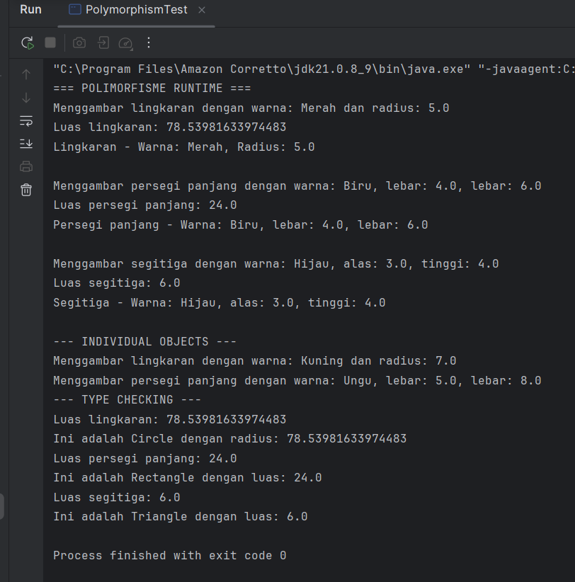

Laporan Modul 7: Polymorphism
---
**Mata Kuliah:** Praktikum Pemrograman Berorientasi Objek  
**Nama:** MIRZA FEBERANI  
**NIM:** 2024573010086  
**Kelas:** TI 2E  
**Tanggal Praktikum:** 06 November 2025

---

## 1. Abstrak

Polymorphism merupakan salah satu pilar utama dalam **Pemrograman Berorientasi Objek (PBO)** yang memungkinkan suatu
objek memiliki banyak bentuk atau perilaku berbeda tergantung pada konteks penggunaannya. Dalam bahasa pemrograman 
**Java**, konsep ini diwujudkan melalui kemampuan kelas turunan (*subclass*) untuk mengubah atau menyesuaikan perilaku
dari kelas induknya (*superclass*) menggunakan **method overriding**, serta kemampuan untuk memanggil metode yang sama
namun menghasilkan hasil berbeda tergantung jenis objek sebenarnya pada saat runtime.

Praktikum ini bertujuan untuk memahami secara mendalam bagaimana **polymorphism** bekerja dalam Java, baik melalui
*compile-time polymorphism* (method overloading) maupun *runtime polymorphism* (method overriding). Melalui penerapan
konsep ini, mahasiswa diharapkan mampu merancang program yang lebih fleksibel, efisien, dan mudah diperluas tanpa harus
memodifikasi struktur kelas yang sudah ada.

Dengan memanfaatkan polymorphism, sistem menjadi lebih dinamis karena satu referensi objek dapat mewakili berbagai tipe
kelas turunan. Hal ini tidak hanya meningkatkan **reusability** dan **maintainability**, tetapi juga mencerminkan
prinsip utama OOP, yaitu kemampuan objek untuk menyesuaikan perilakunya terhadap situasi yang berbeda. Praktikum ini
sekaligus menegaskan bahwa polymorphism merupakan fondasi penting dalam membangun aplikasi yang modular, scalable, dan
mudah dikembangkan di masa depan.


---

## 2. Praktikum

### Pendahuluan

Dalam konteks pemrograman OOP (Object Oriented Programming), istilah polymorphism sering digunakan karena berkaitan erat
dengan salah satu pilar seperti class, object, method, atau inheritance. Polymorphism adalah banyak bentuk atau
bermacam-macam. Dalam istilah pemrograman, polymorphism adalah sebuah konsep di mana sebuah interface tunggal digunakan
pada entitas yang berbeda-beda. Umumnya, penggunaan suatu simbol tunggal berfungsi untuk mewakili beberapa jenis tipe
entitas.

Polymorphism adalah konsep pemrograman yang berorientasi pada objek yang mengacu pada kemampuan variabel, fungsi atau
objek untuk mengambil beberapa bentuk. Polymorphism adalah penggunaan salah satu item seperti fungsi, atribut, atau
interface pada berbagai jenis objek yang berbeda dalam bahasa pemrograman. Dalam bahasa pemrograman yang menunjukkan
polimorfisme, objek kelas miliki hierarki yang sama yang diwariskan dari kelas induk yang sama, mungkin memiliki fungsi
dengan nama yang sama, tetapi dengan perilaku berbeda.



**Tujuan Polymorphism**

1. _Flexibility_ - Memungkinkan kode yang lebih fleksibel dan mudah diperluas.
2. _Code Reusability_ - Mengurangi duplikasi kode dengan menggunakan interface yang sama.
3. _Maintainability_ - Memudahkan maintenance dan pengembangan fitur baru.
4. _Dynamic Behavior_ - Perilaku objek ditentukan pada runtime
5. _Interface Consistency_ - Konsistensi dalam penggunaan interface

**Cara Implementasi**

1. Gunakan inheritance hierarchy
2. Override method di subclass
3. Gunakan reference superclass untuk memegang objek subclass
4. Method yang dipanggil ditentukan pada runtime berdasarkan tipe aktual objek

**Jenis-jenis Polimorfisme:**

#### 1. Compile-time Polymorphism (Method Overloading)

Method overriding terjadi ketika subclass (class anak) menyediakan implementasi spesifik untuk method yang sudah
didefinisikan di superclass (class induk). Method overriding digunakan untuk mengubah atau memperluas perilaku method
yang diwarisi dari superclass. Method yang di-override harus memiliki nama, parameter, dan return type yang sama dengan
method di superclass.

#### Aturan Method Overriding:

- Method harus memiliki nama dan parameter yang sama dengan method di superclass.
- Return type harus sama atau subtype dari return type di superclass.
- Access modifier tidak boleh lebih restriktif daripada method di superclass (misalnya, jika method di superclass
  protected, method di subclass bisa protected atau public).
- Method tidak bisa di-override jika di superclass dideklarasikan sebagai final.

#### 2. Runtime Polymorphism (Method Overriding)

Runtime polymorphism terjadi ketika sebuah method di-override oleh subclass untuk memberikan implementasi yang lebih
spesifik dari method yang sama yang didefinisikan di superclass.
Pemilihan method mana yang akan dijalankan tidak dilakukan oleh compiler, tetapi oleh Java Virtual Machine (JVM) saat
program dijalankan.

#### Aturan Method Overriding:

- Nama dan parameter method harus identik dengan method di superclass.
- Return type harus sama, atau merupakan subtype dari return type di superclass (covariant return type).
- Access modifier tidak boleh lebih restriktif daripada di superclass.
    - Contoh: Jika method di superclass `protected`, maka di subclass bisa `protected` atau `public`, tetapi tidak
      `private`.
- Method tidak bisa di-override jika:
    - Dideklarasikan sebagai `final` atau `static`.
    - Termasuk konstruktor.

---

### Praktikum 1: Memahami Method Overloading (Compile-time Polymorphism)

**Tujuan:**

Memahami konsep dan implementasi method overloading.

#### Langkah Praktikum : Method Overloading (Compile-time Polymorphism)

1. Buat class baru `Calculator`.
2. Ketik kode berikut:

```
package modul_7.praktikum_1;

public class Calculator {

    // Method untuk menjumlahkan 2 integer
    public int add(int a, int b) {
        System.out.println("Memanggil add(int, int)");
        return a + b;
    }

    // Overload method untuk menjumlahkan 3 integer
    public int add(int a, int b, int c) {
        System.out.println("Memanggil add(int, int, int)");
        return a + b + c;
    }

    // Overload method untuk menjumlahkan 2 double
    public double add(double a, double b) {
        System.out.println("Memanggil add(double, double)");
        return a + b;
    }

    // Overload method untuk menjumlahkan array integer
    public int add(int[] numbers) {
        System.out.println("Memanggil add(int[])");
        int sum = 0;
        for (int num : numbers) {
            sum += num;
        }
        return sum;
    }

    // Overload method untuk concatenate strings
    public String add(String a, String b) {
        System.out.println("Memanggil add(String a, String b)");
        return a + b;
    }
}
```

- Buat class `OverloadingTest` untuk testing:

```
package modul_7.praktikum_1;

public class OverloadingTest {
    public static void main(String[] args) {
        Calculator calc = new Calculator();

        // Test berbagai versi method add
        System.out.println("Hasil: " + calc.add(5, 10));
        System.out.println();

        System.out.println("Hasil: " + calc.add(5, 10, 15));
        System.out.println();

        System.out.println("Hasil: " + calc.add(3.5, 2.70));
        System.out.println();

        int[] numbers = {1, 2, 3, 4, 5};
        System.out.println("Hasil: " + calc.add(numbers));
        System.out.println();

        System.out.println("Hasil: " + calc.add("Hello", "World"));
        System.out.println();

        // Demonstrasi automatic type promotion
        System.out.println("Automatic Type Promotion:");
        System.out.println("Hasil: " + calc.add(5, 3.5));  // int + double
    }
}
```

- Jalankan program dan amati hasil.
- Perhatikan bagaimana compiler memilih method yang tepat berdasarkan parameter

#### Screenshot Hasil



---

### Analisa dan Pembahasan

**1. Deskripsi Umum Program**

Program pada package `modul_7.praktikum_1` berjudul **“Polymorphism – Compile-time Polymorphism (Method Overloading)”**.  
Tujuan dari praktikum ini adalah untuk memahami konsep **polymorphism pada tahap kompilasi**, yang diimplementasikan
melalui **method overloading** dalam bahasa pemrograman **Java**.

Program ini terdiri dari dua kelas:

1. **`Calculator`** - berisi beberapa versi method `add()` yang memiliki nama sama, namun parameter berbeda (jumlah,
   tipe data, atau struktur datanya).
2. **`OverloadingTest`** - berfungsi sebagai kelas utama untuk menguji berbagai bentuk pemanggilan method `add()`.

---

**2. Analisis class Calculator**

**Konsep Dasar**

Kelas `Calculator` menunjukkan bagaimana satu nama method (`add`) dapat digunakan untuk berbagai operasi tergantung
pada:

- Jumlah parameter yang diterima.
- Jenis data dari parameter.
- Struktur parameter (misalnya: array, string, atau bilangan desimal).

Inilah yang disebut **method overloading**, bagian dari **compile-time polymorphism**, di mana *compiler* menentukan
method mana yang akan dijalankan berdasarkan tanda tangan (signature) method saat proses kompilasi.

**Daftar Method Overloading**

**1. Menjumlahkan dua integer**

   ```
   public int add(int a, int b)
   ```

Menerima dua bilangan bulat dan mengembalikan hasil penjumlahannya.

Output tambahan menunjukkan bahwa method ini dipanggil:

   ```
   Memanggil add(int, int)
   ```

**2. Menjumlahkan tiga integer**

   ```
   public int add(int a, int b, int c)
   ```

Menerima tiga bilangan bulat dan menjumlahkannya.

Ini menunjukkan overloading berdasarkan jumlah parameter.

**3. Menjumlahkan dua double**

   ```
   public double add(double a, double b)
   ```

Method ini menunjukkan overloading berdasarkan tipe data parameter.

**4. Menjumlahkan array integer**

   ```
   public int add(int[] numbers)
   ```

Menggunakan struktur parameter yang berbeda (array) untuk menghitung total dari elemen-elemen di dalam array.

**5. Menggabungkan dua string**

   ```
   public String add(String a, String b)
   ```

Menerapkan overloading berdasarkan tipe data berbeda (bukan numerik), mengembalikan hasil berupa gabungan dua string.

**Karakteristik Method Overloading**

- Semua method memiliki nama yang sama `(add)`.
- Ditentukan berdasarkan perbedaan tanda tangan (method signature), yaitu:
    - Jumlah parameter
    - Jenis parameter
    - Urutan parameter
- Proses pemilihan method dilakukan oleh compiler, bukan saat runtime.
- Tidak bergantung pada konsep inheritance atau overriding.

---

**3. Analisis class OverloadingTest**

Kelas `OverloadingTest` digunakan untuk menguji berbagai bentuk method `add()`.
Setiap pemanggilan menunjukkan bagaimana Java secara otomatis memilih versi method yang sesuai dengan parameter yang
diberikan.

**Langkah Eksekusi**

**1. Menjumlahkan dua integer**

   ```
   calc.add(5, 10);
   ```

Output:

   ```
   Memanggil add(int, int)
   Hasil: 15
   ```

**2. Menjumlahkan tiga integer**

   ```
   calc.add(5, 10, 15);
   ```

Output:

   ```
   Memanggil add(int, int, int)
   Hasil: 30
   ```

**3. Menjumlahkan dua double**

   ```
   calc.add(3.5, 2.70);
   ```

Output:

   ```
   Memanggil add(double, double)
   Hasil: 6.2
   ```

**4. Menjumlahkan elemen array**

   ```
   int[] numbers = {1, 2, 3, 4, 5};
   calc.add(numbers);
   ```

Output:

   ```
   Memanggil add(int[])
   Hasil: 15
   ```

**5. Menggabungkan dua string**

   ```
   calc.add("Hello", "World");
   ```

Output:

   ```
   Memanggil add(String a, String b)
   Hasil: HelloWorld
   ```

**6. Demonstrasi Automatic Type Promotion**

   ```
   calc.add(5, 3.5);
   ```

Karena tidak ada method `add(int, double)` secara eksplisit, Java otomatis mempromosikan tipe `int` ke `double`, dan
menjalankan method:

   ```
   Memanggil add(double, double)
   Hasil: 8.5
   ```

---

**4. Pembahasan**

**Konsep yang Diuji: Compile-time Polymorphism**

Program ini menampilkan bagaimana Java mampu menentukan method mana yang dijalankan berdasarkan tipe dan jumlah
parameter saat kompilasi. Tidak ada mekanisme dinamis (runtime dispatch) seperti pada overriding.

**Keuntungan method overloading:**

- **Konsistensi nama method**: tidak perlu membuat banyak nama berbeda untuk fungsi serupa.
- Meningkatkan keterbacaan kode: programmer cukup mengingat satu nama method `(add)` untuk berbagai tipe operasi.
- **Mendukung fleksibilitas**: method yang sama dapat bekerja untuk berbagai tipe data.

**Automatic Type Promotion**

Fitur ini menunjukkan bahwa Java dapat secara otomatis mengonversi tipe data yang lebih kecil ke tipe yang lebih besar
jika diperlukan.

Contoh:

- int - double
- float - double
- char - int

Sehingga, pemanggilan `calc.add(5, 3.5)` akan diarahkan ke `add(double, double)` karena Java menaikkan tipe `int`
menjadi
`double`.

---

### Praktikum 2: Memahami Method Overriding (Runtime Polymorphism)

**Tujuan:**

Memahami konsep runtime polymorphism melalui method overriding.

#### Langkah Praktikum : Method Overriding (Runtime Polymorphism)

1. Buat class baru `Shape` sebagai superclass.
2. Ketik kode berikut:

```
package modul_7.praktikum_2;

public class Shape {
    protected String color;

    public Shape(String color) {
        this.color = color;
    }

    public void draw() {
        System.out.println("Menggambar shape dengan warna: " + color);
    }

    public double calculateArea() {
        System.out.println("Menghitung luas shape umum");
        return 0.0;
    }

    public void displayInfo() {
        System.out.println("Shape - Warna: " + color);
    }
}
```

- Buat class `Circle ` yang mewarisi `Shape`:

```
package modul_7.praktikum_2;

public class Circle extends Shape {
    private double radius;

    public Circle(String color, double radius) {
        super(color);
        this.radius = radius;
    }

    @Override
    public void draw() {
        System.out.println("Menggambar lingkaran dengan warna: " + color + " dan radius: " + radius);
    }

    @Override
    public double calculateArea() {
        double area = Math.PI * radius * radius;
        System.out.println("Luas lingkaran: " + area);
        return area;
    }

    @Override
    public void  displayInfo() {
        System.out.println("Lingkaran - Warna: " + color + ", Radius: " + radius);
    }
}
```

- Buat class `Rectangle` untuk untuk mewarisi `Shape`:

```
package modul_7.praktikum_2;

public class Rectangle extends Shape {
    private double width;
    private double height;

    public Rectangle(String color, double width, double height) {
        super(color);
        this.width = width;
        this.height = height;
    }

    @Override
    public void draw() {
        System.out.println("Menggambar persegi panjang dengan warna: " + color + ", lebar: " + width + ", lebar: " + height);
    }

    @Override
    public double calculateArea() {
        double area = width * height;
        System.out.println("Luas persegi panjang: " + area);
        return area;
    }

    @Override
    public void displayInfo() {
        System.out.println("Persegi panjang - Warna: " + color + ", lebar: " + width + ", lebar: " + height);
    }
}
```

- Buat class `Triangle` untuk untuk mewarisi `Shape`:

```
package modul_7.praktikum_2;

public class Triangle extends Shape {
    private double base;
    private double height;

    public Triangle(String color, double base, double height) {
        super(color);
        this.base = base;
        this.height = height;
    }

    @Override
    public void draw() {
        System.out.println("Menggambar segitiga dengan warna: " + color + ", alas: " + base + ", tinggi: " + height);
    }

    @Override
    public double calculateArea() {
        double area = 0.5 * base * height;
        System.out.println("Luas segitiga: " + area);
        return area;
    }

    @Override
    public void displayInfo() {
        System.out.println("Segitiga - Warna: " + color + ", alas: " + base + ", tinggi: " + height);
    }
}
```

- Buat class `PolymorphismTest` untuk testing:

```
package modul_7.praktikum_2;

public class PolymorphismTest {
    public static void main(String[] args) {
        // Demonstrasi runtime polymorphism
        Shape[] shapes = new Shape[3];
        shapes[0] = new Circle("Merah", 5.0);
        shapes[1] = new Rectangle("Biru", 4.0, 6.0);
        shapes[2] = new Triangle("Hijau", 3.0, 4.0);

        System.out.println("=== POLIMORFISME RUNTIME ===");
        for (Shape shape : shapes) {
            shape.draw();           // akan memanggil method sesuai objek sebenarnya
            shape.calculateArea();  // akan memanggil method sesuai objek sebenarnya
            shape.displayInfo();    // akan memanggil method sesuai objek sebenarnya
            System.out.println();
        }

        // Demonstrasi dengan individual objects
        System.out.println("--- INDIVIDUAL OBJECTS ---");
        Shape shape1 = new Circle("Kuning", 7.0);
        Shape shape2 = new Rectangle("Ungu", 5.0, 8.0);

        shape1.draw();          // Memanggil Circle's draw()
        shape2.draw();          // Memanggil Rectangle draw()

        // Type casting dan instanceof
        System.out.println("--- TYPE CHECKING ---");
        for (Shape shape : shapes) {
            if (shape instanceof Circle) {
                Circle circle = (Circle) shape;
                System.out.println("Ini adalah Circle dengan radius: " + circle.calculateArea());
            } else if (shape instanceof Rectangle) {
                Rectangle rectangle = (Rectangle) shape;
                System.out.println("Ini adalah Rectangle dengan luas: " + rectangle.calculateArea());
            }  else if (shape instanceof Triangle) {
                Triangle triangle = (Triangle) shape;
                System.out.println("Ini adalah Triangle dengan luas: " + triangle.calculateArea());
            }
        }
    }
}
```

- Jalankan program dan amati
- Bagaimana method yang dipanggil ditentukan pada runtime
- Perilaku polimorfik dari objek-objek berbeda
- Penggunaan instanceof untuk type checking

#### Screenshot Hasil



---

### Analisa dan Pembahasan

**1. Deskripsi Umum Program**

Program pada package `modul_7.praktikum_2` merupakan implementasi **polimorfisme runtime (Runtime Polymorphism)**
menggunakan konsep **inheritance dan method overriding** pada bahasa pemrograman **Java**.  
Melalui percobaan ini, mahasiswa diharapkan memahami bagaimana **Java menentukan method yang dijalankan berdasarkan tipe
objek sebenarnya**, meskipun objek tersebut direferensikan oleh tipe superclass.

Program terdiri dari lima kelas utama:

1. **`Shape`** - superclass (kelas induk) yang merepresentasikan bentuk umum.
2. **`Circle`**, **`Rectangle`**, dan **`Triangle`** - subclass yang mewarisi `Shape` dan mengimplementasikan perilaku
   spesifik masing-masing bentuk.
3. **`PolymorphismTest`** - utama untuk melakukan pengujian dan demonstrasi konsep runtime polymorphism.

---

**2. Analisis Tiap Kelas**

**a. Class Shape (Superclass)**

```
public class Shape {
    protected String color;

    public Shape(String color) {
        this.color = color;
    }

    public void draw() { ... }
    public double calculateArea() { ... }
    public void displayInfo() { ... }
}
```

Kelas `Shape` merupakan kelas dasar (superclass) yang mendefinisikan atribut umum:

- `color` - warna dari bentuk.

Serta tiga method umum:

- `draw()` - menggambar bentuk (umum).
- `calculateArea()` - menghitung luas (default 0.0).
- `displayInfo()` - menampilkan informasi warna bentuk.

Ketiga method ini nantinya di-override oleh subclass agar menampilkan perilaku spesifik sesuai bentuknya.

**b. Class Circle (Subclass)**

```
public class Circle extends Shape {
    private double radius;
    ...
    @Override
    public void draw() { ... }
    @Override
    public double calculateArea() { ... }
    @Override
    public void displayInfo() { ... }
}
```

Kelas `Circle` mewarisi `Shape` dan menambahkan atribut baru `radius`.
Method `draw()`, `calculateArea()`, dan `displayInfo()` di-override agar sesuai dengan karakteristik lingkaran.

Perhitungan luas menggunakan rumus: **Luas = pi x r^2**

Ketika method `draw()` dipanggil melalui referensi `Shape`, yang dijalankan adalah implementasi milik `Circle`, bukan
`Shape`.

Inilah contoh nyata runtime polymorphism.

**c. Class Rectangle (Subclass)**

```
public class Rectangle extends Shape {
    private double width;
    private double height;
    ...
    @Override
    public void draw() { ... }
    @Override
    public double calculateArea() { ... }
    @Override
    public void displayInfo() { ... }
}
```

Kelas `Rectangle` menambahkan dua atribut: `width` (lebar) dan `height` (tinggi).
Method `calculateArea()` menghitung luas dengan rumus:

**Luas= width x height**

Method ini juga menimpa (`override`) method bawaan `Shape`, sehingga saat dipanggil dari referensi `Shape`, yang
dijalankan tetap versi milik `Rectangle`.

**d. Class Triangle (Subclass)**

```
public class Triangle extends Shape {
    private double base;
    private double height;
    ...
}
```

Kelas Triangle menambahkan atribut base (alas) dan height (tinggi).

Luas dihitung menggunakan rumus:

**Luas = 1/2 x base x height**

×base×height

Method `draw()`, `calculateArea()`, dan `displayInfo()` diimplementasikan ulang agar menampilkan informasi khas
segitiga.

**e. Class PolymorphismTest (Main Class)**

```
Shape[] shapes = new Shape[3];
shapes[0] = new Circle("Merah", 5.0);
shapes[1] = new Rectangle("Biru", 4.0, 6.0);
shapes[2] = new Triangle("Hijau", 3.0, 4.0);
```

Kelas ini berfungsi untuk mendemonstrasikan runtime polymorphism, yaitu kemampuan referensi superclass (`Shape`) untuk
menunjuk ke objek subclass (`Circle`, `Rectangle`, `Triangle`).

**Bagian utama yang diuji:**

**1. Pemanggilan method polymorphic**

```
for (Shape shape : shapes) {
shape.draw();
shape.calculateArea();
shape.displayInfo();
}
```

Meskipun `shape` bertipe `Shape`, method yang dijalankan sesuai dengan tipe objek sebenarnya (`Circle`, `Rectangle`,
`Triangle`).

**2. Individual Object Test**

```
Shape shape1 = new Circle("Kuning", 7.0);
Shape shape2 = new Rectangle("Ungu", 5.0, 8.0);
shape1.draw();
shape2.draw();
```

Terlihat bahwa method overriding bekerja meski objek diakses lewat referensi superclass.

**3. Type Checking dengan `instanceof` dan Casting**

```
if (shape instanceof Circle) {
    Circle circle = (Circle) shape;
    ...
}
```

`instanceof` digunakan untuk memeriksa tipe objek sebenarnya sebelum melakukan _type casting_, agar program aman dari
error
`ClassCastException`.

---

**3. Mekanisme Runtime Polymorphism**

Polimorfisme runtime bekerja berdasarkan dynamic method dispatch, yaitu proses di mana JVM memilih implementasi method
yang akan dijalankan saat program berjalan (runtime), bukan saat kompilasi.

Misalnya:

```
Shape s = new Circle("Merah", 5.0);
s.draw(); // Memanggil draw() milik Circle, bukan Shape
```

Meskipun `s` bertipe `Shape`, yang dijalankan tetap method `draw()` dari kelas `Circle`, karena objek sebenarnya adalah `Circle`.

---

**4. Pembahasan Konseptual**

| Konsep OOP                 | Implementasi dalam Program                                                                                          |
| -------------------------- | ------------------------------------------------------------------------------------------------------------------- |
| **Inheritance**            | `Circle`, `Rectangle`, dan `Triangle` mewarisi atribut dan method dari `Shape`.                                     |
| **Method Overriding**      | Ketiga subclass menimpa (`override`) method `draw()`, `calculateArea()`, dan `displayInfo()` dengan versi spesifik. |
| **Polymorphism**           | Referensi superclass `Shape` dapat digunakan untuk menyimpan objek dari berbagai subclass.                          |
| **Dynamic Binding**        | JVM menentukan method mana yang dijalankan berdasarkan tipe objek aktual saat runtime.                              |
| **Instanceof dan Casting** | Digunakan untuk mengidentifikasi tipe objek sebelum melakukan konversi tipe.                                        |

---

## 3. Kesimpulan

Berdasarkan hasil praktikum dan analisis yang telah dilakukan pada materi **Polymorphism** di Java, dapat disimpulkan beberapa hal penting sebagai berikut:

1. **Polymorphism** adalah salah satu pilar utama dalam pemrograman berorientasi objek (OOP) yang memungkinkan satu referensi superclass untuk digunakan dalam memanggil method dari berbagai subclass yang berbeda.  
   Hal ini memberikan **fleksibilitas tinggi** dalam desain program dan mempermudah pengelolaan objek dengan perilaku yang berbeda namun memiliki antarmuka yang sama.

2. **Runtime Polymorphism (Dynamic Polymorphism)** terjadi ketika penentuan method yang dijalankan dilakukan **saat program berjalan**, bukan saat kompilasi.  
   Dalam percobaan ini, hal tersebut terlihat pada pemanggilan method `draw()`, `calculateArea()`, dan `displayInfo()` yang hasilnya bergantung pada tipe objek aktual (`Circle`, `Rectangle`, atau `Triangle`) meskipun direferensikan oleh variabel bertipe `Shape`.

3. **Method Overriding** menjadi kunci utama dalam penerapan runtime polymorphism, karena subclass dapat menimpa (override) method dari superclass untuk memberikan perilaku yang lebih spesifik sesuai kebutuhan masing-masing kelas turunan.

4. Dengan menggunakan **polymorphism**, program menjadi **lebih modular, efisien, dan mudah dikembangkan**, karena penambahan kelas baru (misalnya bentuk baru selain `Circle`, `Rectangle`, dan `Triangle`) tidak memerlukan perubahan besar pada struktur kode yang sudah ada.

5. Fitur **`instanceof`** dan **type casting** pada Java berperan penting dalam memastikan keamanan saat berinteraksi dengan objek polymorphic, terutama untuk mengetahui tipe sebenarnya dari suatu objek sebelum dilakukan operasi tertentu.

Secara keseluruhan, praktikum ini membuktikan bahwa **polymorphism memungkinkan kode yang lebih dinamis dan adaptif**, serta merupakan pondasi penting dalam membangun sistem berorientasi objek yang berskala besar, fleksibel, dan mudah dipelihara.

---

## 4. Referensi

- Oracle. *Java SE Documentation*. https://docs.oracle.com/javase
- Modul Praktikum PBO, Modul 2: Dasar Pemrograman Java 
- Oracle. (2024). *The Java™ Tutorials: Polymorphism.*  
Diakses dari: [https://docs.oracle.com/javase/tutorial/java/IandI/polymorphism.html](https://docs.oracle.com/javase/tutorial/java/IandI/polymorphism.html)
- Deitel, P. J., & Deitel, H. M. (2022). *Java: How to Program (Early Objects), 12th Edition.* Pearson Education.
- Schildt, H. (2022). *Java: The Complete Reference, 12th Edition.* McGraw-Hill Education.
- Wicaksono, A. (2021). *Pemrograman Berorientasi Objek dengan Java.* Elex Media Komputindo.
- GeeksforGeeks. (2024). *Polymorphism in Java.*  
Diakses dari: [https://www.geeksforgeeks.org/polymorphism-in-java/](https://www.geeksforgeeks.org/polymorphism-in-java/)
- Tutorialspoint. (2023). *Java Polymorphism.*  
Diakses dari: [https://www.tutorialspoint.com/java/java_polymorphism.htm](https://www.tutorialspoint.com/java/java_polymorphism.htm)
