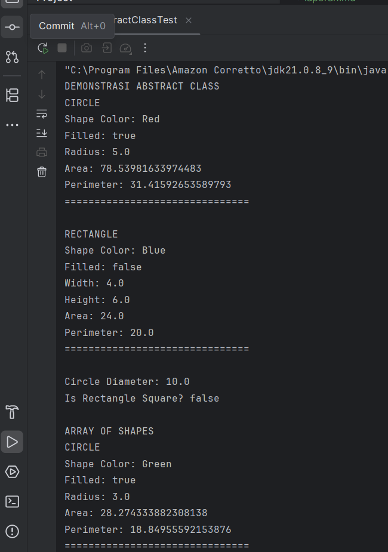
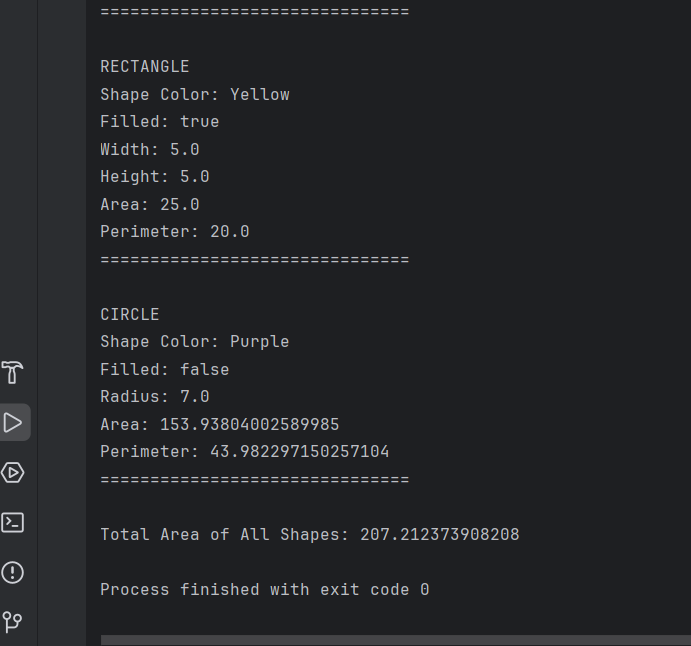
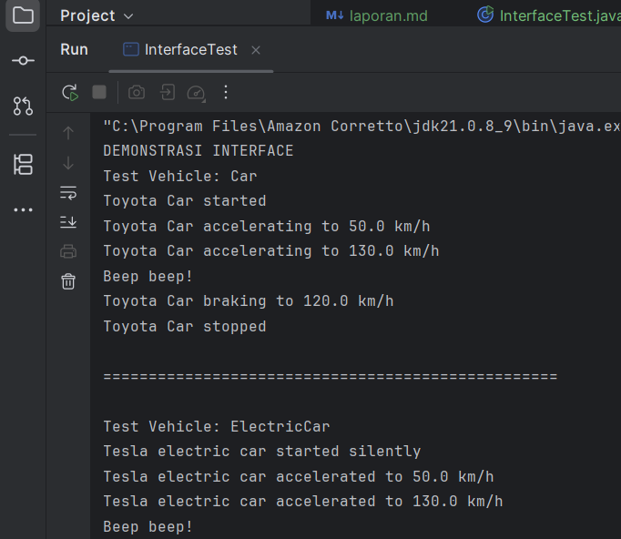
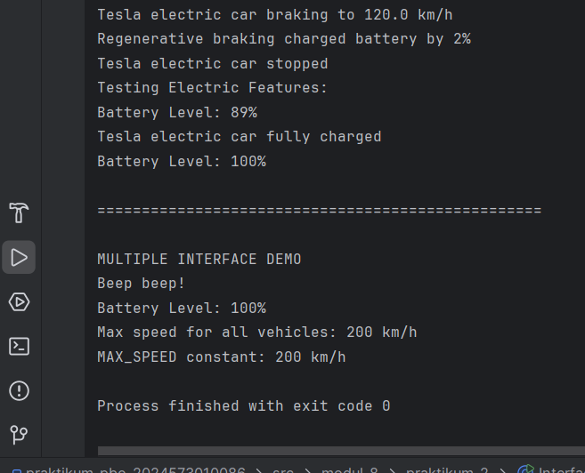
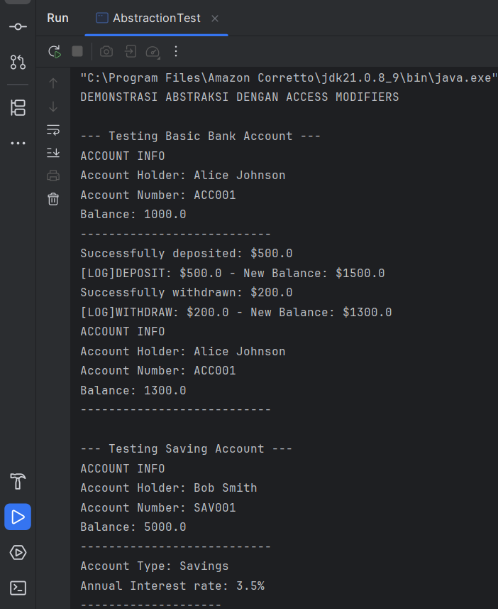
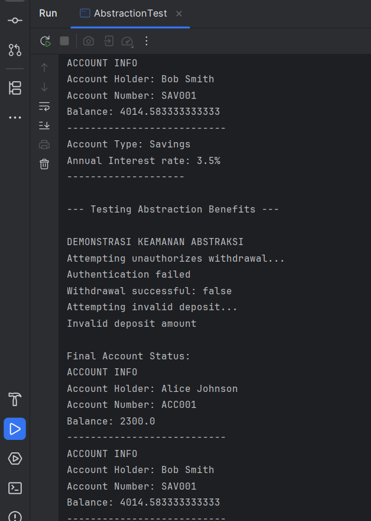
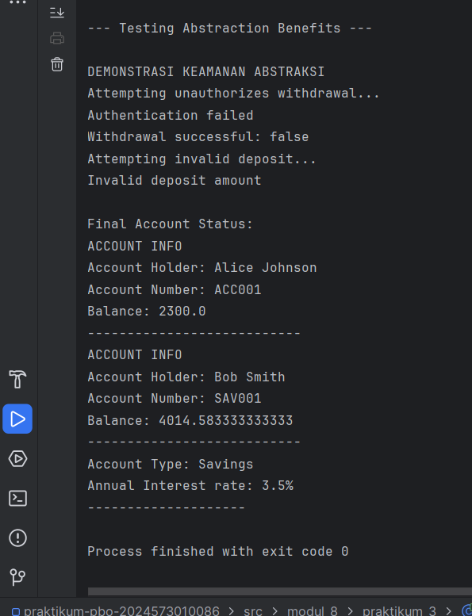

Laporan Modul 8: Abstraction
---
**Mata Kuliah:** Praktikum Pemrograman Berorientasi Objek  
**Nama:** MIRZA FEBERANI  
**NIM:** 2024573010086  
**Kelas:** TI 2E  
**Tanggal Praktikum:** 13 November 2025

---

## 1. Abstrak

Abstraksi (Abstraction) merupakan salah satu pilar utama dalam pemrograman berorientasi objek (OOP) yang digunakan untuk
menyederhanakan kompleksitas sistem dengan hanya menampilkan fitur inti yang relevan, sekaligus menyembunyikan detail
implementasi yang tidak diperlukan. Melalui abstraksi, programmer dapat membangun struktur kode yang lebih terorganisir,
mudah dipahami, dan fleksibel untuk dikembangkan.

Pada praktikum ini, konsep abstraksi diterapkan menggunakan abstract class dan interface. Abstract class memungkinkan
pendefinisian kerangka perilaku dasar yang dapat diwariskan sekaligus memaksa subclass untuk mengimplementasikan method
tertentu. Sementara itu, interface menawarkan kontrak perilaku yang dapat diimplementasikan oleh berbagai class,
mendukung fleksibilitas sekaligus multiple inheritance.

Tujuan dari praktikum ini adalah memahami cara kerja abstraksi dalam Java, mengimplementasikan abstract class dan
interface, serta menganalisis bagaimana abstraction membantu pengembangan sistem yang modular, reusable, dan mudah
diperluas. Dengan menerapkan abstraksi secara benar, mahasiswa dapat membangun program yang lebih bersifat general,
efisien, dan mudah dikelola.

---

## 2. Praktikum

### Pendahuluan

Abstraksi adalah konsep dalam object-oriented programming (OOP) yang bertujuan untuk menyederhanakan kompleksitas sistem
dengan menyembunyikan detail-detail teknis yang tidak perlu.

Inti dari abstraksi adalah tentang fokus pada 'apa' yang dilakukan suatu objek atau komponen, bukan 'bagaimana' hal itu
dilakukan. Dalam praktiknya, abstraksi membantu programmer mendefinisikan interface, menunjukkan operasi yang dapat
dilakukan oleh suatu objek, tanpa harus menyertakan detail tentang logika internal atau implementasi di balik operasi
tersebut.

Misalnya, ketika menggunakan remote TV, kita hanya perlu tahu cara mengoperasikannya tanpa harus memahami mekanisme
internalnya. Dalam OOP, objek menyediakan abstraksi yang menyembunyikan detail implementasi internal. Seperti remote TV,
user hanya perlu tahu metode apa dari objek yang tersedia untuk dipanggil dan parameter input apa yang diperlukan untuk
memicu operasi tertentu.

Dalam desain software, abstraksi berguna agar sistem dapat dibagi menjadi komponen-komponen yang lebih kecil dan lebih
mudah dikelola, di mana masing-masing menyembunyikan kompleksitasnya sendiri. Hal ini tidak hanya memudahkan proses
pengembangan, tetapi juga memfasilitasi maintenance dan testing software.

Selain itu, abstraksi juga bisa dipakai untuk mengubah implementasi internal suatu komponen tanpa memengaruhi komponen
lain yang berinteraksi dengan komponen tersebut, asalkan interface yang digunakan tetap konsisten.

**Fungsi Abstraksi**

1. Menyederhanakan kompleksitas: abstraksi membantu dalam menyederhanakan sistem yang kompleks. Dengan menyembunyikan
   detail internal dan menampilkan hanya fungsionalitas yang diperlukan, abstraksi membantu programmer untuk tidak
   terbebani oleh kompleksitas yang tidak relevan.
2. Meningkatkan modularitas: abstraksi mendukung pembuatan modul yang dapat digunakan kembali. Dengan mendefinisikan
   interface yang jelas, modul dapat dikembangkan secara independen dan digunakan dalam berbagai konteks tanpa perlu
   mengetahui detail internalnya.
3. Memudahkan maintenance: kode yang mengimplementasikan abstraksi lebih mudah dipelihara dan diperbarui. Perubahan pada
   implementasi internal suatu modul tidak memengaruhi modul lain yang menggunakan interface abstrak tersebut.
4. Meningkatkan keamanan: dengan menyembunyikan detail internal, abstraksi akan meningkatkan keamanan software. Hal ini
   mencegah akses tidak sah ke data internal atau manipulasi fungsi internal.
5. Memfasilitasi kolaborasi: dalam proyek besar dengan banyak developer, abstraksi memungkinkan tim untuk bekerja secara
   paralel pada komponen yang berbeda. Setiap tim fokus pada tugasnya sendiri tanpa perlu memahami keseluruhan sistem.
6. Mendukung polimorfisme dan penggunaan ulang kode: abstraksi mendukung penggunaan polimorfisme, di mana objek dari
   class berbeda dapat diakses melalui interface yang sama. Ini meningkatkan fleksibilitas dan penggunaan ulang kode.
7. Mendukung pemisahan antara interface dan implementasi: abstraksi bisa memisahkan apa yang dilakukan suatu objek (
   interface) dan bagaimana hal itu dilakukan (implementasi). Ini memudahkan pemahaman dan pengembangan software.

**Jenis-jenis Abstraksi**

**1. Abstraksi data (data abstraction)**

Data abstraction terjadi ketika data objek tidak terlihat oleh dunia luar. Akses ke data objek (jika diperlukan)
disediakan melalui beberapa metode. Abstraksi data memastikan detail internal objek tetap tersembunyi, sementara
fungsionalitas yang diperlukan dapat diakses.

**2. Abstraksi proses (process abstraction)**

Process abstraction terjadi ketika implementasi internal dari berbagai fungsi yang terlibat dalam operasi user
disembunyikan. Artinya, detail tentang bagaimana fungsi tertentu diimplementasikan tidak terlihat oleh user, hanya hasil
akhirnya yang penting.

**Contoh Abstraksi**

Contoh dari abstraksi adalah penggunaan aplikasi pengolah kata, seperti Microsoft Word. Microsoft Word adalah aplikasi
pengolah kata untuk membuat, mengedit, dan memformat dokumen teks. Aplikasi ini menyediakan berbagai fitur seperti
pengecekan ejaan dan tata bahasa, format teks, penambahan gambar, dan pembuatan tabel.

Beberapa fitur yang ditawarkan Microsoft Word yaitu:

1. Pembuatan dan pengeditan Dokumen
2. Pengecekan ejaan dan tata bahasa
3. Insert object
4. Template dan desain dokumen

Microsoft Word mengabstraksikan kompleksitas pemrosesan fitur-fitur di atas. User tidak perlu memahami detail teknis
tentang pemformatan teks atau pengelolaan dokumen. Sebaliknya, mereka hanya perlu menggunakan user interface intuitif
untuk mencapai hasil yang diinginkan. Proses seperti rendering teks, penanganan margin dan spasi, serta konversi format
file, semua diabstraksikan oleh aplikasi.

**Cara Implementasi**

1. Abstract Classes - Class yang tidak dapat diinstansiasi langsung dan mengandung abstract methods
2. Interfaces - Kontrak yang mendefinisikan method yang harus diimplementasikan
3. Access Modifiers - Menggunakan private/protected untuk menyembunyikan detail implementasi

---

### Praktikum 1: Memahami Abstract Class dan Abstract Method

**Abstract Class**

Abstract class adalah kelas yang tidak dapat diinstansiasi (tidak bisa dibuat objeknya langsung). Kelas ini berfungsi
sebagai kerangka dasar (template) untuk kelas-kelas turunannya.

**Ciri-ciri Abstract Class:**

- Dideklarasikan dengan keyword abstract
- Tidak bisa dibuat objeknya dengan new
- Dapat memiliki method abstrak dan method konkret (biasa)
- Dapat memiliki constructor, field, dan method seperti kelas biasa

**Abstract Method**

Abstract method adalah method yang hanya dideklarasikan tanpa implementasi (tanpa body). Implementasinya wajib diberikan
oleh subclass yang mewarisinya.

**Ciri-ciri Abstract Method:**

- Hanya deklarasi tanpa body {}
- Harus berada dalam abstract class
- Subclass wajib mengoverride method abstrak ini
- Dideklarasikan dengan keyword abstract

**Tujuan:**

Memahami konsep dan implementasi abstract class dan abstract method.

#### Langkah Praktikum : Memahami Abstract Class dan Abstract Method

1. Buat class baru `Shape`.
2. Ketik kode berikut:

```
package modul_8.praktikum_1;

public abstract class Shape {
    protected String color;
    protected boolean filled;

    // Constructor
    public Shape(String color,  boolean filled) {
        this.color = color;
        this.filled = filled;
    }

    // Abstract methods - harus diimplementasikan subclass
    public abstract double calculateArea();
    public abstract double calculatePerimeter();

    // Concrete methods - sudah memiliki implementasi
    public String getColor() {
        return color;
    }

    public void setColor(String color) {
        this.color = color;
    }

    public boolean isFilled() {
        return filled;
    }

    public void setFilled(boolean filled) {
        this.filled = filled;
    }

    // Concrete method yang bisa dioverride
    public void displayInfo() {
        System.out.println("Shape Color: " + color);
        System.out.println("Filled: " + filled);
    }
}
```

- Buat class `Circle` yang mewarisi `Shape`:

```
package modul_8.praktikum_1;

public class Circle extends Shape {
    private double radius;

    public Circle(String color, boolean filled, double radius) {
        super(color, filled);
        this.radius = radius;
    }

    // Implementasi abstract methods
    @Override
    public double calculateArea() {
        return Math.PI * radius * radius;
    }

    @Override
    public double calculatePerimeter() {
        return 2 * Math.PI * radius;
    }

    // Override concrete method
    @Override
    public void displayInfo() {
        System.out.println("CIRCLE");
        super.displayInfo();
        System.out.println("Radius: " + radius);
        System.out.println("Area: " + calculateArea());
        System.out.println("Perimeter: " + calculatePerimeter());
        System.out.println("===============================");
    }

    // Method khusus Circle
    public double getDiameter() {
        return 2 * radius;
    }
}
```

- Buat class `Rectangle` yang mewarisi `Shape`:

```
package modul_8.praktikum_1;

public class Rectangle extends Shape {
    private double width;
    private double height;

    public Rectangle(String color, boolean filled, double width, double height) {
        super(color, filled);
        this.width = width;
        this.height = height;
    }

    // Implementasi abstract methods
    @Override
    public double calculateArea() {
        return width * height;
    }

    @Override
    public double calculatePerimeter() {
        return 2 * (width + height);
    }

    // Override concrete method
    @Override
    public void displayInfo() {
        System.out.println("RECTANGLE");
        super.displayInfo();
        System.out.println("Width: " + width);
        System.out.println("Height: " + height);
        System.out.println("Area: " + calculateArea());
        System.out.println("Perimeter: " + calculatePerimeter());
        System.out.println("===============================");
    }

    // Method khusus Rectangle
    public boolean isSquare() {
        return width == height;
    }
}
```

- Buat class `AbstractClassTest` untuk testing:

```
package modul_8.praktikum_1;

public class AbstractClassTest {
    public  static void main(String[] args) {
        // Tidak bisa membuat instance abstract class langsung
        // Shape shape = new Shape("Red", true; // ERROR!

        // Membuat objects dari concrete subclasses
        Circle circle = new Circle("Red", true, 5.0);
        Rectangle rectangle = new Rectangle("Blue", false, 4.0, 6.0);

        System.out.println("DEMONSTRASI ABSTRACT CLASS");

        // Menggunakan abstract class reference
        Shape shape1 = circle;
        Shape shape2 = rectangle;

        // Polymorphic calls
        shape1.displayInfo();
        System.out.println();

        shape2.displayInfo();
        System.out.println();

        // Mengakses method khusus subclass melalui casting
        System.out.println("Circle Diameter: " + circle.getDiameter());
        System.out.println("Is Rectangle Square? " + rectangle.isSquare());

        // Array of Shapes - demonstrating polymorphism
        System.out.println("\nARRAY OF SHAPES");
        Shape[] shapes = new Shape[3];
        shapes[0] = new Circle("Green", true, 3.0);
        shapes[1] = new Rectangle("Yellow", true, 5.0, 5.0);
        shapes[2] = new Circle("Purple", false,7.0);

        double totalArea = 0;
        for (Shape shape : shapes) {
            shape.displayInfo();
            totalArea += shape.calculateArea(); // Abstract method call
            System.out.println();
        }

        System.out.println("Total Area of All Shapes: " + totalArea);
    }
}
```

- Jalankan program dan amati hasil.
- Buat instance abstract class langsung dan lihat error yang terjadi.

#### Screenshot Hasil




---

_Ketika saya mencoba membuat instance dari kelas Shape, program menghasilkan error "Shape is abstract; cannot be
instantiated". Hal ini terjadi karena kelas Shape dideklarasikan sebagai abstract dan memiliki abstract method, sehingga
tidak dapat di-instansiasi secara langsung. Objek hanya dapat dibuat dari subclass konkret yang mengimplementasikan
seluruh abstract method._

### Analisa dan Pembahasan

**1. Konsep Umum Abstraksi pada Program**

Program ini mendemonstrasikan bagaimana abstract class, abstract method, dan polymorphism bekerja dalam Java.
Kelas Shape berperan sebagai abstraction layer yang mendefinisikan perilaku umum dari semua bentuk geometris, tanpa
menentukan detail implementasinya.

**Tiga fitur inti abstraksi terlihat jelas:**

**a. Menyembunyikan detail implementasi**

Kelas `Shape` hanya menjelaskan apa yang harus dimiliki setiap bentuk `(calculateArea()`, `calculatePerimeter()`, tetapi
tidak menjelaskan bagaimana cara menghitungnya.

**b. Mewajibkan subclass mengimplementasikan method tertentu**

Karena `calculateArea()` dan `calculatePerimeter()` adalah abstract, setiap subclass wajib menerapkan logika
perhitungannya
masing-masing.

**c. Polymorphism melalui referensi superclass**

Objek `Circle` dan `Rectangle` bisa diperlakukan sebagai `Shape`, dan method yang berjalan akan mengikuti jenis objek
sebenarnya.

**2. Analisis Class `Shape`**

```
public abstract class Shape {
   protected String color;
   protected boolean filled;
   ...
   public abstract double calculateArea();
   public abstract double calculatePerimeter();
   }
```

**Analisis**

- `Shape` adalah kelas abstrak → tidak bisa di-instansiasi.
- Memiliki dua abstract method yang harus diimplementasikan subclass.
- Juga menyediakan concrete methods seperti `getColor()`, `displayInfo()`.
- `displayInfo()` dapat dioverride → memberi fleksibilitas pada subclass.

**Insight**

Abstraksi di sini berfungsi sebagai blueprint untuk berbagai bentuk geometri.

**3. Analisis Class `Circle`**

```
public class Circle extends Shape {
   private double radius;
}
```

**Analisis**

- `Circle` mewarisi seluruh properti `Shape`.
- Mengimplementasikan `calculateArea()` dan `calculatePerimeter()` dengan rumus lingkaran.
- `displayInfo()` dioverride untuk menampilkan detail lebih lengkap.
- Memiliki method khusus `getDiameter()` - menunjukkan perluasan fitur subclass.

**Insight**

Subclass boleh menambahkan fitur unik tanpa memengaruhi superclass.

**4. Analisis Class `Rectangle`**

```
public class Rectangle extends Shape {
   private double width;
   private double height;
}
```

**Analisis**

- Mengimplementasikan abstract methods dengan rumus persegi panjang.
- Override `displayInfo()` untuk menyertakan width & height.
- Menambahkan method `isSquare()` - pengecekan apakah rectangle tersebut persegi.

**Insight**

Subclass dapat menambahkan logika domain-spesifik sesuai kebutuhan.

**5. Analisis Class `AbstractClassTest` (Testing)**

Program ini mendemonstrasikan:

**a. Tidak bisa membuat objek abstract class**

```
// Shape shape = new Shape("Red", true); // ERROR!
```

Karena `Shape` adalah abstract - compiler akan menolak membuat instance.

**b. Polymorphism**

```
Shape shape1 = new Circle("Red", true, 5.0);
Shape shape2 = new Rectangle("Blue", false, 4.0, 6.0);
```

Memanggil:

```
shape1.displayInfo();
shape2.displayInfo();
```

method yang dipanggil adalah milik subclass - runtime polymorphism.

**c. Casting untuk akses fitur khusus**

```
circle.getDiameter();
rectangle.isSquare();
```

Menunjukkan bahwa subclass memiliki fitur tambahan di luar kontrak Shape.

**d. Array of Shapes**

```
Shape[] shapes = new Shape[3];
```

Semua elemen array bisa berisi beragam subclass, menunjukkan polymorphism umum dalam OOP.

**e. Pemanggilan abstract method secara polimorfik**

```
totalArea += shape.calculateArea();
```

Yang dipanggil adalah:

- rumus lingkaran jika objeknya `Circle`
- rumus persegi jika objeknya `Rectangle`

**6. Kesimpulan Analisis Program**

Program ini berhasil menampilkan:

- Bagaimana abstract class digunakan untuk menyusun struktur umum.
- Bagaimana subclass mengimplementasikan detail perhitungan spesifik.
- Bagaimana polymorphism memungkinkan sistem mengelola berbagai bentuk melalui satu tipe referensi.
- Bahwa abstraksi menyederhanakan desain dan meningkatkan fleksibilitas program.

---

### Praktikum 2: Memahami Interface

Interface adalah kontrak yang mendefinisikan method yang harus diimplementasikan oleh class yang menggunakannya.
Interface hanya berisi deklarasi method tanpa implementasi (kecuali default dan static methods di Java 8+).

**Karakteristik Interface:**

- Semua method secara default abstract dan public.
- Semua variables secara default public, static, dan final.
- Mendukung multiple inheritance.
- Dapat memiliki default dan static methods.
- Dapat memiliki private methods.

**Tujuan:**

Memahami konsep dan implementasi interface.

#### Langkah Praktikum : Memahami Interface

1. Buat class baru `Vehicle` sebagai superclass.
2. Ketik kode berikut:

```
package modul_8.praktikum_2;

public interface Vehicle {
    // Constant fields (public static final by default)
    int MAX_SPEED = 200;

    // Abstract methods (public abstract by default)
    void start();
    void stop();
    void accelerate(double speed);
    void brake();

    // Default method (Java 8+)
    default void honk() {
        System.out.println("Beep beep!");
    }

    // Static method (Java 8+)
    static void displayMaxSpeed() {
        System.out.println("Max speed for all vehicles: " + MAX_SPEED + " km/h");
    }
}
```

- Buat interface `Electric`:

```
package modul_8.praktikum_2;

public interface Electric {
    void charge();
    int getBatteryLevel();
    void setBatteryLevel(int level);

    default void displayBatteryInfo() {
        System.out.println("Battery Level: " + getBatteryLevel() + "%");
    }
}
```

- Buat class `Car` yang mengimplementasikan `Vehicle`:

```
package modul_8.praktikum_2;

public class Car implements Vehicle {
    private String brand;
    private double currentSpeed;
    private boolean isRunning;

    public Car(String brand) {
        this.brand = brand;
        this.currentSpeed = 0;
        this.isRunning = false;
    }

    @Override
    public void start() {
        if (!isRunning) {
            isRunning = true;
            System.out.println(brand + " Car started");
        } else {
            System.out.println(brand + " Car is already running");
        }
    }

    @Override
    public void stop() {
        if (isRunning) {
            isRunning = false;
            currentSpeed = 0;
            System.out.println(brand + " Car stopped");
        } else {
            System.out.println(brand + " Car is already stopped");
        }
    }

    @Override
    public void accelerate(double speed) {
        if (isRunning) {
            currentSpeed += speed;
            if (currentSpeed > MAX_SPEED) {
                currentSpeed = MAX_SPEED;
            }
            System.out.println(brand + " Car accelerating to " + currentSpeed + " km/h");
        } else {
            System.out.println("Please start the car first");
        }
    }

    @Override
    public void brake() {
        if (currentSpeed > 0) {
            currentSpeed -= 10;
            if (currentSpeed < 0) currentSpeed = 0;
            System.out.println(brand + " Car braking to " + currentSpeed + " km/h");
        } else  {
            System.out.println(brand + " Car is already stopped");
        }
    }

    // Getter methods
    public String getBrand() { return brand; }
    public double getCurrentSpeed() { return currentSpeed; }
    public boolean isRunning() { return isRunning; }
}
```

- Buat class `ElectricCar` yang mengimplementasi kedua interface:

```
package modul_8.praktikum_2;

public class ElectricCar implements Vehicle, Electric {
    private String brand;
    private double currentSpeed;
    private boolean isRunning;
    private int batteryLevel;

    public ElectricCar(String brand) {
        this.brand = brand;
        this.currentSpeed = 0;
        this.isRunning = false;
        this.batteryLevel = 100; // Fully charged
    }

    // Implement Vehicle interface methods
    @Override
    public void start() {
        if (!isRunning && batteryLevel > 0) {
            isRunning = true;
            System.out.println(brand + " electric car started silently");
        } else if (batteryLevel <= 0) {
            System.out.println("Cannot start. Battery is empty. Please charge first.");
        } else {
            System.out.println(brand + " electric car is already running");
        }
    }

    @Override
    public void stop() {
        if (isRunning) {
            isRunning = false;
            currentSpeed = 0;
            System.out.println(brand + " electric car stopped");
        } else {
            System.out.println(brand + " electric car is already stopped");
        }
    }

    @Override
    public void accelerate(double speed) {
        if (isRunning && batteryLevel > 0) {
            currentSpeed += speed;
            batteryLevel -= (int)speed / 10; // Battery consumption
            if (batteryLevel < 0) batteryLevel = 0;
            if (currentSpeed > MAX_SPEED) currentSpeed = MAX_SPEED;
            System.out.println(brand + " electric car accelerated to " +  currentSpeed + " km/h");
        } else if (batteryLevel <= 0) {
            System.out.println("Cannot accelerate. Battery is empty.");
        } else  {
            System.out.println("Please start the car first");
        }
    }

    @Override
    public void brake() {
        if (currentSpeed > 0) {
            currentSpeed -= 10;
            if (currentSpeed < 0) currentSpeed = 0;
            System.out.println(brand + " electric car braking to " +  currentSpeed + " km/h");

            // Regenerative braking - charge battery slightly
            if (batteryLevel < 100) {
                batteryLevel += 2;
                System.out.println("Regenerative braking charged battery by 2%");
            }
        } else {
            System.out.println(brand + " electric car is already stopped");
        }
    }

    // Override default method
    @Override
    public void charge() {
        batteryLevel = 100;
        System.out.println(brand + " electric car fully charged");
    }

    @Override
    public int getBatteryLevel() {
        return batteryLevel;
    }

    @Override
    public void setBatteryLevel(int level) {
        if (level >= 0 && level <= 100) {
            batteryLevel = level;
        } else {
            System.out.println("Battery level must be between 0 and 100");
        }
    }

    // Getter Methods
    public String getBrand() { return brand; }
    public double getCurrentSpeed() { return currentSpeed; }
    public boolean isRunning() { return isRunning; }
}
```

- Buat class `InterfaceTest` untuk testing:

```
package modul_8.praktikum_2;

public class InterfaceTest {
    public static void main(String[] args) {
        System.out.println("DEMONSTRASI INTERFACE");

        // Test regular car
        Car car = new Car("Toyota");
        testVehicle(car);

        System.out.println("\n" + "=".repeat(50) + "\n");

        // Test electric car
        ElectricCar electricCar = new ElectricCar("Tesla");
        testVehicle(electricCar);
        testElectric(electricCar);

        System.out.println("\n" + "=".repeat(50) + "\n");

        // Demonstrasi multiple interface implementation
        System.out.println("MULTIPLE INTERFACE DEMO");
        electricCar.honk();  // Overridden default method
        electricCar.displayBatteryInfo();  // Default method from Electric interface

        // Static method call
        Vehicle.displayMaxSpeed();

        // Interface constants
        System.out.println("MAX_SPEED constant: " + Vehicle.MAX_SPEED + " km/h");
    }

    public static void testVehicle(Vehicle vehicle) {
        System.out.println("Test Vehicle: " + vehicle.getClass().getSimpleName());
        vehicle.start();
        vehicle.accelerate(50);
        vehicle.accelerate(80);
        vehicle.honk(); // default method
        vehicle.brake();
        vehicle.stop();
    }

    public static void testElectric(Electric electric) {
        System.out.println("Testing Electric Features: ");
        electric.displayBatteryInfo();
        electric.charge();
        electric.displayBatteryInfo();
    }
}
```

- Jalankan program dan amati
- Implementasi multiple interface
- Penggunaan default dan static methods
- Perbedaan antara abstract class dan interface

#### Screenshot Hasil




---

### Analisa dan Pembahasan

**1. Konsep Dasar Interface dalam Program**

Program ini menunjukkan bagaimana Java menggunakan interface sebagai bentuk abstraction tingkat tinggi yang
mendefinisikan perilaku tanpa implementasi. Interface menekankan kontrak perilaku, bukan struktur atau state. Kelas yang
mengimplementasikan interface wajib menyediakan implementasinya sendiri.

Di praktikum ini terdapat:

- Interface `Vehicle`
- Interface `Electric`
- Class `Car` (mengimplementasi 1 interface)
- Class `ElectricCar` (mengimplementasi 2 interface sekaligus - multiple interface)
- Class `InterfaceTest` untuk pengujian.

Interface memfasilitasi polymorphism, modularitas, dan pemisahan peran (role-based design).

**2. Analisis Interface `Vehicle`**

```
public interface Vehicle {
   int MAX_SPEED = 200;
   void start();
   void stop();
   void accelerate(double speed);
   void brake();
   default void honk() { ... }
   static void displayMaxSpeed() { ... }
}
```

**Analisis Poin Penting**

- Constant field `MAX_SPEED` - otomatis `public static final`.
- Abstract methods (`start`, `stop`, `accelerate`, `brake`) - wajib diimplementasikan semua class yang memakai interface
  ini.
- Default method (`honk`) - memberi implementasi bawaan, bisa dipanggil langsung atau ditimpa (override).
- Static method (`displayMaxSpeed`) - dipanggil lewat nama interface, bukan objek.

**Insight**

Interface ini mendefinisikan apa yang harus dilakukan "kendaraan", tanpa aturan bagaimana cara melakukannya.
Ini adalah pure behavior abstraction.

**3. Analisis Interface `Electric`**

```
public interface Electric {
   void charge();
   int getBatteryLevel();
   void setBatteryLevel(int level);
   default void displayBatteryInfo() { ... }
}
```

**Analisis**

- Berfokus pada fitur listrik - kontrak yang dapat diadopsi class apa pun.
- Default method mendukung DRY (Don't Repeat Yourself).

**Insight**

Interface ini menambahkan role tambahan yang tidak wajib dimiliki semua kendaraan. Inilah kekuatan utama interface:
flexible composition.

**4. Analisis Class `Car`**

```   
public class Car implements Vehicle { ... }
```

**Analisis**

- Mengimplementasikan semua method abstract dari Vehicle.
- Memiliki state internal (`brand`, `currentSpeed`, `isRunning`).
- Menggunakan `MAX_SPEED` dari interface sebagai batas akselerasi.

**Insight**

`Car` adalah contoh implementasi konkret yang mematuhi contract dari interface.
Kalau method tidak diimplementasikan - compile error.

**5. Analisis Class `ElectricCar`**

```
public class ElectricCar implements Vehicle, Electric { ... }
```

**Analisis Kritis**

- `ElectricCar` mengimplementasikan dua interface sekaligus.
- Harus meng-override semua abstract method dari kedua interface.
- Memiliki fitur tambahan seperti:
    - konsumsi baterai saat akselerasi
    - regenerative braking

- Bisa memanggil:
    - `honk()` dari Vehicle (default)
    - `displayBatteryInfo()` dari Electric (default)

**Insight Mendalam**

`ElectricCar` adalah contoh nyata multiple inheritance of type yang tidak mungkin dilakukan menggunakan class di Java (
karena Java tidak mendukung multiple inheritance).
Dengan interface - “perilaku” bisa diwariskan ke banyak class secara fleksibel.

**6. Analisis Class InterfaceTest**

**a. Polymorphism melalui interface**

```
   testVehicle(car);  
   testVehicle(electricCar);
```

Parameter method adalah tipe `Vehicle`, sehingga:

- Class apa pun yang implement `Vehicle` dapat masuk.
- Method yang dipanggil tetap mengikuti objek nyata (runtime polymorphism).

**b. Penggunaan default methods**

```
    vehicle.honk();
    electric.displayBatteryInfo();
```

Menunjukkan bahwa interface boleh punya method dengan implementasi.

**c. Static method pada interface**

```
Vehicle.displayMaxSpeed();
```

Tidak mungkin dipanggil via objek - hanya lewat nama interface.

**d. Multiple interface**

```
ElectricCar electricCar = new ElectricCar("Tesla");
testVehicle(electricCar); // from Vehicle
testElectric(electricCar); // from Electric
```

Satu objek menjalankan dua kontrak sekaligus.

**7. Kesimpulan Analisis**

Program ini menunjukkan bahwa:

- Interface efektif digunakan untuk mendefinisikan kontrak perilaku tanpa menyentuh detail implementasi.
- Class dapat mengimplementasikan banyak interface untuk menggabungkan berbagai peran.
- Default dan static methods memberi interface fleksibilitas lebih tanpa mengganggu kompatibilitas lama.
- Polymorphism pada interface memungkinkan desain yang modular, fleksibel, dan mudah diperluas.

---

### Praktikum 3: Abstraksi dengan Access Modifiers

**Tujuan:**

Memahami bagaimana access modifiers membantu dalam mencapai abstraksi.

---

#### Langkah Praktikum : Abstraksi dengan Access Modifiers

1. Buat class baru `BankAccount`.
2. Ketik kode berikut:

```
package modul_8.praktikum_3;

public class BankAccount {
    // Private fields - hidden from outside world
    private String accountNumber;
    private String accountHolder;
    private double balance;
    private String password;

    // Public constructor
    public BankAccount(String accountNumber, String accountHolder, double initialBalance, String password) {
        this.accountNumber = accountNumber;
        this.accountHolder = accountHolder;
        this.balance = initialBalance;
        this.password = password;
    }

    // Public methods - interface to the outside world
    public double getBalance() {
        return balance;
    }

    public String getAccountNumber() {
        return accountNumber;
    }

    public String getAccountHolder() {
        return accountHolder;
    }

    public void deposit(double amount) {
        if (amount > 0) {
            balance += amount;
            System.out.println("Successfully deposited: $" + amount);
            logTransaction("DEPOSIT", amount);
        } else {
            System.out.println("Invalid deposit amount");
        }
    }

    public boolean withdraw(double amount, String inputPassword) {
        if (authenticate(inputPassword)) {
            if (amount > 0 && amount < balance) {
                balance -= amount;
                System.out.println("Successfully withdrawn: $" + amount);
                logTransaction("WITHDRAW", amount);
                return true;
            } else {
                System.out.println("Invalid withdrawal amount or insufficient funds");
                return false;
            }
        } else {
            System.out.println("Authentication failed");
            return false;
        }
    }

    public boolean transfer(BankAccount recipient, double amount, String inputPassword) {
        if (authenticate(inputPassword)) {
            if  (withdraw(amount, inputPassword)) {
                recipient.deposit(amount);
                System.out.println("Transfer successful to " + recipient.getAccountHolder());
                logTransaction("TRANSFER to " + recipient.getAccountNumber(), amount);
                return true;
            }
        }
        return false;
    }

    // Private method - hidden implementation detail
    private boolean authenticate(String inputPassword) {
        return this.password.equals(inputPassword);
    }

    // Private method - hidden implementation detail
    private void logTransaction(String type, double amount) {
        System.out.println("[LOG]" + type + ": $" + amount + " - New Balance: $" + balance);
    }

    // Protected method - accessible within package and subclasses
    protected void applyInterest(double rate) {
        double interest = balance * (rate / 100);
        balance += interest;
        System.out.println("Interest applied: $" + interest);
    }

    // Public method to display account info (without sensitive data)
    public void displayAccountInfo() {
        System.out.println("ACCOUNT INFO");
        System.out.println("Account Holder: " + accountHolder);
        System.out.println("Account Number: " + accountNumber);
        System.out.println("Balance: " + balance);
        System.out.println("---------------------------");
    }
}
```

- Buat class `SavingsAccount` yang mewarisi `BankAccount`:

```
package modul_8.praktikum_3;

public class SavingAccount extends BankAccount {
    private double interestRate;

    public SavingAccount(String accountNumber, String accountHolder, double initialBalance, String password, double interestRate) {
        super(accountNumber, accountHolder, initialBalance, password);
        this.interestRate = interestRate;
    }

    // Public method to apply interest
    public void applyMonthlyInterest() {
        applyInterest(interestRate / 12); // Calling protected method from parent
        System.out.println("Monthly interest applied at rate: " + interestRate + "% annually");
    }

    @Override
    public void displayAccountInfo() {
        super.displayAccountInfo();
        System.out.println("Account Type: Savings");
        System.out.println("Annual Interest rate: " + interestRate + "%");
        System.out.println("--------------------");
    }
}
```

- Buat class `AbstractionTest` untuk testing:

```
package modul_8.praktikum_3;

public class AbstractionTest {
    public static void main(String[] args) {
        System.out.println("DEMONSTRASI ABSTRAKSI DENGAN ACCESS MODIFIERS");

        // create accounts
        BankAccount account1 = new BankAccount("ACC001", "Alice Johnson", 1000.0, "pass123");
        SavingAccount account2 = new SavingAccount("SAV001", "Bob Smith", 5000.0, "save456", 3.5 );

        // Test public interface
        System.out.println("\n--- Testing Basic Bank Account ---");
        account1.displayAccountInfo();
        account1.deposit(500.0);
        account1.withdraw(200.0, "pass123");
        account1.displayAccountInfo();

        System.out.println("\n--- Testing Saving Account ---");
        account2.displayAccountInfo();
        account2.applyMonthlyInterest();
        account2.displayAccountInfo();

        System.out.println("\n--- Testing Transfer ---");
        account2.transfer(account1, 1000.0, "save456");
        account1.displayAccountInfo();
        account2.displayAccountInfo();

        System.out.println("\n--- Testing Abstraction Benefits ---");

        // Cannot acces private members directly
        // System.out.println(account1.balance); // ERROR - Private field
        // System.out.println(account1.password); // ERROR - Private field

        // Cannot call private methods
        // account1.authenticate("pass123"); // ERROR - private method
        // account1.logTransaction("TEST", 100); // ERROR - private method

        // Protected method is accessible through public interface in subclass
        // account1.applyInterest(5.0); // ERROR - protected method not accessible outside hierarchy

        System.out.println("\nDEMONSTRASI KEAMANAN ABSTRAKSI");

        // Attempt unauthorized access
        System.out.println("Attempting unauthorizes withdrawal...");
        boolean succes = account1.withdraw(1000.0, "wrongpassword");
        System.out.println("Withdrawal successful: " + succes);

        System.out.println("Attempting invalid deposit...");
        account1.deposit(-100.0); // Invalid amount

        System.out.println("\nFinal Account Status:");
        account1.displayAccountInfo();
        account2.displayAccountInfo();
    }
}
```

- Jalankan program dan amati hasil.
- Bagaimana public methods menyediakan interface yang aman
- Manfaat abstraksi dalam keamanan dan encapsulation
- Penggunaan protected methods dalam inheritance

---

#### Screenshot Hasil





---

### Analisa dan Pembahasan

**1. Gambaran Umum Program**

Pada praktikum ini kamu lagi nge-explore gimana abstraction + encapsulation bekerja barengan melalui penggunaan access
modifiers (`private`, `public`, `protected`).

Program ini terdiri dari:

- `BankAccount` - class utama yang pakai access control ketat
- `SavingAccount` - subclass yang memanfaatkan fitur `protected`
- `AbstractionTest` - tempat ngetes implementasi dan dampak access control

Fokusnya: gimana abstraksi bikin sistem aman, terstruktur, dan tetap fleksibel buat diperluas.

**2. Analisis Class `BankAccount`**

**a. Private Fields = Full Encapsulation**

```
private String accountNumber;
private String accountHolder;
private double balance;
private String password;
```

Dari perspektif keamanan: _good move_. Semua data sensitif disembunyiin dari luar supaya:

- nggak bisa dimanipulasi sembarangan
- aksesnya cuma lewat public methods yang udah tervalidasi
- kamu bisa pastikan logic banking-nya gak dilanggar

**b. Public Constructor**

Constructor nge-set state awal akun.

Ini bagian “gerbang masuk” yang tetap terkendali.

**c. Public Methods sebagai _Secure Interface_**

Method seperti:

- `deposit()`
- `withdraw()`
- `transfer()`
- `getBalance()`
- `displayAccountInfo()`

Ini adalah “antarmuka publik” yang boleh dipakai dunia luar. Karena semua kontrol amannya ada di sini, program ini
ngamankan:

- validasi jumlah transaksi
- verifikasi password
- pencatatan log transaksi
- perlindungan dari manipulasi tidak langsung

**d. Private Methods sebagai Detail Tersembunyi**

```
private boolean authenticate(String inputPassword)
private void logTransaction(String type, double amount)
```

Ini pure abstraction:

- dunia luar _gak perlu_ tahu gimana autentikasi atau logging bekerja
- kamu bebas ngubah implementasinya kapan pun tanpa ngerusak kode lain yang udah bergantung pada class ini

**e. Protected Method untuk Subclass**

```
protected void applyInterest(double rate)
```

Ini bukti abstraction yang lebih “cerdas”:

method ini hanya dibuka untuk kelas turunan, bukan untuk dunia luar.

Analoginya:

    “Kalau kamu bagian dari keluarga BankAccount, kamu boleh pakai logika ini. Tapi orang luar? No way.”

**3. Analisis Class SavingAccount**

`SavingAccount` memperluas perilaku `BankAccount` dan memanfaatkan method `protected` buat ngaplikasiin bunga bulanan.

Catatan penting:

- Ia tidak bisa mengakses field private (`balance`, `password`, dll) karena encapsulation ketat.
- Tapi ia bisa menggunakan `applyInterest()`, karena modifier-nya `protected`.

Ini contoh OOP yang bener-bener niat:

Ada kontrol akses tapi tetap membuka jalan buat extendability.

**4. Analisis Class AbstractionTest**

Class ini menunjukkan:

**a. Public Interface yang Aman**

Saat

```
account1.deposit(500);
account1.withdraw(200, "pass123");
```

Yang terjadi:

- Validasi dilakukan dulu
- Password diverifikasi
- Log dicatat
- Balance dimutakhirkan

Kamu _enggak_ bisa _bypass_ aturan ini karena semua field critical itu private.

**b. Pembuktian Enkapsulasi**

Kode berikut akan error:

```
account1.balance;  
account1.password;
account1.authenticate();
account1.logTransaction();
```

Dan memang harus error!

Kalau ini boleh diakses, seluruh konsep keamanan hancur total.

**c. Protected Method Tidak Bisa Diakses Secara Langsung**

```
account1.applyInterest(5); // ERROR
```

Tapi subclass bisa:

```
account2.applyMonthlyInterest();
```

Ini bukti bahwa `protected` memberikan fleksibilitas — tapi tetap dikontrol.

**d. Simulasi Serangan & Kesalahan Pengguna**

Program ini secara eksplisit menguji case-case seperti:

- password salah
- jumlah deposit negatif
- penarikan melebihi saldo

Ini memperlihatkan:

    “Abstraction bukan cuma tentang menyembunyikan detail, tapi juga memastikan akses yang diberikan aman dan terkontrol.”

**5. Kesimpulan Akhir Pembahasan**

Program ini menunjukkan bahwa abstraksi + access modifiers adalah fondasi kontrol keamanan dalam OOP. Dengan
menyembunyikan data sensitif menggunakan `private`, menyediakan akses aman melalui `public`, dan membuka keterluasan
fitur
melalui `protected`, program menjadi:

- aman
- modular
- terstruktur
- mudah diperluas
- dan tahan dari manipulasi langsung

---

## 3. Kesimpulan

Melalui tiga praktikum yang membahas Abstract Class, Interface, dan Abstraksi dengan Access Modifiers, dapat disimpulkan
bahwa abstraksi adalah fondasi penting dalam perancangan program berorientasi objek. Ketiganya menunjukkan bagaimana
detail implementasi yang kompleks bisa disembunyikan di balik struktur yang lebih sederhana dan terkontrol sehingga
program menjadi lebih aman, fleksibel, dan mudah dikembangkan.

Abstract class memberikan kerangka dasar yang memaksa subclass untuk mengimplementasikan perilaku tertentu sambil tetap
menyediakan method umum yang bisa langsung dipakai. Interface menegaskan konsep kontrak perilaku tanpa membawa state,
memungkinkan multiple inheritance yang bersih dan longgar (loose coupling). Sementara itu, penggunaan access modifier
dalam contoh BankAccount menekankan bagaimana abstraksi dan enkapsulasi bekerja bersama untuk melindungi data sensitif,
membatasi interaksi langsung, dan menjaga keamanan sistem.

Secara keseluruhan, ketiga praktikum ini menunjukkan bahwa abstraksi tidak hanya tentang “menyederhanakan kode”, tetapi
tentang mengatur struktur program, memisahkan tanggung jawab, mengontrol akses, menjaga keamanan, dan memungkinkan
polimorfisme bekerja secara optimal. Pemahaman terhadap abstraksi adalah kunci untuk menciptakan sistem yang scalable,
maintainable, dan bebas dari ketergantungan ketat antar komponen. Dengan menerapkan abstraksi secara konsisten, program
menjadi lebih modular, aman, dan siap beradaptasi dengan perubahan kebutuhan di masa mendatang.


---

## 4. Referensi

- Oracle. *Java SE Documentation*. https://docs.oracle.com/javase
- Modul Praktikum PBO, Modul 2: Dasar Pemrograman Java
- Oracle. (2024). *The Java™ Tutorials: Polymorphism.*  
  Diakses
  dari: [https://docs.oracle.com/javase/tutorial/java/IandI/polymorphism.html](https://docs.oracle.com/javase/tutorial/java/IandI/polymorphism.html)
- Oracle Java Language Specification
  https://docs.oracle.com/javase/specs/
- Herbert Schildt — Java: The Complete Reference, McGraw-Hill.
- Cay Horstmann — Core Java Volume I: Fundamentals, Pearson.
- Brian Goetz — Java Language Architect, berbagai artikel tentang abstractions dan design patterns.